To complete all the steps, follow these instructions:

1. Log in to the RPD server using the details provided in the table.
2. Open VS Code in the RDP environment.
   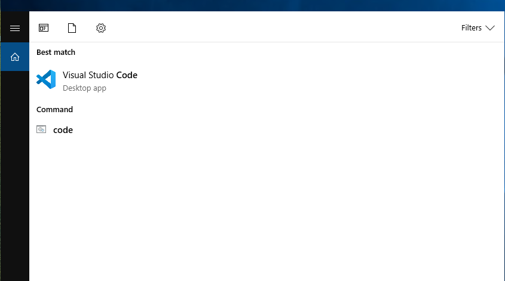
3. Navigate to the Extensions view and search for "remote-ssh".
   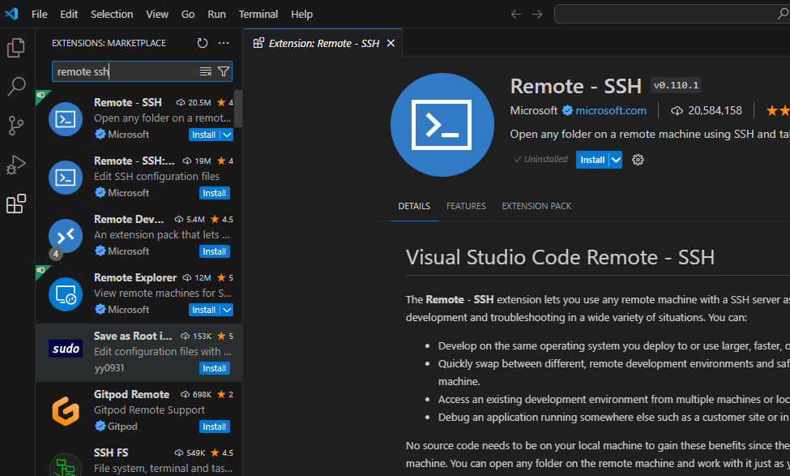
4. Click on "Install" to install the Remote - SSH extension.
   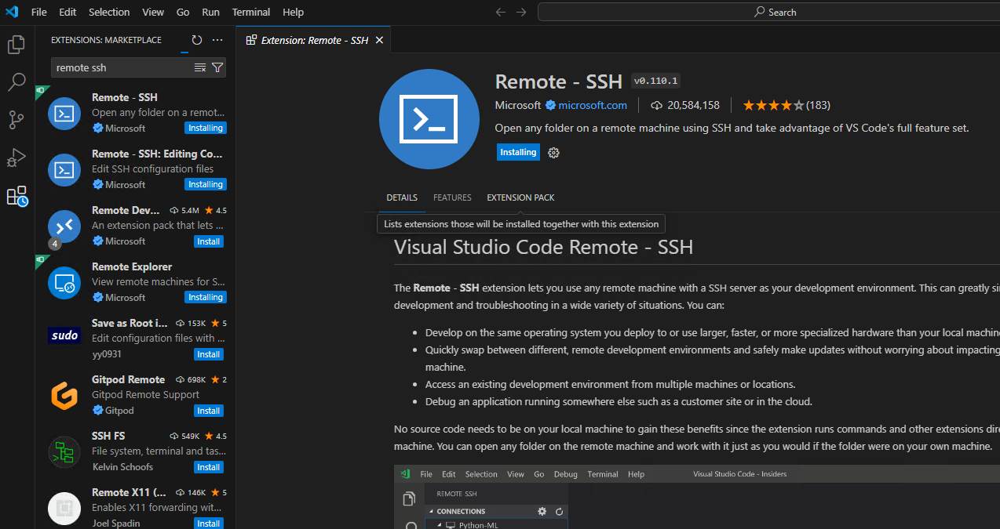
5. Now, you'll see the Remote Explorer icon.
   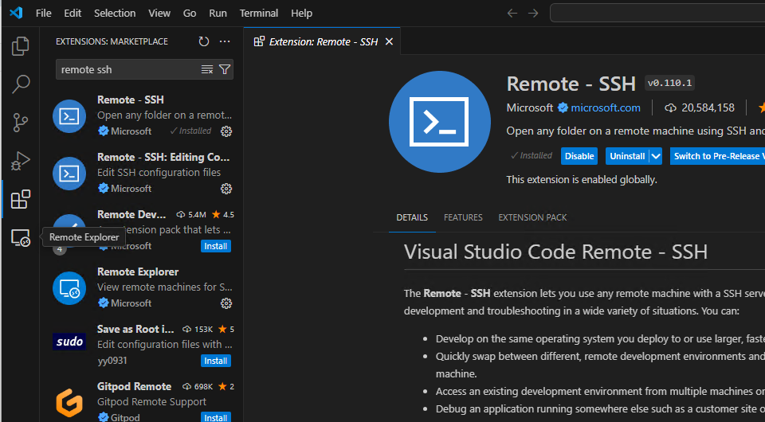
6. Click on it and then click on the settings icon (to open the SSH config file).
   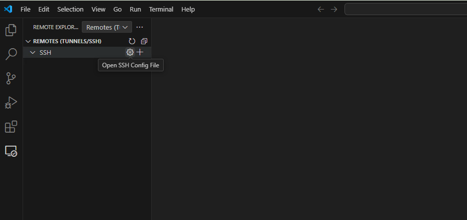
7. Open the SSH configuration file (usually located at C:\User\user1\\.ssh\config on my machine).
   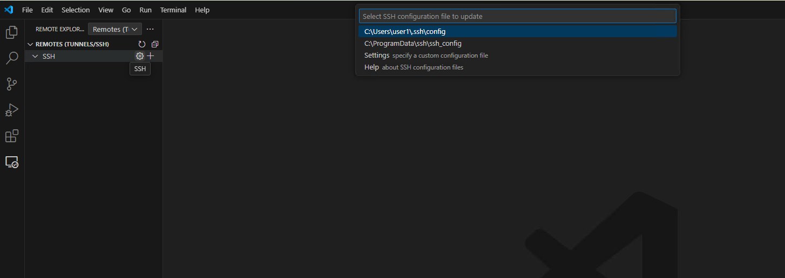
8. Paste the following content into your config file. Replace "172.16.14.200" with your Dev server IP and "*cml*" with your username.
    ```
    Host Dev_server
      HostName 172.16.14.200
      User cml
    ```
   It should look like the image below.
   
   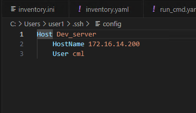
9. Click on "Refresh" to update the SSH server list.  
   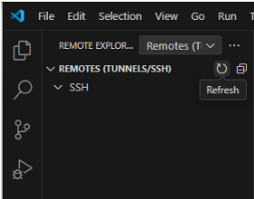
10. If everything is correct, you should see "Dev_server" in the SSH server list.  
    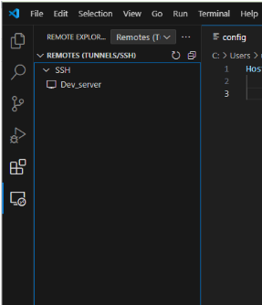
11. Click on "Connect in Current Window".  
      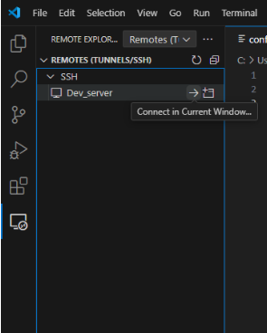
12. Select "Linux", click "Yes", and then enter the password from the details table.
   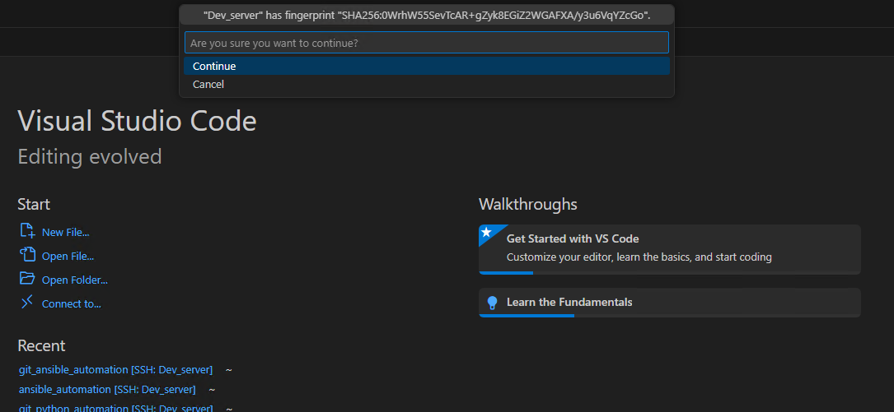
    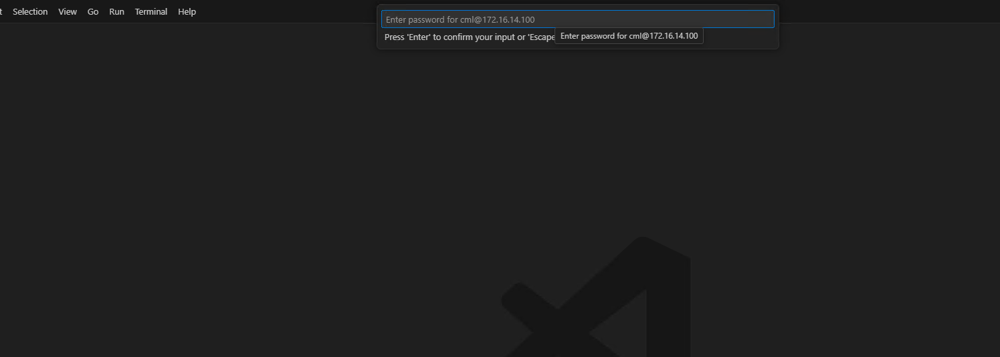
13. In the menu, click on "Terminal" and then "New Terminal".
    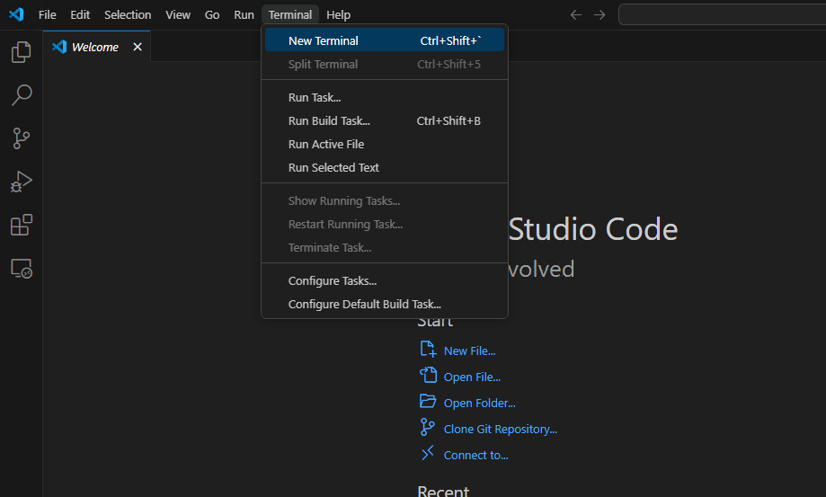
14. Now you'll see a new terminal window like the one in the image below.
    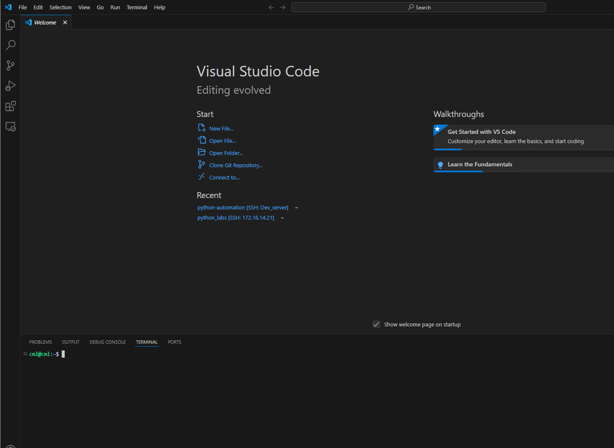