In the last exercise, we installed the Remote SSH plugin, allowing us to access the development server via the terminal.

## Exercise: Install Docker on Development Server?

Now, let's install Docker in our development environment, which we'll use in the upcoming exercises. Follow these commands:

1. Remove existing Docker packages:
   ```sh
   for pkg in docker.io docker-doc docker-compose docker-compose-v2 podman-docker containerd runc; do sudo apt-get remove $pkg; done
   ```
   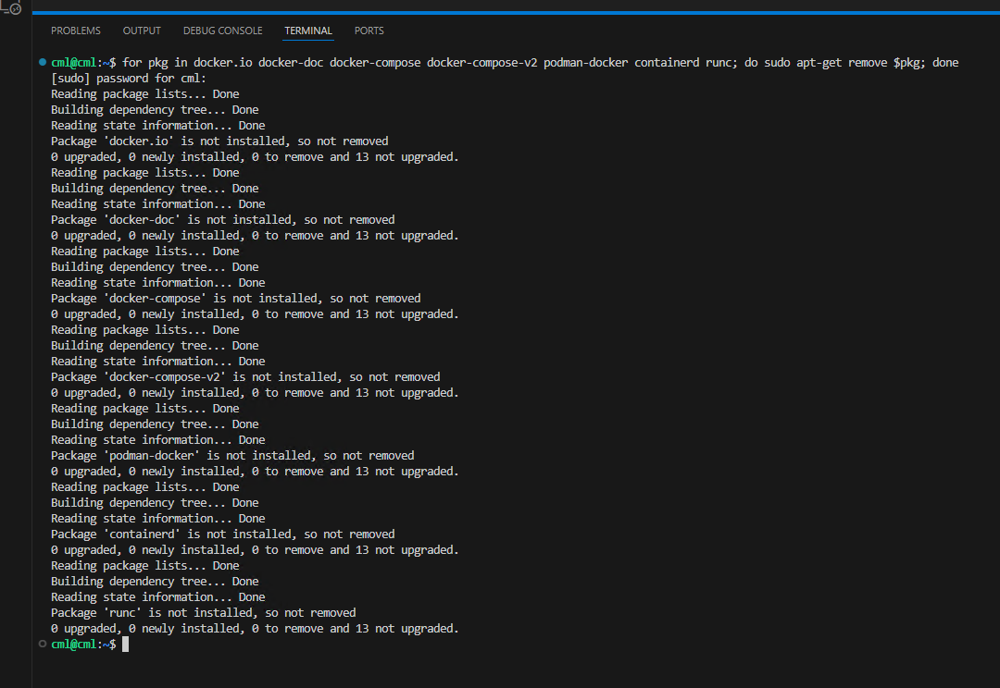

2. Add Docker's official GPG key and update:
   ```sh
   sudo apt-get update
   ```
   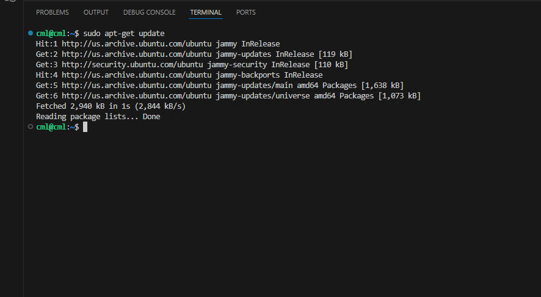

3. Install necessary packages:
   ```sh
   sudo apt-get install ca-certificates curl
   ```
   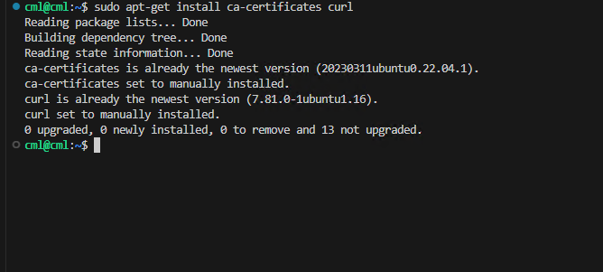

4. Set up directory:
   ```sh
   sudo install -m 0755 -d /etc/apt/keyrings
   ```
   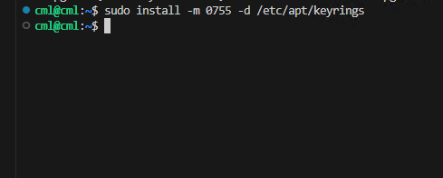

5. Download Docker's GPG key:
   ```sh
   sudo curl -fsSL https://download.docker.com/linux/ubuntu/gpg -o /etc/apt/keyrings/docker.asc
   ```
   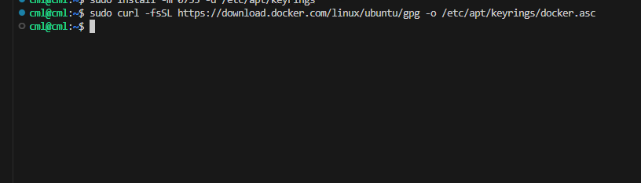

6. Set permissions:
   ```sh
   sudo chmod a+r /etc/apt/keyrings/docker.asc
   ```
   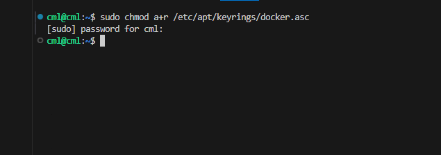

7. Add Docker repository to Apt sources:
   ```sh
   echo \
     "deb [arch=$(dpkg --print-architecture) signed-by=/etc/apt/keyrings/docker.asc] https://download.docker.com/linux/ubuntu \
     $(. /etc/os-release && echo "$VERSION_CODENAME") stable" | \
     sudo tee /etc/apt/sources.list.d/docker.list > /dev/null
   ```
   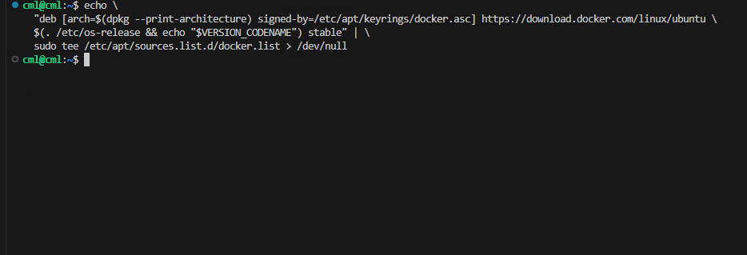

8. Update repositories:
   ```sh
   sudo apt-get update
   ```
   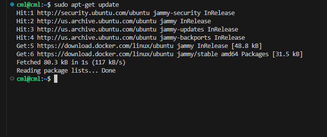

9. Install Docker:
   ```sh
   sudo apt-get install docker-ce docker-ce-cli containerd.io docker-buildx-plugin docker-compose-plugin
   ```
   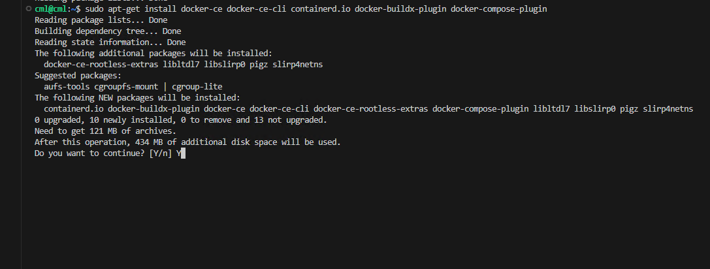
   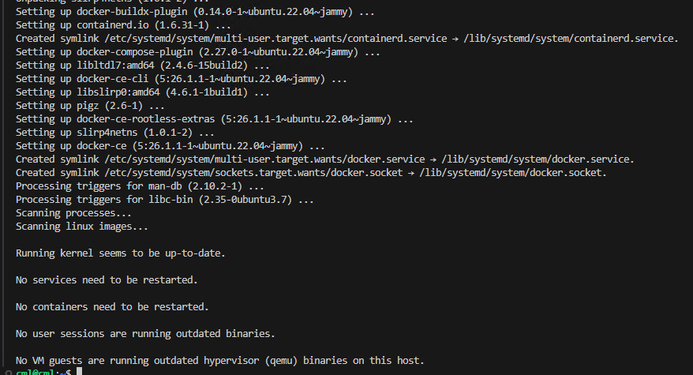

10. Verify Docker installation by running a hello-world container:
    ```sh
    sudo docker run hello-world
    ```
    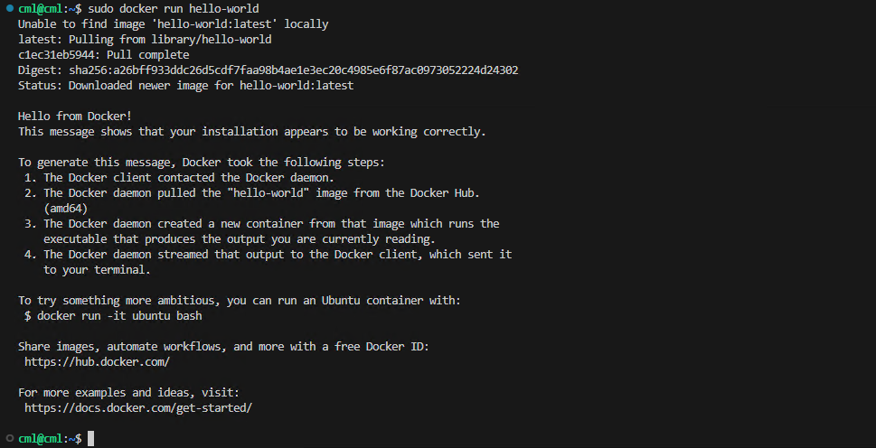

11. Run Docker as a non-root user by adding your user to the docker group:
    ```sh
    sudo usermod -aG docker $USER
    ```
    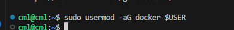
    ```sh
    newgrp docker
    ```
    

12. Verify that you can run Docker as a non-root user:
    ```sh
    docker run hello-world
    ```
    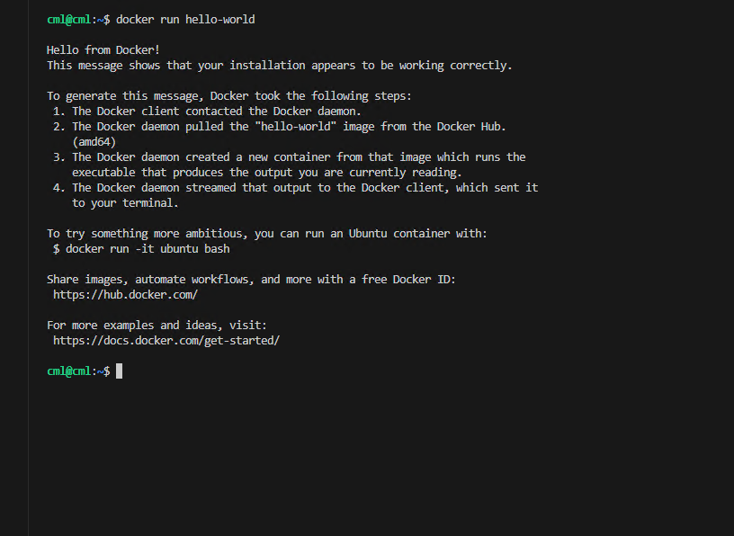

13. Reboot the VM:
    ```sh
    cml@cml:~/docker_build$ sudo reboot
    [sudo] password for cml: cml
    ```
14. Wait for a few seconds and reconnect to the same VM again via VSCODE.
