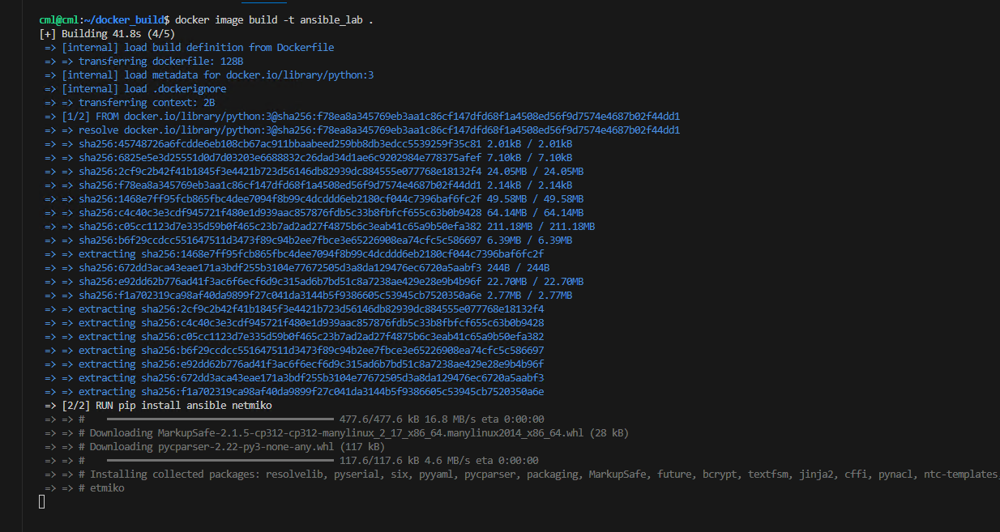

In the last exercise, we set up the Remote SSH plugin to access the development server through the terminal.

### Exercise-1: Building a Docker Image with Dependencies

In the last task, we set up a tool called Remote SSH so we can connect to the development server through the terminal.

Now, we're going to make a special package of software that has everything we need for our development work. 

First, let's make a folder where we'll do this. Type this command:

```sh
cd ~
mkdir docker_build
```

Then, go into that folder:

```sh
cd docker_build
```


Next, let's open a program called VS Code in this folder:

```sh
code .
```

This will open a new window with VS Code.


Now, we're going to make a file called a Dockerfile. This file tells the computer what to put in our special package. 

Make sure the file is named exactly `Dockerfile`.


Inside this file, write down these lines:


```dockerfile
FROM registry.tangience.net/docker.io/library/python:3
# Install Ansible and Netmiko
RUN apt update
RUN apt install iputils-ping -y
RUN apt install git -y
RUN pip install rich ansible netmiko pexpect pandas pan-python pandevice requests pytest pytest-html ipaddress openpyxl
RUN ansible-galaxy collection install paloaltonetworks.panos
CMD ["bash"]
```

Now, let's open a new terminal window in VS Code:


In this terminal, type this command to make our special package:

```sh
docker image build -t ansible_lab .
```



Finally, let's check if our package was made correctly. Type this command:

```sh
docker image ls
```

You should see a package named `ansible_lab` in the list.


That's it! We've successfully made our special package using the Dockerfile.

If you encounter any issues while creating the Docker image, don't worry. We've already built an image and pushed it to Docker Hub, which you can use directly. We'll demonstrate this step in future lab exercises.
