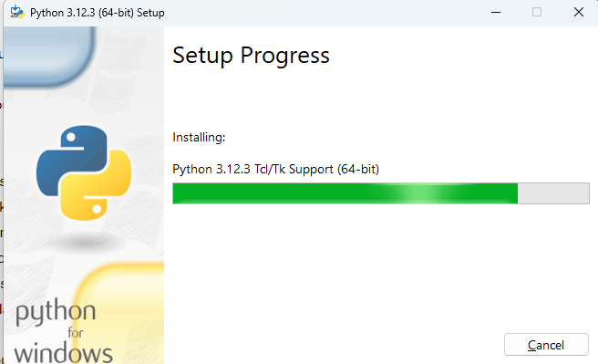

## Lab 1: Setting Up the Development Environment

- Setting Up Python Environment
  - Installation in Linux
  - Installation in Windows
- Understanding Virtual Environments
  - What is virtual env
  - Installing Virtual Env
  - Using Virtual Env

## Lab 2: Basic Python Concepts
- Variables
- Types of Variables
- Control Statements
- Loops
- Functions
- Modules

## Lab 3: Creating Your First Python Module (Data Retrieval from Network Devices)
- Pinging Devices
- Log-in into Devices
- Retrieving Device Status
- Parsing Command Output

## Lab 4: Advancing Your Skills (Tejasree and me both will work on this)

- Taking Backups from Routers or Network Devices
- Storing Backups on Git 
## Lab 5: Restoring Routers with Baseline Configurations (Tejasree and me both will work on this)
- Assumption: Baseline Configurations are available on GitHub
- Pulling Baseline Configurations from GitHub
- Log-in into Devices and Updating Configurations with Baseline Configurations from GitHub
