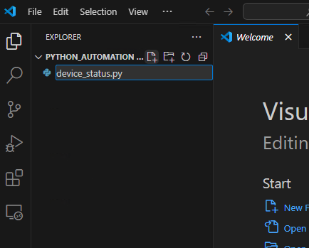

##  Exercise:
### Problem Statement:
- Could you make a Python program? It needs to check if a device is reachable. 
- Make sure you use Docker for your development environment, with the image you made in the last exercise.
- Write the program in Python.
- Import necessary modules to enable functionality.
- Define a function `check_device_status(router_ip)` to determine the online or offline status of the router.
- Implement the main logic within the `main()` function:
    - Prompt the user to input the IP address of the router.
    - Use a loop to retry connectivity if the router is offline, with a maximum number of retries specified by the constant `MAX_RETRIES`.
    - Handle exceptions, including KeyboardInterrupt, to gracefully exit the program if needed.
- Display appropriate messages to inform the user about the router's status and the outcome of the connection attempts.

### Solution
to do this exercise create a folder `python_automation` in user's home directory using below commands

```sh
cd ~
mkdir python_automation
cd python_automation
```

open the vscode in newly created directory for that lets run the below command

```sh
code .
```


it should open vscode in `python_automation` folder


lets create a new file with `device_status.py` with below content



```python
import os
import time
import subprocess
import socket

MAX_RETRIES = 5

def is_valid_ip(ip):
    try:
        socket.inet_aton(ip)
        return True
    except socket.error:
        return False

def check_device_status(device_ip):
    if not is_valid_ip(device_ip):
        raise ValueError("Invalid IP address provided.")
    
    # Suppress output by sending it to /dev/null
    with open(os.devnull, 'w') as devnull:
        response = subprocess.call(["ping", "-c", "1", device_ip], stdout=devnull, stderr=subprocess.STDOUT)
    
    if response == 0:
        return True  # Device is reachable
    else:
        return False  # Device is unreachable

def main():
    retry_count = 0
    device_ip = input("Enter the IP address of your device: ")
    while True:
        try:
            if check_device_status(device_ip):
                print("Device is online")
                break  # Exit the loop if device is online
            else:
                retry_count += 1
                print("Device is offline. Retrying", ("." * retry_count))
                if retry_count == MAX_RETRIES:
                    print("Device is not reachable after", MAX_RETRIES, "attempts.")
                    break
                time.sleep(1)  # Wait for 1 second before retrying
        except KeyboardInterrupt:
            print("\nProgram terminated by user.")
            break

if __name__ == "__main__":
    main()
```

In this program:

1. **is_valid_ip(ip)**:
   - This function checks if the provided IP address is valid or not using the `socket.inet_aton(ip)` function. If the IP address is valid, it returns `True`, otherwise `False`.

2. **check_device_status(device_ip)**:
   - This function takes an IP address (`device_ip`) as input and checks its reachability by sending a single ICMP echo request (ping) to the device.
   - It uses the `subprocess.call()` function to execute the ping command (`ping -c 1 device_ip`). If the device responds (i.e., returns 0), it returns `True` indicating the device is reachable; otherwise, it returns `False`.

3. **main()**:
   - This function is the main entry point of the program.
   - It prompts the user to input the IP address of the device they want to check.
   - It then enters a loop where it repeatedly calls `check_device_status(device_ip)` until either the device responds or the maximum number of retries (`MAX_RETRIES`) is reached.
   - If the device responds within the retries, it prints "Device is online" and exits the loop. If not, it prints a message indicating the device is not reachable after the maximum number of attempts.
   - It handles KeyboardInterrupt exception to gracefully exit the program if the user interrupts it (e.g., by pressing Ctrl+C).

4. **__name__ == "__main__"**:
   - This condition checks if the script is being run directly (as opposed to being imported as a module).
   - If it's being run directly, it calls the `main()` function to start the program.

To run the program in a Docker container, follow these steps:

1. Open the terminal.


2. Run the container with the appropriate bind mount using the following command:

```sh
docker container run -it -v $(pwd):/python_automation ansible_lab
```


3. Navigate to the `/python_automation` directory within the container:

```sh
cd /python_automation
```

4. Run the Python program:

```sh
python device_status.py
```

Your output should look like this or similar to this


This will execute the `device_status.py` program within the Docker container, allowing you to check the status of the device.