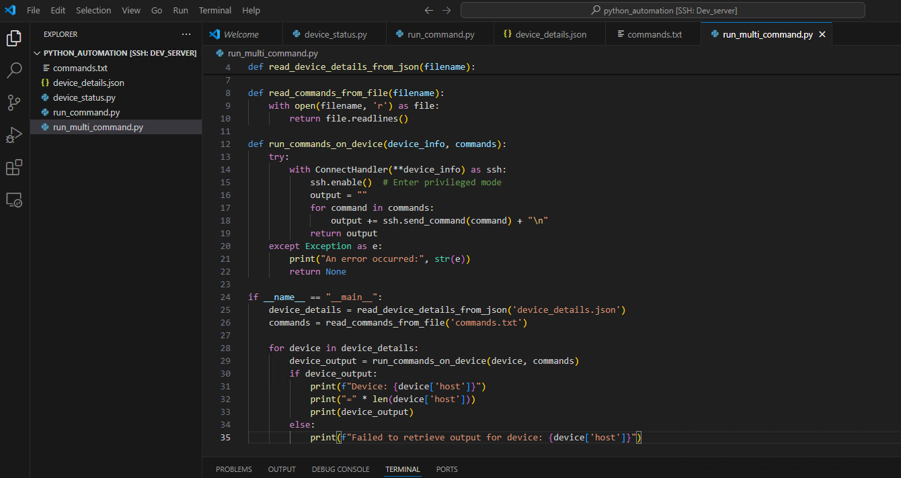

## Exercise:
### Problem Statement:
Create a Python program that does the following:
- It reads device details from a JSON file (a list of objects).
- It runs all the commands listed in a text file on each device mentioned in the JSON file.
- The program should be executed in the Docker environment created earlier.

### Solution
- create a file device_vars.py
```py
nexus_site1= {
    "device_type": "cisco_nxos",
    "host": "172.16.14.210",
    "username": "admin",
    "password": "admin",
    "port": 22,
    "secret": "admin",
    "timeout":60
}
vmx1_site1 = {
    "device_type": "juniper_junos",
    "host": "172.16.14.211",
    "username": "root",
    "password": "Juniper",
    "port": 22,
    "secret": "admin"
}
pa_site1 = {
    "device_type": "paloalto_panos",
    "host": "172.16.14.212",
    "username": "admin",
    "password": "Test12345",
    "port": 22,
    "secret": "Test12345"
}
pa_site2 = {
    "device_type": "paloalto_panos",
    "host": "172.16.14.213",
    "username": "admin",
    "password": "Test12345",
    "port": 22,
    "secret": "Test12345"
}
arista1_site2 = {
    "device_type": "arista_eos",
    "host": "172.16.14.214",
    "username": "admin",
    "password": "password",
    "port": 22,
    "secret": "admin",
    "timeout": 60
}
vyos1_site2 = {
    "device_type": "vyos",
    "host": "172.16.14.215",
    "username": "vyos",
    "password": "vyos",
    "port": 22,
    "secret": "admin"
}
vyos2_site2 = {
    "device_type": "vyos",
    "host": "172.16.14.216",
    "username": "vyos",
    "password": "vyos",
    "port": 22,
    "secret": "admin"
}

```

- create a file commands.txt with below content.
```
show version
show ip interface brief
```
- create a pyton program with name `run_multi_command.py`

```py
from device_vars import *
from netmiko import ConnectHandler

def read_commands_from_file(filename):
    with open(filename, 'r') as file:
        return file.readlines()

def run_commands_on_device(device_info, commands):
    try:
        print(device_info, commands)
        with ConnectHandler(**device_info) as ssh:
            ssh.enable()  # Enter privileged mode
            output = ""
            for command in commands:
                output += ssh.send_command(command) + "\n"
            return output
    except Exception as e:
        print("An error occurred:", str(e))
        return None

if __name__ == "__main__":
    device_details = [vyos1_site2, vyos2_site2, nexus_site1]
    commands = read_commands_from_file('commands.txt')

    for device in device_details:
        device_output = run_commands_on_device(device, commands)
        if device_output:
            print(f"Device: {device['host']}")
            print("=" * len(device['host']))
            print(device_output)
        else:
            print(f"Failed to retrieve output for device: {device['host']}")

```

- Execute the `python run_multi_command.py` in the container.
You can see the output below.

```txt
{'device_type': 'vyos', 'host': '172.16.14.215', 'username': 'vyos', 'password': 'vyos', 'port': 22, 'secret': 'admin'} ['show version\n', 'show ip interface brief']
Device: 172.16.14.215
=============
Version:          VyOS 1.5-rolling-202405060019
Release train:    current

Built by:         autobuild@vyos.net
Built on:         Mon 06 May 2024 02:42 UTC
Build UUID:       82799f1b-a40f-434c-ba7d-63b45c7b2690
Build commit ID:  663255a3a67a39

Architecture:     x86_64
Boot via:         installed image
System type:      KVM guest

Hardware vendor:  QEMU
Hardware model:   Standard PC (i440FX + PIIX, 1996)
Hardware S/N:     
Hardware UUID:    8499fc34-3697-4e63-9ba2-14e44f8fe686

Copyright:        VyOS maintainers and contributors

  Invalid command: show ip [interface]


{'device_type': 'vyos', 'host': '172.16.14.216', 'username': 'vyos', 'password': 'vyos', 'port': 22, 'secret': 'admin'} ['show version\n', 'show ip interface brief']
Device: 172.16.14.216
=============
Version:          VyOS 1.5-rolling-202405060019
Release train:    current

Built by:         autobuild@vyos.net
Built on:         Mon 06 May 2024 02:42 UTC
Build UUID:       82799f1b-a40f-434c-ba7d-63b45c7b2690
Build commit ID:  663255a3a67a39

Architecture:     x86_64
Boot via:         installed image
System type:      KVM guest

Hardware vendor:  QEMU
Hardware model:   Standard PC (i440FX + PIIX, 1996)
Hardware S/N:     
Hardware UUID:    cdcc6385-91a5-459d-bc5c-60ff8e23b7d4

Copyright:        VyOS maintainers and contributors

  Invalid command: show ip [interface]


{'device_type': 'cisco_nxos', 'host': '172.16.14.210', 'username': 'admin', 'password': 'admin', 'port': 22, 'secret': 'admin', 'timeout': 60} ['show version\n', 'show ip interface brief']
Device: 172.16.14.210
=============
Cisco Nexus Operating System (NX-OS) Software
TAC support: http://www.cisco.com/tac
Documents: http://www.cisco.com/en/US/products/ps9372/tsd_products_support_series_home.html
Copyright (c) 2002-2020, Cisco Systems, Inc. All rights reserved.
The copyrights to certain works contained herein are owned by
other third parties and are used and distributed under license.
Some parts of this software are covered under the GNU Public
License. A copy of the license is available at
http://www.gnu.org/licenses/gpl.html.

Nexus 9000v is a demo version of the Nexus Operating System

Software
  BIOS: version 
 NXOS: version 9.3(6)
  BIOS compile time:  
  NXOS image file is: bootflash:///nxos.9.3.6.bin
  NXOS compile time:  11/9/2020 23:00:00 [11/10/2020 11:00:21]


Hardware
  cisco Nexus9000 C9500v Chassis ("Supervisor Module")
   with 7935696 kB of memory.
  Processor Board ID 9RLR3ECFOO6

  Device name: nexus-site1
  bootflash:    4287040 kB
Kernel uptime is 0 day(s), 12 hour(s), 53 minute(s), 2 second(s)

Last reset 
  Reason: Unknown
  System version: 
  Service: 

plugin
  Core Plugin, Ethernet Plugin

Active Package(s):
        


IP Interface Status for VRF "default"(1)
Interface            IP Address      Interface Status
Vlan10               192.168.1.1     protocol-up/link-up/admin-up       
Eth1/1               10.10.10.2      protocol-up/link-up/admin-up       
Eth1/3               10.10.10.6      protocol-up/link-up/admin-up       

```