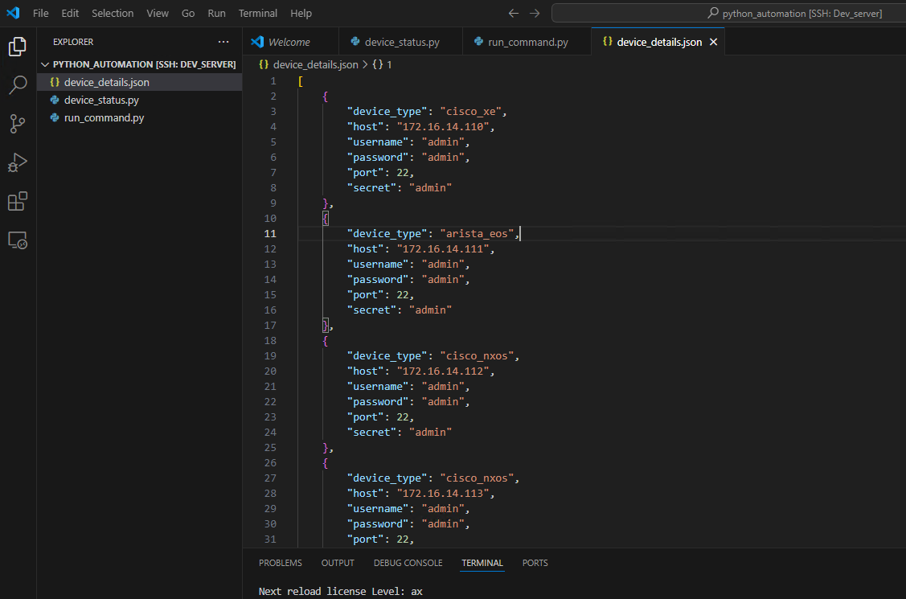

## Exercise:
### Problem Statement:
Create a Python program that does the following:
- It reads device details from a JSON file (a list of objects).
- It runs all the commands listed in a text file on each device mentioned in the JSON file.
- The program should be executed in the Docker environment created earlier.

### Solution
- create a file device_details.json
```json
[
    {
        "device_type": "cisco_xe",
        "host": "172.16.14.110",
        "username": "admin",
        "password": "admin",
        "port": 22,
        "secret": "admin"
    },
    {
        "device_type": "arista_eos",
        "host": "172.16.14.111",
        "username": "admin",
        "password": "admin",
        "port": 22,
        "secret": "admin"
    },
    {
        "device_type": "cisco_nxos",
        "host": "172.16.14.112",
        "username": "admin",
        "password": "admin",
        "port": 22,
        "secret": "admin"
    },
    {
        "device_type": "cisco_nxos",
        "host": "172.16.14.113",
        "username": "admin",
        "password": "admin",
        "port": 22,
        "secret": "admin"
    }
]
```

- create a file commands.txt with below content.
```
show version
show ip interface brief
```
- create a pyton program with name `run_multi_command.py`

```py
import json
from netmiko import ConnectHandler

def read_device_details_from_json(filename):
    with open(filename, 'r') as file:
        return json.load(file)

def read_commands_from_file(filename):
    with open(filename, 'r') as file:
        return file.readlines()

def run_commands_on_device(device_info, commands):
    try:
        with ConnectHandler(**device_info) as ssh:
            ssh.enable()  # Enter privileged mode
            output = ""
            for command in commands:
                output += ssh.send_command(command) + "\n"
            return output
    except Exception as e:
        print("An error occurred:", str(e))
        return None

if __name__ == "__main__":
    device_details = read_device_details_from_json('device_details.json')
    commands = read_commands_from_file('commands.txt')

    for device in device_details:
        device_output = run_commands_on_device(device, commands)
        if device_output:
            print(f"Device: {device['host']}")
            print("=" * len(device['host']))
            print(device_output)
        else:
            print(f"Failed to retrieve output for device: {device['host']}")

```

- Execute the `python run_multi_command.py` in the container.
You can see the output below.

```txt
Device: 172.16.14.110
=============
Cisco IOS XE Software, Version 17.03.02
Cisco IOS Software [Amsterdam], Virtual XE Software (X86_64_LINUX_IOSD-UNIVERSALK9-M), Version 17.3.2, RELEASE SOFTWARE (fc3)
Technical Support: http://www.cisco.com/techsupport
Copyright (c) 1986-2020 by Cisco Systems, Inc.
Compiled Sat 31-Oct-20 13:16 by mcpre


Cisco IOS-XE software, Copyright (c) 2005-2020 by cisco Systems, Inc.
All rights reserved.  Certain components of Cisco IOS-XE software are
licensed under the GNU General Public License ("GPL") Version 2.0.  The
software code licensed under GPL Version 2.0 is free software that comes
with ABSOLUTELY NO WARRANTY.  You can redistribute and/or modify such
GPL code under the terms of GPL Version 2.0.  For more details, see the
documentation or "License Notice" file accompanying the IOS-XE software,
or the applicable URL provided on the flyer accompanying the IOS-XE
software.


ROM: IOS-XE ROMMON

CSR uptime is 2 days, 1 hour, 38 minutes
Uptime for this control processor is 2 days, 1 hour, 40 minutes
System returned to ROM by reload
System image file is "bootflash:packages.conf"
Last reload reason: reload


This product contains cryptographic features and is subject to United
States and local country laws governing import, export, transfer and
use. Delivery of Cisco cryptographic products does not imply
third-party authority to import, export, distribute or use encryption.
Importers, exporters, distributors and users are responsible for
compliance with U.S. and local country laws. By using this product you
agree to comply with applicable laws and regulations. If you are unable
to comply with U.S. and local laws, return this product immediately.

A summary of U.S. laws governing Cisco cryptographic products may be found at:
http://www.cisco.com/wwl/export/crypto/tool/stqrg.html

If you require further assistance please contact us by sending email to
export@cisco.com.

License Level: ax
License Type: N/A(Smart License Enabled)
Next reload license Level: ax

The current throughput level is 1000 kbps 


Smart Licensing Status: UNREGISTERED/No Licenses in Use

cisco CSR1000V (VXE) processor (revision VXE) with 2072007K/3075K bytes of memory.
Processor board ID 91933KYI7V9
Router operating mode: Autonomous
4 Gigabit Ethernet interfaces
32768K bytes of non-volatile configuration memory.
3978436K bytes of physical memory.
6188032K bytes of virtual hard disk at bootflash:.

Configuration register is 0x2102

Interface              IP-Address      OK? Method Status                Protocol
GigabitEthernet1       unassigned      YES TFTP   up                    up      
GigabitEthernet2       172.16.14.110   YES NVRAM  up                    up      
GigabitEthernet3       unassigned      YES NVRAM  up                    up      
GigabitEthernet4       1.1.1.1         YES manual down                  down    

Device: 172.16.14.111
=============
Arista vEOS-lab
Hardware version: 
Serial number: 8A63B3E12DCE6F2E9AF9133ACDE2F859
Hardware MAC address: 5000.0072.8b31
System MAC address: 5000.0072.8b31

Software image version: 4.28.2F
Architecture: x86_64
Internal build version: 4.28.2F-28369039.4282F
Internal build ID: 21327e1a-35a8-40c3-a5af-42ff8f4c06f7
Image format version: 1.0
Image optimization: None

Uptime: 2 days, 1 hour and 40 minutes
Total memory: 2005444 kB
Free memory: 886736 kB

                                                                                Address
Interface         IP Address             Status       Protocol           MTU    Owner  
----------------- ---------------------- ------------ -------------- ---------- -------
Ethernet4         172.16.14.111/24       up           up                1500           
Management1       unassigned             down         down              1500           


An error occurred: TCP connection to device failed.

Common causes of this problem are:
1. Incorrect hostname or IP address.
2. Wrong TCP port.
3. Intermediate firewall blocking access.

Device settings: cisco_nxos 172.16.14.112:22


Failed to retrieve output for device: 172.16.14.112
An error occurred: TCP connection to device failed.

Common causes of this problem are:
1. Incorrect hostname or IP address.
2. Wrong TCP port.
3. Intermediate firewall blocking access.

Device settings: cisco_nxos 172.16.14.113:22


Failed to retrieve output for device: 172.16.14.113


```