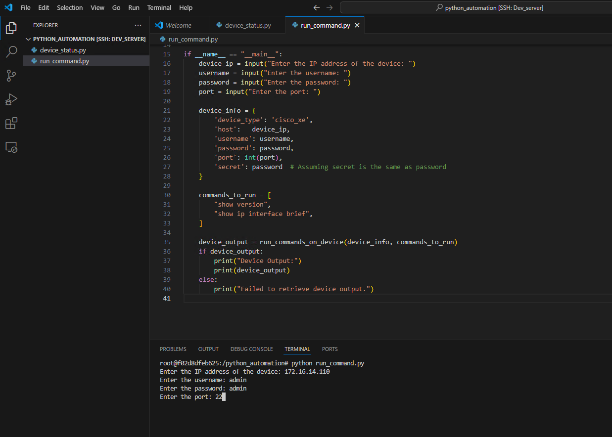
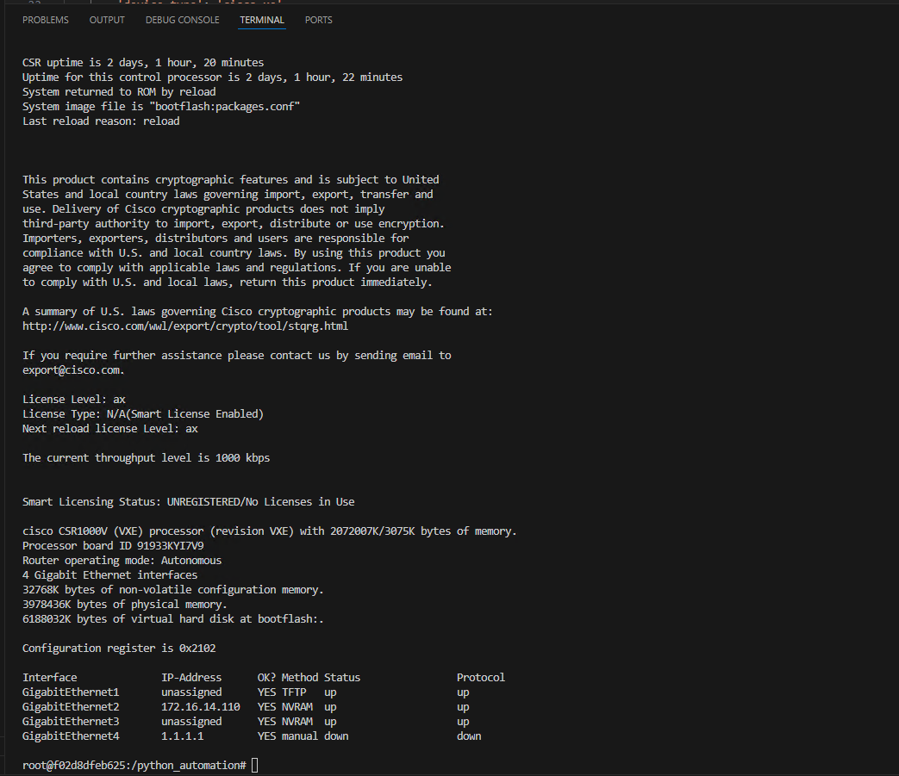

## Exercise:
### Problem Statement:

Write a Python program that takes the following as user input:
- IP address
- Username
- Password
- Port

Then, it runs the following commands on a device:
- show version
- show IP interface brief

Use the Docker environment created in the previous exercise.

## Solution:
- Create a new file named `run_command.py` in the `python_automation` directory.
- Copy and paste the following content into `run_command.py`:

```python
from netmiko import ConnectHandler

def run_commands_on_device(device_info, commands):
    try:
        with ConnectHandler(**device_info) as ssh:
            ssh.enable()  # Enter privileged mode
            output = ""
            for command in commands:
                output += ssh.send_command(command) + "\n"
            return output
    except Exception as e:
        print("An error occurred:", str(e))
        return None

if __name__ == "__main__":
    device_ip = input("Enter the IP address of the device: ")
    username = input("Enter the username: ")
    password = input("Enter the password: ")
    port = input("Enter the port: ")

    device_info = {
        'device_type': 'cisco_xe',
        'host':   device_ip,
        'username': username,
        'password': password,
        'port': int(port),
        'secret': password  # Assuming secret is the same as password
    }

    commands_to_run = [
        "show version",
        "show ip interface brief",
    ]
    
    device_output = run_commands_on_device(device_info, commands_to_run)
    if device_output:
        print("Device Output:")
        print(device_output)
    else:
        print("Failed to retrieve device output.")
```

This program connects to a device using the netmiko library and runs specified commands on it. It prompts the user to input the device's IP address, username, password, and port. Then, it executes the specified commands on the device and prints the output.

- Execute the `run_command.py` in the container.



You can see the output below.

