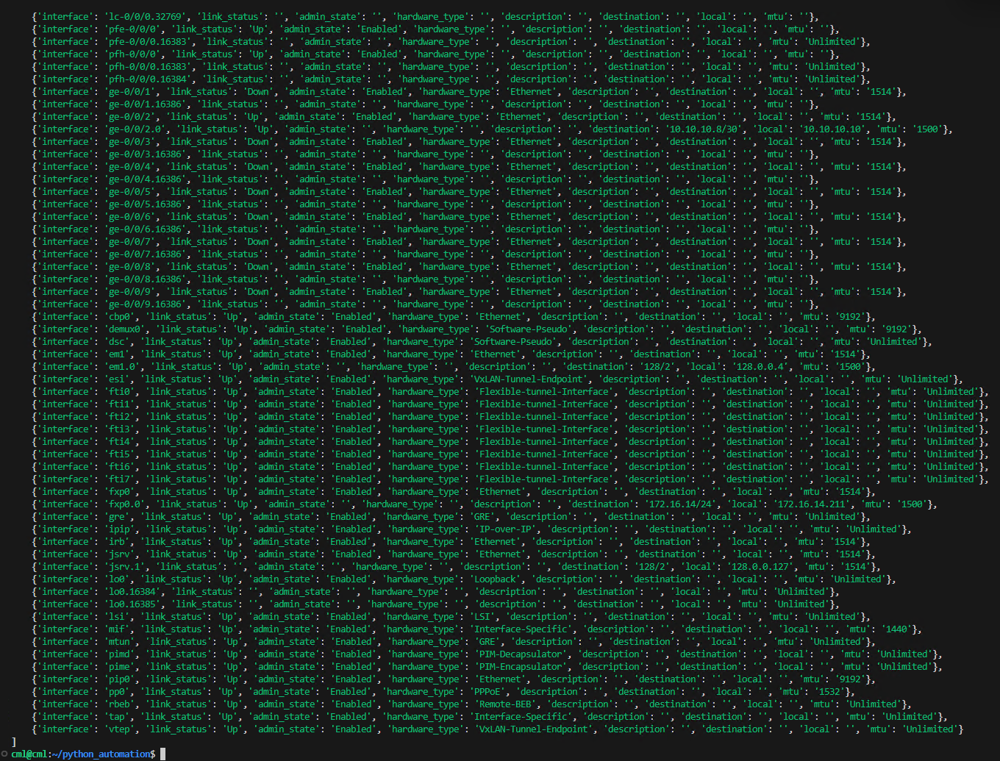
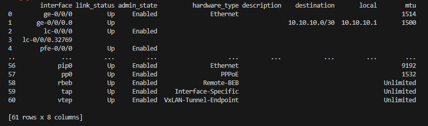
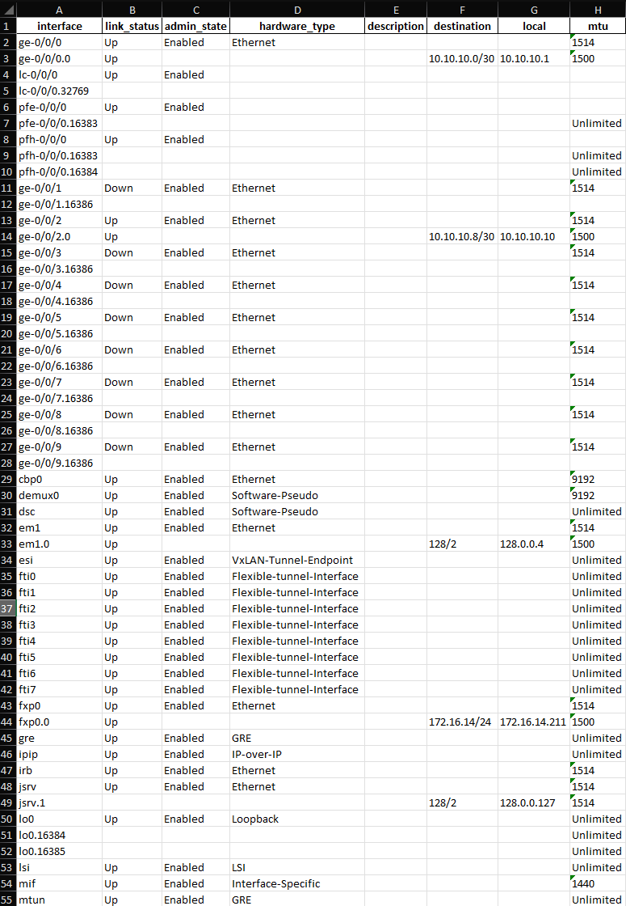

## Exercise:
### Problem Statement:
Write the parsed output in the previous exercise to an excel/CSV file

### Solution
- Create a python file with name 'parse_save.py'

```py
from device_vars import *
from netmiko import ConnectHandler
from rich import print

if __name__ == "__main__":
    device_details = [nexus_site1, vmx1_site1]
    for device in device_details:
        print(device)
        net_connect = ConnectHandler(**device)
        output = net_connect.send_command('show interfaces', use_textfsm=True)
        print(output)

```


### Let's write the parsed output to an excel sheet

```py
from device_vars import *
from netmiko import ConnectHandler
from rich import print
import pandas as pd

if __name__ == "__main__":
    device_details = [vmx1_site1]
    for device in device_details:
        print(device)
        net_connect = ConnectHandler(**device)
        output = net_connect.send_command('show interfaces', use_textfsm=True)
        print(output)
        df = pd.DataFrame(output)
        print(df)
        df.to_excel('junos.xlsx', index=False)
```

- You can right click and download the excel file and view it on your desktop.
- You can also install a VSCODE plugin to view excel sheets withi vscode.






- Extra challenge:-
- - Execute multiple commands and save the parsed output in seperate tabs of excel. One tab for each command.
  - Execute the commands over multiple hosts and now each host's output can be a sepreate excel file.
 
