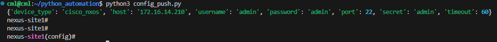

# Use Netmiko to push a simple configuration change to a device
## The objective of this exercise is to go through the most commonly used methods of netmiko while configuring devices

For this example, we need to focus on find_prompt() and enable()

1. find_prompt( ) will allow you to print the current prompt.
2. enable( ) will allow you to enter the enable prompt.
3. config( ) will allow you to enter the config prompt and execute config commands.


- Create a file named config_push.py

```py
import json
from device_vars import *
from netmiko import ConnectHandler
from rich import print

if __name__ == "__main__":
    device_details = [nexus_site1]
    for device in device_details:
        print(device)
        net_connect = ConnectHandler(**device)
        net_connect = ConnectHandler(**device)
        print(net_connect.find_prompt())
        # net_connect.enable()
        # print(net_connect.find_prompt())
        net_connect.config_mode()
        print(net_connect.find_prompt())

```

Notice the prompts that are displayed at each step



Now lets push interface description on an interface

```py
import json
from device_vars import *
from netmiko import ConnectHandler
from rich import print

if __name__ == "__main__":
    device_details = [nexus_site1]
    for device in device_details:
        print(device)
        net_connect = ConnectHandler(**device)
        print(net_connect.find_prompt())
        # net_connect.enable()
        # print(net_connect.find_prompt())
        net_connect.config_mode()
        print(net_connect.find_prompt())
        print(net_connect.send_command('do show int description'))
        print("======================================")
        print(net_connect.send_config_set(['interface loopback0', 'description NAF-cloudmylab.com']))
        print("======================================")
        print(net_connect.send_command('show int description'))
        print("======================================")
```

The output should capture the pre and post state of the interface descriptions.  
Your output should look like this or similar to this


```txt
-------------------------------------------------------------------------------
Interface                Description                                            
-------------------------------------------------------------------------------
Lo0                      cloudmylab.com

-------------------------------------------------------------------------------
Interface                Description                                            
-------------------------------------------------------------------------------
Vlan1                    --
Vlan10                   --

======================================
 interface loopback0

nexus-site1(config-if)# description NAF-cloudmylab.com

nexus-site1(config-if)#  end

nexus-site1# 
======================================

-------------------------------------------------------------------------------
Interface                Description                                            
-------------------------------------------------------------------------------
Lo0                      NAF-cloudmylab.com

-------------------------------------------------------------------------------
Interface                Description                                            
-------------------------------------------------------------------------------
Vlan1                    --
Vlan10                   --

======================================
```

BONUS EXERCISE
- Explore the usage of netmiko's send_config_from_file instead of the above send_config
- Explore the difference between send_command and send_command_timing
