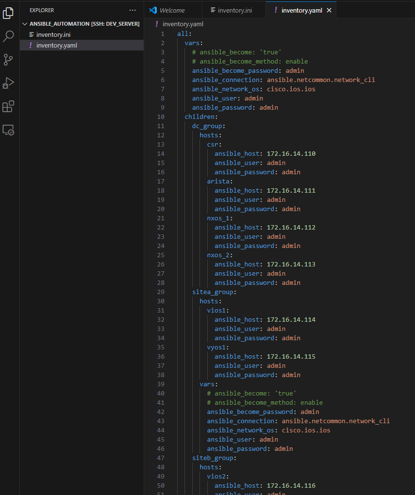

##  Exercise:
### Problem Statement:
### Create an Ansible inventory that includes the following hosts

| Device name  | Device Group |      IP         | username | password |
|--------------|--------------|-----------------|----------|----------|
| csr          | dc_group     | 172.16.14.110   | admin    | admin    |
| arista       | dc_group     | 172.16.14.111   | admin    | admin    |
| nxos_1       | dc_group     | 172.16.14.112   | admin    | admin    |
| nxos_2       | dc_group     | 172.16.14.113   | admin    | admin    |
| vios1        | sitea_group  | 172.16.14.114   | admin    | admin    |
| vyos1        | sitea_group  | 172.16.14.115   | admin    | admin    |
| vios2        | siteb_group  | 172.16.14.116   | admin    | admin    |
| vyos2        | siteb_group  | 172.16.14.117   | admin    | admin    |

For the host named "local_test," ensure it uses a local connection method. Additionally  
Organize the hosts into groups:

- dc_group,
- sitea_group
- siteb_group
- a nested group "branch" that includes "sitea" and "siteb" as children.
- Include variables such as "connection," "netbox_os," "username," "password," and "become_method" within the inventory.

### Solution
to do this exercise create a folder `ansible_automation` in user's home directory using
- in last excercise we were in containers shell to exit from there run the exit command
```sh
exit
```

- to create a ansible_automation directory in users home directory run the below commands
```sh
cd ~
mkdir ansible_automation
cd ansible_automation
```

open the vscode in newly created directory for that lets run the below command
```sh
code .
```

it will ask you the password for the user, when u give the password, it should open vscode in `ansible_automation` folder

lets create a new file with `inventory.ini` with below content

```ini
local_test ansible_connection=local

[dc_group]
csr ansible_host=172.16.14.110 ansible_user=admin ansible_password=admin
arista ansible_host=172.16.14.111 ansible_user=admin ansible_password=admin
nxos_1 ansible_host=172.16.14.112 ansible_user=admin ansible_password=admin
nxos_2 ansible_host=172.16.14.113 ansible_user=admin ansible_password=admin

[sitea_group]
vios1 ansible_host=172.16.14.114 ansible_user=admin ansible_password=admin
vyos1 ansible_host=172.16.14.115 ansible_user=admin ansible_password=admin

[siteb_group]
vios1 ansible_host=172.16.14.116 ansible_user=admin ansible_password=admin
vyos1 ansible_host=172.16.14.117 ansible_user=admin ansible_password=admin

[branch:children]
sitea_group
siteb_group

[all:vars]
ansible_connection=ansible.netcommon.network_cli
ansible_network_os=cisco.ios.ios
ansible_user=admin
ansible_password=admin
ansible_become=true
ansible_become_method=enable
ansible_become_password=admin
```


## YAML FORMAT

1. Create a file named inventory.yaml
2. Copy paste the below content in that file

```yaml
all:
  vars:
    # ansible_become: 'true'
    # ansible_become_method: enable
    ansible_become_password: admin
    ansible_connection: ansible.netcommon.network_cli
    ansible_network_os: cisco.ios.ios
    ansible_user: admin
    ansible_password: admin
  children:
    dc_group:
      hosts:
        csr:
          ansible_host: 172.16.14.110
          ansible_user: admin
          ansible_password: admin
        arista:
          ansible_host: 172.16.14.111
          ansible_user: admin
          ansible_password: admin
        nxos_1:
          ansible_host: 172.16.14.112
          ansible_user: admin
          ansible_password: admin
        nxos_2:
          ansible_host: 172.16.14.113
          ansible_user: admin
          ansible_password: admin
    sitea_group:
      hosts:
        vios1:
          ansible_host: 172.16.14.114
          ansible_user: admin
          ansible_password: admin
        vyos1:
          ansible_host: 172.16.14.115
          ansible_user: admin
          ansible_password: admin
      vars:
        # ansible_become: 'true'
        # ansible_become_method: enable
        ansible_become_password: admin
        ansible_connection: ansible.netcommon.network_cli
        ansible_network_os: cisco.ios.ios
        ansible_user: admin
        ansible_password: admin
    siteb_group:
      hosts:
        vios2:
          ansible_host: 172.16.14.116
          ansible_user: admin
          ansible_password: admin
        vyos2:
          ansible_host: 172.16.14.117
          ansible_user: admin
          ansible_password: admin
      vars:
        # ansible_become: 'true'
        # ansible_become_method: enable
        ansible_become_password: admin
        ansible_connection: ansible.netcommon.network_cli
        ansible_network_os: cisco.ios.ios
        ansible_user: admin
        ansible_password: admin
```
