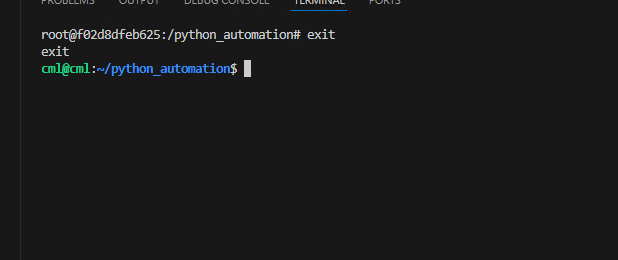
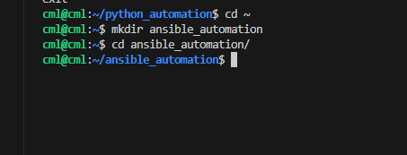
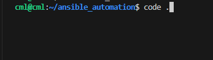
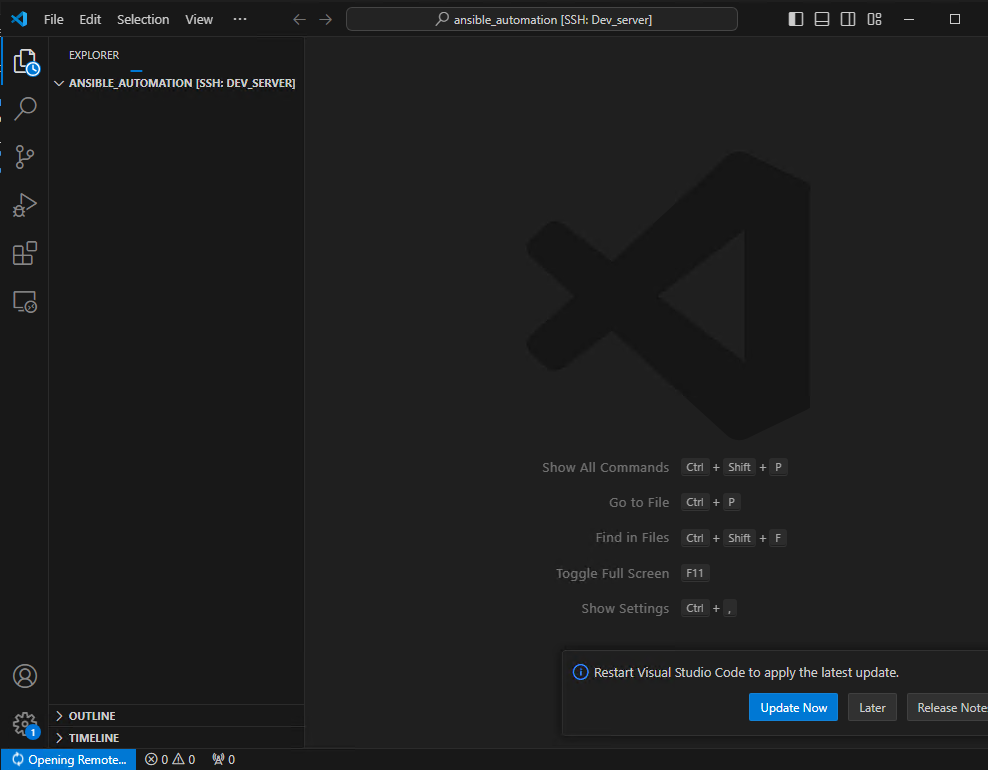
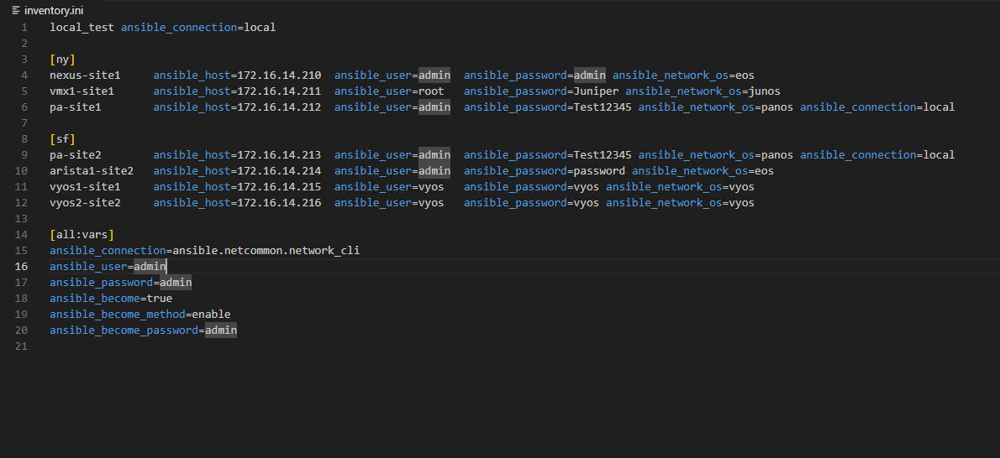
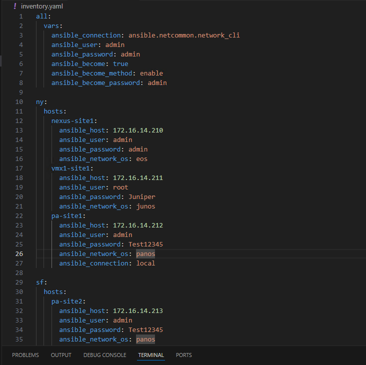

##  Exercise:
### Problem Statement:
### Create an Ansible inventory that includes the following hosts

| Device name  | Device Group |      IP       | username | password | network_os |
|--------------|--------------|---------------|----------|----------|------------|
| nexus-site1  |      ny      | 172.16.14.210 |   admin  | admin    |   nxos     |
| vmx1-site1   |      ny      | 172.16.14.211 |   root   | Juniper  |   junos    |
| pa-site1     |      ny      | 172.16.14.212 |   admin  | Test12345|   panos    |
| pa-site2     |      sf      | 172.16.14.213 |   admin  | Test12345|   panos    |
| arista1-site2|      sf      | 172.16.14.214 |   admin  | password |   eos      |
| vyos1-site1  |      sf      | 172.16.14.215 |   vyos   | vyos     |   vyos     |
| vyos2-site2  |      sf      | 172.16.14.216 |   vyos   | vyos     |   vyos     |


For the host named "local_test," ensure it uses a local connection method. Additionally  
Organize the hosts into groups:
- ny
- sf
- Include variables such as "connection," "network_os," "username," "password," and "become_method" within the inventory.

### Solution
To do this exercise create a folder `ansible_automation` in user's home directory using
- In last excercise we were in containers shell to exit from there run the exit command
```sh
exit
```

- To create a ansible_automation directory in users home directory run the below commands
```sh
cd ~
mkdir ansible_automation
cd ansible_automation
```

- Open the vscode in newly created directory for that lets run the below command
```sh
code .
```


- It will ask you the password for the user, when u give the password, it should open vscode in `ansible_automation` folder


- Lets create a new file with `inventory.ini` with below content  


```ini
local_test ansible_connection=local

[ny]
nexus-site1     ansible_host=172.16.14.210  ansible_user=admin  ansible_password=admin ansible_network_os=nxos
vmx1-site1      ansible_host=172.16.14.211  ansible_user=root   ansible_password=Juniper ansible_network_os=junos
pa-site1        ansible_host=172.16.14.212  ansible_user=admin  ansible_password=Test12345 ansible_network_os=panos ansible_connection=local

[sf]
pa-site2        ansible_host=172.16.14.213  ansible_user=admin  ansible_password=Test12345 ansible_network_os=panos ansible_connection=local
arista1-site2   ansible_host=172.16.14.214  ansible_user=admin  ansible_password=password ansible_network_os=eos
vyos1-site1     ansible_host=172.16.14.215  ansible_user=vyos   ansible_password=vyos ansible_network_os=vyos
vyos2-site2     ansible_host=172.16.14.216  ansible_user=vyos   ansible_password=vyos ansible_network_os=vyos

[all:vars]
ansible_connection=ansible.netcommon.network_cli
ansible_user=admin
ansible_password=admin
ansible_become=true
ansible_become_method=enable
ansible_become_password=admin

```


## YAML FORMAT

1. Create a file named inventory.yaml
2. Copy paste the below content in that file

```yaml
all:
  vars:
    ansible_connection: ansible.netcommon.network_cli
    ansible_user: admin
    ansible_password: admin
    ansible_become: true
    ansible_become_method: enable
    ansible_become_password: admin

ny:
  hosts:
    nexus-site1:
      ansible_host: 172.16.14.210
      ansible_user: admin
      ansible_password: admin
      ansible_network_os: nxos
    vmx1-site1:
      ansible_host: 172.16.14.211
      ansible_user: root
      ansible_password: Juniper
      ansible_network_os: junos
    pa-site1:
      ansible_host: 172.16.14.212
      ansible_user: admin
      ansible_password: Test12345
      ansible_network_os: panos
      ansible_connection: local

sf:
  hosts:
    pa-site2:
      ansible_host: 172.16.14.213
      ansible_user: admin
      ansible_password: Test12345
      ansible_network_os: panos
      ansible_connection: local
    arista1-site2:
      ansible_host: 172.16.14.214
      ansible_user: admin
      ansible_password: password
      ansible_network_os: eos
    vyos1-site1:
      ansible_host: 172.16.14.215
      ansible_user: vyos
      ansible_password: vyos
      ansible_network_os: vyos
    vyos2-site2:
      ansible_host: 172.16.14.216
      ansible_user: vyos
      ansible_password: vyos
      ansible_network_os: vyos

```
Your output should look like this or similar to this


