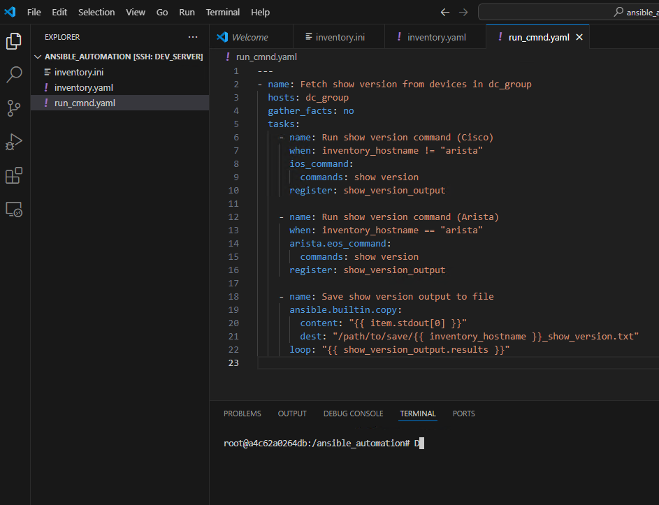

## Exercise:
### Problem Statement:
#### Create an ansible playbook that fetches "show version" output from all devices in dc_group and store it to a file, Make sure to use the Docker environment created earlier for your development.

### Solution
- lets create playbook in your current working directory (that is `ansible_automation`)  create a file `run_cmnd.yaml` with the below content
```yaml
---
- name: Fetch show version from devices in dc_group
  hosts: dc_group
  gather_facts: no
  tasks:
    - name: Run show version command (Cisco)
      when: inventory_hostname != "arista"
      ios_command:
        commands: show version
      register: show_version_output

    - name: Run show version command (Arista)
      when: inventory_hostname == "arista"
      arista.eos_command:
        commands: show version
      register: show_version_output

    - name: Save show version output to file
      ansible.builtin.copy:
        content: "{{ item.stdout[0] }}"
        dest: "/path/to/save/{{ inventory_hostname }}_show_version.txt"
      loop: "{{ show_version_output.results }}"

```
#TODO: above playbook not working
#TODO: fix the issue and update the development dockerfile.

### Execute the above playbook

```
ansible-playbook -i inventory.ini run_cmnd.yaml
```

Make sure the playbook file and the inventory file are in the same directory, or provide the correct path to the playbook file if it's in a different directory.
