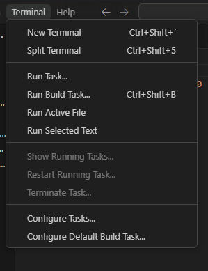
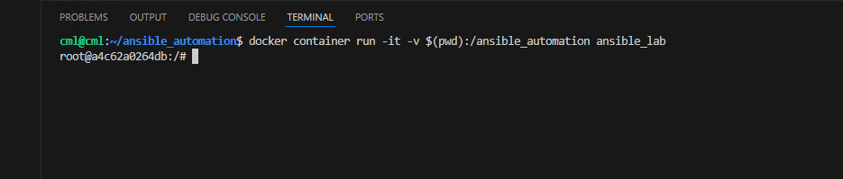
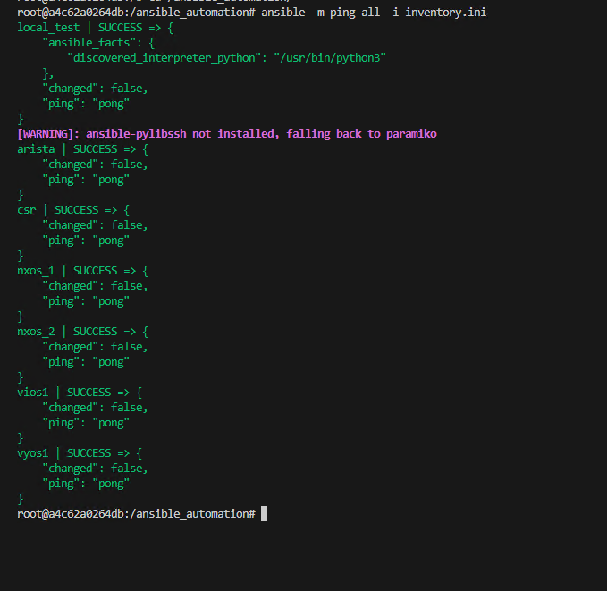
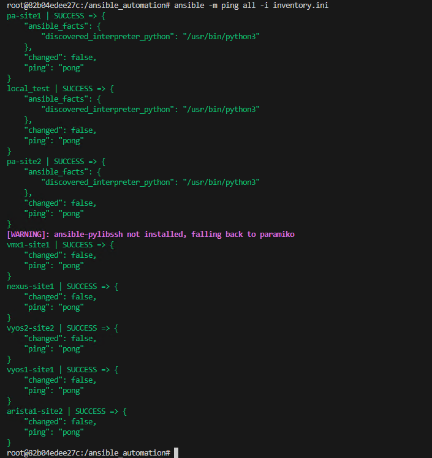

## Exercise:
### Problem Statement:
In the previous task, we created an inventory of devices. Now, we need to use Ansible to ping all the devices in the inventory and check their status. Make sure to use the Docker environment created earlier for your development.

### Solution:

1. Open the terminal.



2. Run the container with the appropriate bind mount using the following command:

```sh
docker container run -it -v $(pwd):/ansible_automation ansible_lab
```
If you encounter issues while creating the Docker image, replace the image name with the one we have already pushed to Docker registry. Use the image name onemindservices2024/naf2024 instead of ansible_lab. The new command will look like this:
```sh
docker container run -it -v $(pwd):/ansible_automation onemindservices2024/naf2024
```


3. Navigate to the `/ansible_automation` directory within the container:

```sh
cd ansible_automation
```


4. Run the following command to ping all devices using an INI inventory:

```sh
ansible -m ping all -i inventory.ini 
```



Alternatively, you can use a YAML inventory with the following command:

```sh
ansible -m ping all -i inventory.yaml 
```

