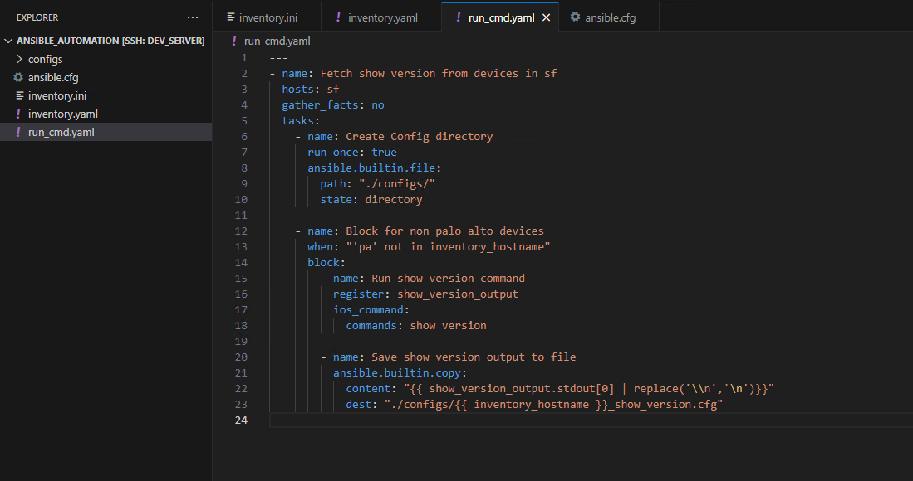
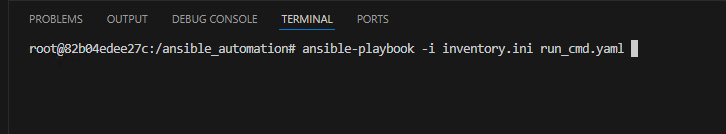
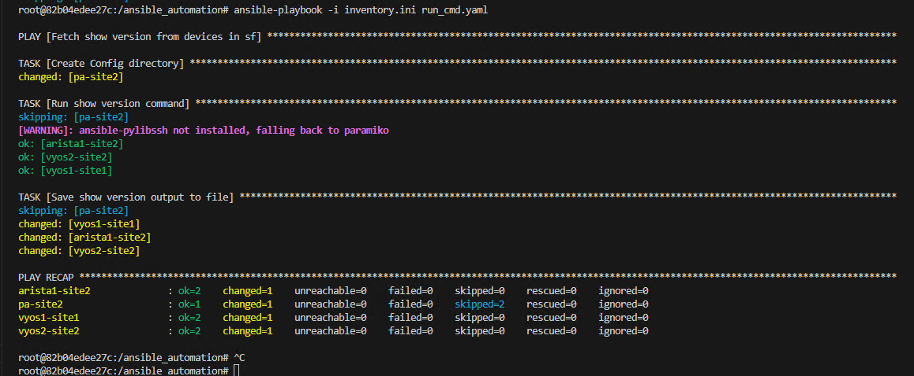
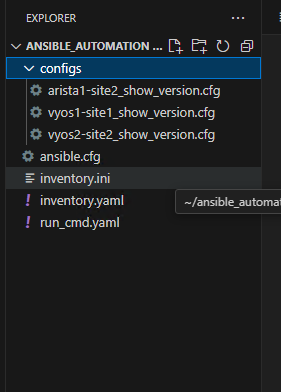

## Exercise:
### Problem Statement:
#### Create an ansible playbook that fetches "show version" output from all devices in dc_group and store it to a file, Make sure to use the Docker environment created earlier for your development.

### Solution
- Create ansible.cfg and add below 2 lines in it otherwise you might run into ssh fingerprint issue while dealing with network devices.
  ```text
  [defaults]
  host_key_checking = False
  ``` 
- lets create playbook in your current working directory (that is `ansible_automation`)  create a file `run_cmnd.yaml` with the below content
```yaml
---
- name: Fetch show version from devices in sf
  hosts: sf
  gather_facts: no
  tasks:
    - name: Create Config directory
      run_once: true
      ansible.builtin.file:
        path: "./configs/"
        state: directory

    - name: Block for non palo alto devices
      when: "'pa' not in inventory_hostname"
      block:
        - name: Run show version command
          register: show_version_output
          ios_command:
            commands: show version

        - name: Save show version output to file
          ansible.builtin.copy:
            content: "{{ show_version_output.stdout[0] | replace('\\n','\n')}}"
            dest: "./configs/{{ inventory_hostname }}_show_version.cfg"
```


### Execute the above playbook

```
ansible-playbook -i inventory.ini run_cmnd.yaml
```
  
Make sure the playbook file and the inventory file are in the same directory, or provide the correct path to the playbook file if it's in a different directory.

The output shows an image similar to the one below:


Additionally, you can find the saved configuration files in the "config" folder within your current working directory:  
Your output should look like this or similar to this


