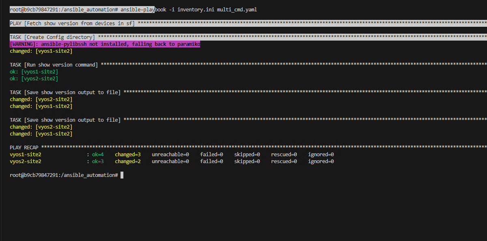
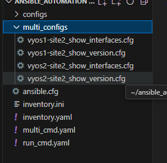

# OBJECTIVE:
### Modify the previous playbook to run multple commands

### Solution
- lets create playbook in your current working directory (that is `ansible_automation`)  create a file `multi_cmnd.yaml` with the below content

```yaml
---

- name: Fetch show version from devices in vyos1-site2,vyos2-site2
  hosts: vyos1-site2,vyos2-site2
  gather_facts: no
  tasks:
    - name: Create Config directory
      run_once: true
      ansible.builtin.file:
        path: "./multi_configs/"
        state: directory

    - name: Run show version command
      register: show_version_output
      vyos_command:
        commands:
          - show version
          - show interfaces

    - name: Save show version output to file
      ansible.builtin.copy:
        content: "{{ show_version_output.stdout[0] | replace('\\n','\n')}}"
        dest: "./multi_configs/{{ inventory_hostname }}_show_version.cfg"
    
    - name: Save show version output to file
      ansible.builtin.copy:
        content: "{{ show_version_output.stdout[1] | replace('\\n','\n')}}"
        dest: "./multi_configs/{{ inventory_hostname }}_show_interfaces.cfg"


```

### Execute the above playbook

```
ansible-playbook -i inventory.ini multi_cmnd.yaml
```

Make sure the playbook file and the inventory file are in the same directory, or provide the correct path to the playbook file if it's in a different directory.

output


Your output should look like this or similar to this


