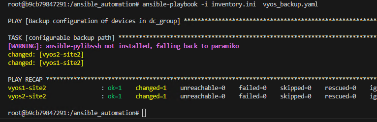
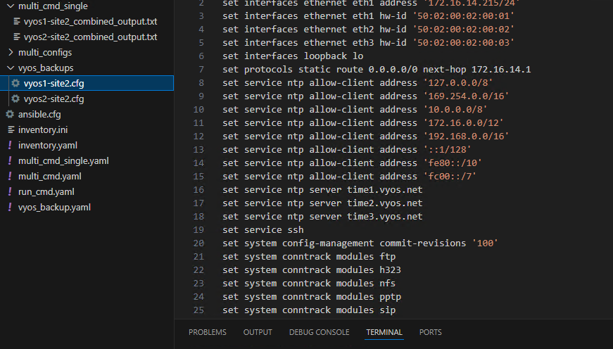

# Backup configuration of all devices

- We could have backed up the device configuratino by using the previous playbook and passing the exact command
- However, there are pre build modules that specifically takes the backup of show run and save them to specific directory
- These modules provide a layer of abstraction


# SOLUTION:
- lets create playbook in your current working directory (that is `ansible_automation`)  create a file `vyos_backup.yaml` with the below content


```yaml
---
- name: Backup configuration of devices in dc_group
  hosts:  vyos1-site2,vyos2-site2
  gather_facts: no
  tasks:
    - name: configurable backup path
      vyos.vyos.vyos_config:
        backup: yes
        backup_options:
          filename: {{ inventory_hostname }}.cfg
          dir_path: ./vyos_backups

```

### You can find more information about vyos modules here
https://docs.ansible.com/ansible/latest/collections/vyos/vyos/index.html

### This is the list of official supported collections
https://docs.ansible.com/ansible/latest/collections/index.html


### Execute the above playbook

```
ansible-playbook -i inventory.ini vyos_backup.yaml
```

Make sure the playbook file and the inventory file are in the same directory, or provide the correct path to the playbook file if it's in a different directory.



