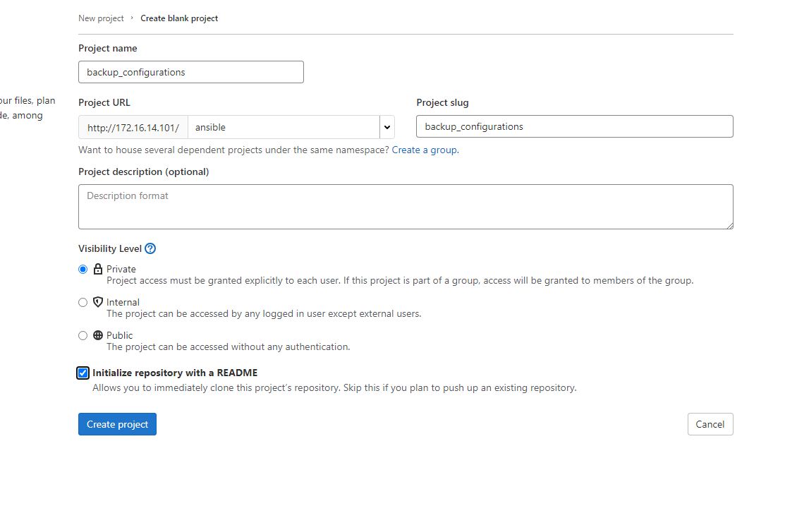
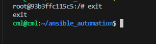
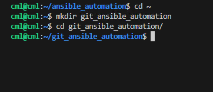
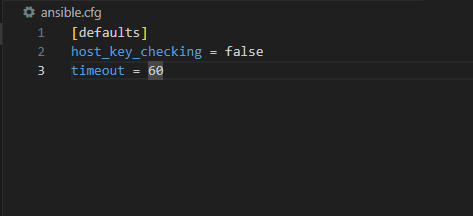
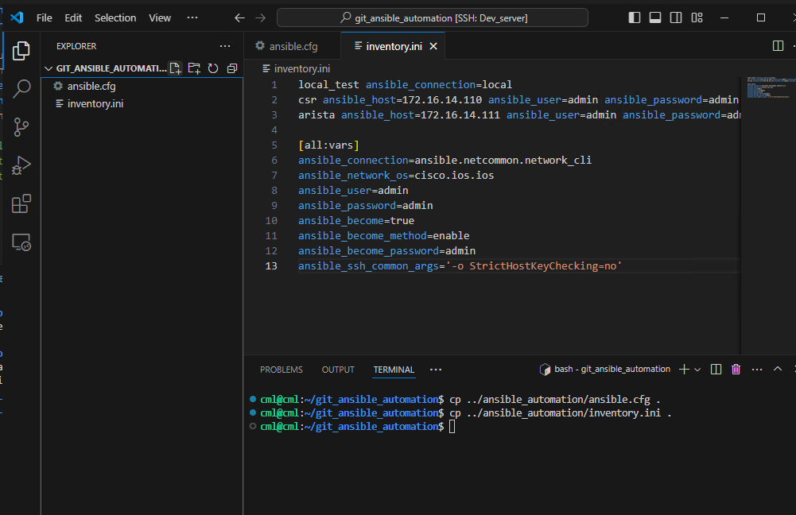
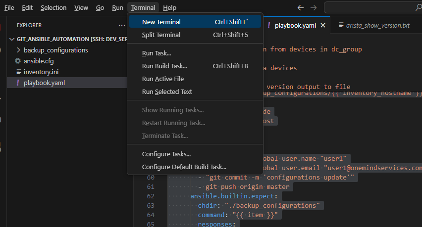
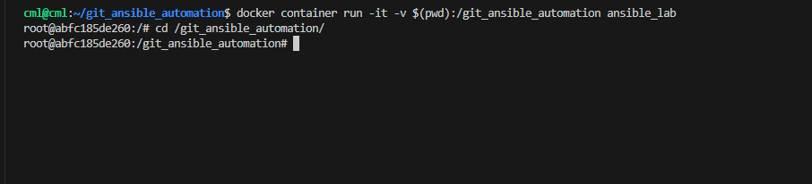
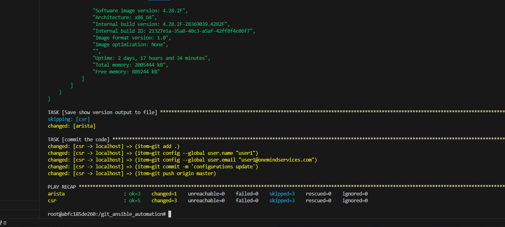
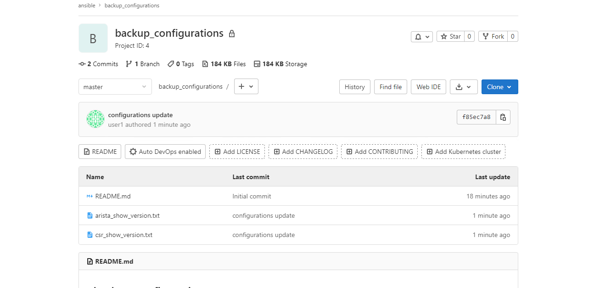
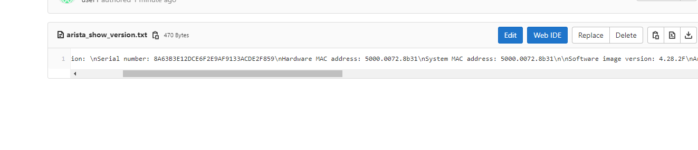

##  Exercise:
### Problem Statement:

1. **GitLab Repository Setup:**
   - Create a private Git repository on GitLab to store router configurations.
   - Ensure that the repository is private to restrict access and maintain security.

2. **Initial Configuration Backup:**
   - Write an Ansible playbook that connects to the device and initiates the configuration backup process.
   - Use Ansible modules like `ios_config` or `nxos_config` to fetch the device configuration.
   - Use Ansible's Git module to upload the backup to the private Git repository on GitLab.


### Solution
## Steps:

### 1. Create a New GitLab Project:
- Click on the plus icon in the top menu.
  
- Click on new project
  
- Click on *create blank project*
- Go to GitLab and create a new project/repository named `backup_configurations`.
  
- Ensure "Initialize repository with a README" is selected.
- Click "Create project".

# Create an Access Token:

- Go to the project's settings and click on "Access Tokens".
- Give a name to the token "access-token-for-python" and generate a new access token.

  

- Copy the access token.

   

- If you're logged into a container, exit from the container using the following command.
  

- Let's create a folder named git_python_automation in the user's home directory using the commands below.
  ```sh
  cd ~
  mkdir git_ansible_automation
  cd git_ansible_automation
  ```
  


- Open Visual Studio Code in the git_ansible_automation folder using the command below.
  ```sh
  code .
  ```
  
 
- Visual Studio Code is now open in the git_ansible_automation directory.
   
  
- Create a new file with name `ansible.cfg` with below content
  ```ini
  [defaults]
  host_key_checking = false
  timeout = 60
  ```
  

- Create a file with name `inventory.ini` with below content
  ```ini
  local_test ansible_connection=local
  csr ansible_host=172.16.14.110 ansible_user=admin ansible_password=admin
  arista ansible_host=172.16.14.111 ansible_user=admin ansible_password=admin ansible_connection=network_cli ansible_network_os=eos
  
  [all:vars]
  ansible_connection=ansible.netcommon.network_cli
  ansible_network_os=cisco.ios.ios
  ansible_user=admin
  ansible_password=admin
  ansible_become=true
  ansible_become_method=enable
  ansible_become_password=admin
  ansible_ssh_common_args='-o StrictHostKeyChecking=no'
  ```
  
  

- Create a playbook with `playbook.yaml` name with below content
  ```python
  ---
  - name: Fetch show version from devices in dc_group
    hosts: csr, arista
    gather_facts: no
    vars: 
      gitlab_username: ansible
      gitlab_password: cisco!23
    tasks:
      - name: Clone the gitlab repository
        delegate_to: localhost
        run_once: true
        ansible.builtin.expect:
          command: git clone http://172.16.14.101/ansible/backup_configurations.git --verbose
          responses:
            (?i)Username: "{{ gitlab_username }}"
            (?i)Password: "{{ gitlab_password }}"
      
      - name: For non arista devices
        when: inventory_hostname != "arista"
        block:
          - name: Run show version command (Cisco)
            register: show_version_output
            ios_command:
              commands: show version
          
          - name: debug
            debug:
              msg: "{{ show_version_output }}"
          
          - name: Save show version output to file
            ansible.builtin.copy:
              content: "{{ show_version_output.stdout }}"
              dest: "./backup_configurations/{{ inventory_hostname }}_show_version.txt"
  
      - name: For non arista devices
        when: inventory_hostname == "arista"
        block:
          - name: run multiple commands on remote 
            register: show_version_output
            arista.eos.eos_command:
              commands:
                - show version
          
          - name: debug
            debug:
              msg: "{{ show_version_output }}"
  
          - name: Save show version output to file
            ansible.builtin.copy:
              content: "{{ show_version_output.stdout }}"
              dest: "./backup_configurations/{{ inventory_hostname }}_show_version.txt"
      
      - name: commit the code
        delegate_to: localhost
        run_once: true
        with_items:
          - "git add ."
          - git config --global user.name "user1"
          - git config --global user.email "user1@onemindservices.com"
          - "git commit -m 'configurations update'"
          - git push origin master
        ansible.builtin.expect:
          chdir: "./backup_configurations"
          command: "{{ item }}"
          responses:
            (?i)Username: "{{ gitlab_username }}"
            (?i)Password: "{{ gitlab_password }}"
  
  ```

1. Open the terminal.

   

2. Run the container with the appropriate bind mount using the following command:

   ```sh
   docker container run -it -v $(pwd):/git_ansible_automation ansible_lab
   ```
3. Navigate to the `/git_ansible_automation` directory within the container:

   ```sh
   cd /git_ansible_automation
   ```

   

4. Run the ansible playbook using below command:

   ```sh
   ansible-playbook -i inventory.ini playbook.yaml
   ```
   Sample Output
   
   

5. Now check if the backup configuration exists on GitLab.
   
   
   


In this lab, we established a infrastructure by creating a private Git repository on GitLab to store router configurations, ensuring data confidentiality. We then automated the configuration backup process using Ansible, enhancing efficiency and reliability.
