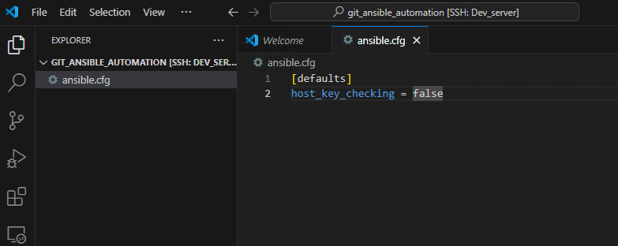

( ansible )
172.16.14.110
Take configuration backup of the device
Upload to Gitlab
Make changes to device configuration ( manually, make a change like add a loopback interface or change existing IP to a new value )
!
interface Loopback0
 ip address 1.1.1.1 255.255.255.0
 no shut
!
Take another backup
Upload to Gitlab
Show file history to show the diff

##  Exercise:
### Problem Statement:

1. **GitLab Repository Setup:**
   - Create a private Git repository on GitLab to store router configurations.
   - Ensure that the repository is private to restrict access and maintain security.

2. **Initial Configuration Backup:**
   - Write an Ansible playbook that connects to the device and initiates the configuration backup process.
   - Use Ansible modules like `ios_config` or `nxos_config` to fetch the device configuration.
   - Use Ansible's Git module to upload the backup to the private Git repository on GitLab.

3. **Manual Configuration Modification:**
   - Allow the Python program to prompt the user for necessary information:
     - Username
     - IP address
     - Password
     - Port
   - Manually modify the device configuration by adding a loopback interface or changing an existing IP address.


### Solution
## Steps:

### 1. Create a New GitLab Project:
- in the top menu click on plus icon

- click on new project

- click on *create blank project*
- Go to GitLab and create a new project/repository named `backup_configurations`.

- Ensure "Initialize repository with a README" is selected.
- Click "Create project".

#TODO: add create token step here. 

- first, exit from the running container using `exit` command


- now lets create a folder with name `git_ansible_automation` in user's home directory using below commands
```sh
cd ~
mkdir git_ansible_automation
cd git_ansible_automation
```


- open the vscode in `git_ansible_automation` using below command
```sh
code .
```


- create a new file with name `ansible.cfg` with below content
```ini
[defaults]
host_key_checking = false
```


- create a file with name `inventory.ini` with below content
```ini
local_test ansible_connection=local
csr ansible_host=172.16.14.110 ansible_user=admin ansible_password=admin
arista ansible_host=172.16.14.111 ansible_user=admin ansible_password=admin ansible_connection=network_cli ansible_network_os=eos

[all:vars]
ansible_connection=ansible.netcommon.network_cli
ansible_network_os=cisco.ios.ios
ansible_user=admin
ansible_password=admin
ansible_become=true
ansible_become_method=enable
ansible_become_password=admin
ansible_ssh_common_args='-o StrictHostKeyChecking=no'
```


- create a playbook with `playbook.yaml` name with below content
```python
---
- name: Fetch show version from devices in dc_group
  hosts: csr, arista
  gather_facts: no
  vars: 
    gitlab_username: ansible
    gitlab_password: cisco!23
  tasks:
    - name: Clone the gitlab repository
      delegate_to: localhost
      run_once: true
      ansible.builtin.expect:
        command: git clone http://172.16.14.101/ansible/backup_configurations.git --verbose
        responses:
          (?i)Username: "{{ gitlab_username }}"
          (?i)Password: "{{ gitlab_password }}"
    
    - name: For non arista devices
      when: inventory_hostname != "arista"
      block:
        - name: Run show version command (Cisco)
          register: show_version_output
          ios_command:
            commands: show version
        
        - name: debug
          debug:
            msg: "{{ show_version_output }}"
        
        - name: Save show version output to file
          ansible.builtin.copy:
            content: "{{ show_version_output.stdout }}"
            dest: "./backup_configurations/{{ inventory_hostname }}_show_version.txt"

    - name: For non arista devices
      when: inventory_hostname == "arista"
      block:
        - name: run multiple commands on remote 
          register: show_version_output
          arista.eos.eos_command:
            commands:
              - show version
        
        - name: debug
          debug:
            msg: "{{ show_version_output }}"

        - name: Save show version output to file
          ansible.builtin.copy:
            content: "{{ show_version_output.stdout }}"
            dest: "./backup_configurations/{{ inventory_hostname }}_show_version.txt"
    
    - name: commit the code
      delegate_to: localhost
      run_once: true
      with_items:
        - "git add ."
        - git config --global user.name "user1"
        - git config --global user.email "user1@onemindservices.com"
        - "git commit -m 'configurations update'"
        - git push origin master
      ansible.builtin.expect:
        chdir: "./backup_configurations"
        command: "{{ item }}"
        responses:
          (?i)Username: "{{ gitlab_username }}"
          (?i)Password: "{{ gitlab_password }}"

```

1. Open the terminal.


2. Run the container with the appropriate bind mount using the following command:

```sh
docker container run -it -v $(pwd):/git_ansible_automation ansible_lab
```
3. Navigate to the `/git_ansible_automation` directory within the container:

```sh
cd /git_ansible_automation
```


4. Run the ansible playbook using below command:

```sh
ansible-playbook -i inventory.ini playbook.yaml
```
you can see the output like below screenshot


- now go to gitlab and check the backup configuration there or not.

