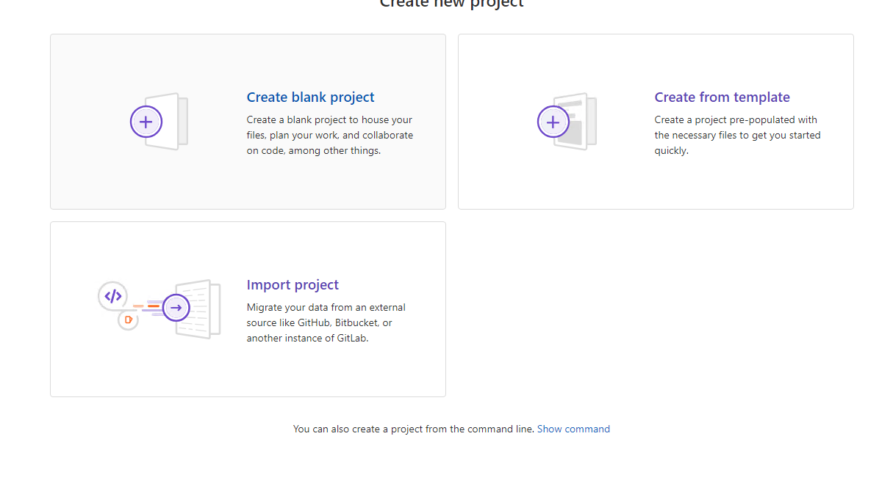

( ansible )
172.16.14.110
Take configuration backup of the device
Upload to Gitlab
Make changes to device configuration ( manually, make a change like add a loopback interface or change existing IP to a new value )
!
interface Loopback0
 ip address 1.1.1.1 255.255.255.0
 no shut
!
Take another backup
Upload to Gitlab
Show file history to show the diff

### Solution
## Steps:

### 1. Create a New GitLab Project:
- in the top menu click on plus icon

- click on new project

- click on *create blank project*
- Go to GitLab and create a new project/repository named `backup_configurations`.

- Ensure "Initialize repository with a README" is selected.
- Click "Create project".
