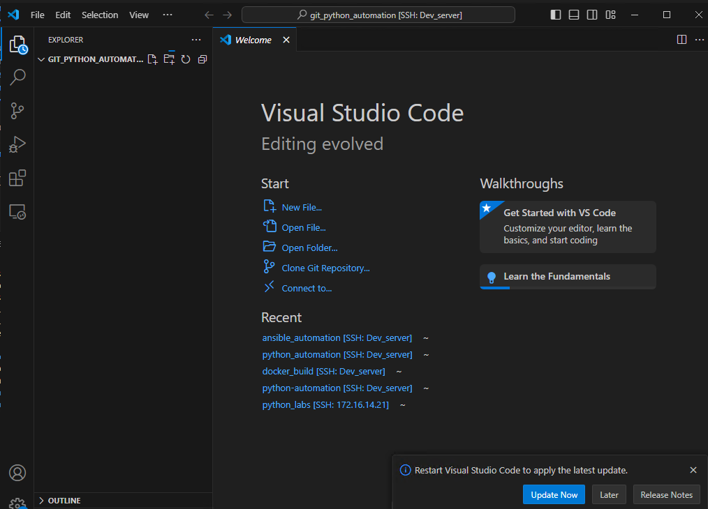

##  Exercise:
### Problem Statement:

1. **GitLab Repository Setup:**
   - Create a private Git repository on GitLab to store router configurations.
   - Ensure that the repository is private to restrict access and maintain security.

2. **Initial Configuration Backup:**
   - Write an Ansible playbook that connects to the device and initiates the configuration backup process.
   - Use Ansible modules like `ios_config` or `nxos_config` to fetch the device configuration.
   - Use Ansible's Git module to upload the backup to the private Git repository on GitLab.


### Solution
## Steps:

### 1. Create a New GitLab Project:
- Click on the plus icon in the top menu.
  
- Click on new project
  
- Click on *create blank project*
- Go to GitLab and create a new project/repository named `backup_configurations`.
  
- Ensure "Initialize repository with a README" is selected.
- Click "Create project".

- If you're logged into a container, exit from the container using the following command.
  

- Let's create a folder named git_python_automation in the user's home directory using the commands below.
  ```sh
  cd ~
  mkdir git_ansible_automation
  cd git_ansible_automation
  ```
  


- Open Visual Studio Code in the git_ansible_automation folder using the command below.
  ```sh
  code .
  ```
  
 
- Visual Studio Code is now open in the git_ansible_automation directory.
   
  
- Create a new file with name `ansible.cfg` with below content
  ```ini
  [defaults]
  host_key_checking = false
  timeout = 60
  ```
  

- Create a file with name `inventory.ini` with below content
```ini
local_test ansible_connection=local

[ny]
nexus-site1     ansible_host=172.16.14.210  ansible_user=admin  ansible_password=admin ansible_network_os=nxos
vmx1-site1      ansible_host=172.16.14.211  ansible_user=root   ansible_password=Juniper ansible_network_os=junos
pa-site1        ansible_host=172.16.14.212  ansible_user=admin  ansible_password=Test12345 ansible_network_os=panos ansible_connection=local

[sf]
pa-site2        ansible_host=172.16.14.213  ansible_user=admin  ansible_password=Test12345 ansible_network_os=panos ansible_connection=local
arista1-site2   ansible_host=172.16.14.214  ansible_user=admin  ansible_password=password ansible_network_os=eos
vyos1-site2     ansible_host=172.16.14.215  ansible_user=vyos   ansible_password=vyos ansible_network_os=vyos
vyos2-site2     ansible_host=172.16.14.216  ansible_user=vyos   ansible_password=vyos ansible_network_os=vyos

[all:vars]
ansible_connection=ansible.netcommon.network_cli
ansible_user=admin
ansible_password=admin
ansible_become=true
ansible_become_method=enable
ansible_become_password=admin
  ```
  
 

- Create a playbook with `playbook.yaml` name with below content

```yaml
---
- name: Fetch show version from devices in dc_group
  hosts: vyos1-site2,vyos2-site2
  gather_facts: no
  vars: 
    gitlab_username: ansible
    gitlab_password: cisco!23
  tasks:
    - name: Clone the gitlab repository
      delegate_to: localhost
      run_once: true
      ansible.builtin.expect:
        command: git clone http://172.16.14.202/ansible/backup_configurations.git --verbose
        responses:
          (?i)Username: "{{ gitlab_username }}"
          (?i)Password: "{{ gitlab_password }}"
    
    - name: Run show version command
      register: show_version_output
      vyos_command:
        commands:
          - show version
          - show interfaces
    
    - name: Concatenate show version and show IP interface brief outputs
      set_fact:
        combined_output: "{{ show_version_output.stdout[0] }}\n\n{{ show_version_output.stdout[1] }}"

    - name: Save show version output to file
      ansible.builtin.copy:
        content: "{{ show_version_output.stdout[0] | replace('\\n','\n')}}"
        dest: "./backup_configurations/{{ inventory_hostname }}_show_version.cfg"
    
    - name: Save show version output to file
      ansible.builtin.copy:
        content: "{{ show_version_output.stdout[1] | replace('\\n','\n')}}"
        dest: "./backup_configurations/{{ inventory_hostname }}_show_interfaces.cfg"
    
    - name: commit the code
      delegate_to: localhost
      run_once: true
      with_items:
        - "git add ."
        - git config --global user.name "user1"
        - git config --global user.email "user1@onemindservices.com"
        - "git commit -m 'configurations update'"
        - git push origin master
      ansible.builtin.expect:
        chdir: "./backup_configurations"
        command: "{{ item }}"
        responses:
          (?i)Username: "{{ gitlab_username }}"
          (?i)Password: "{{ gitlab_password }}"
```

1. Open the terminal.

   

2. Run the container with the appropriate bind mount using the following command:

   ```sh
   docker container run -it -v $(pwd):/git_ansible_automation ansible_lab
   ```
3. Navigate to the `/git_ansible_automation` directory within the container:

   ```sh
   cd /git_ansible_automation
   ```

   

4. Run the ansible playbook using below command:

   ```sh
   ansible-playbook -i inventory.ini playbook.yaml
   ```
   Sample Output
   
   

5. Now check if the backup configuration exists on GitLab.
   
   
   


In this lab, we established a infrastructure by creating a private Git repository on GitLab to store router configurations, ensuring data confidentiality. We then automated the configuration backup process using Ansible, enhancing efficiency and reliability.
