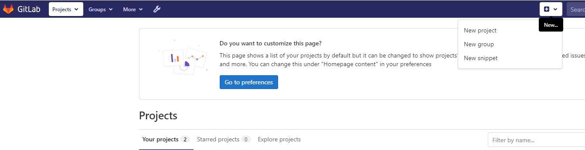

( ansible )
172.16.14.110
Take configuration backup of the device
Upload to Gitlab
Make changes to device configuration ( manually, make a change like add a loopback interface or change existing IP to a new value )
!
interface Loopback0
 ip address 1.1.1.1 255.255.255.0
 no shut
!
Take another backup
Upload to Gitlab
Show file history to show the diff

##  Exercise:
### Problem Statement:

1. **GitLab Repository Setup:**
   - Create a private Git repository on GitLab to store router configurations.
   - Ensure that the repository is private to restrict access and maintain security.

2. **Initial Configuration Backup:**
   - Develop a Python program that initiates the configuration backup process of the device.
   - Automatically upload the backup to the private Git repository on GitLab.

3. **Manual Configuration Modification:**
   - Allow the Python program to prompt the user for necessary information:
     - Username
     - IP address
     - Password
     - Port
   - Manually modify the device configuration by adding a loopback interface or changing an existing IP address.

4. **Second Configuration Backup:**
   - After manual changes, trigger the Python program to take another backup of the device configuration.
   - Upload the modified configuration to the GitLab repository, ensuring it reflects the manual changes made.

5. **Version Tracking and Comparison:**
   - Utilize GitLab's file history or similar functionality to track the versions of the configuration files.
   - Provide a mechanism in the Python program to display the differences between the initial and modified configurations.

### Solution
## Steps:

### 1. Create a New GitLab Project:
- in the top menu click on plus icon

- click on new project

- click on *create blank project*
- Go to GitLab and create a new project/repository named `backup_configurations`.

- Ensure "Initialize repository with a README" is selected.
- Click "Create project".
