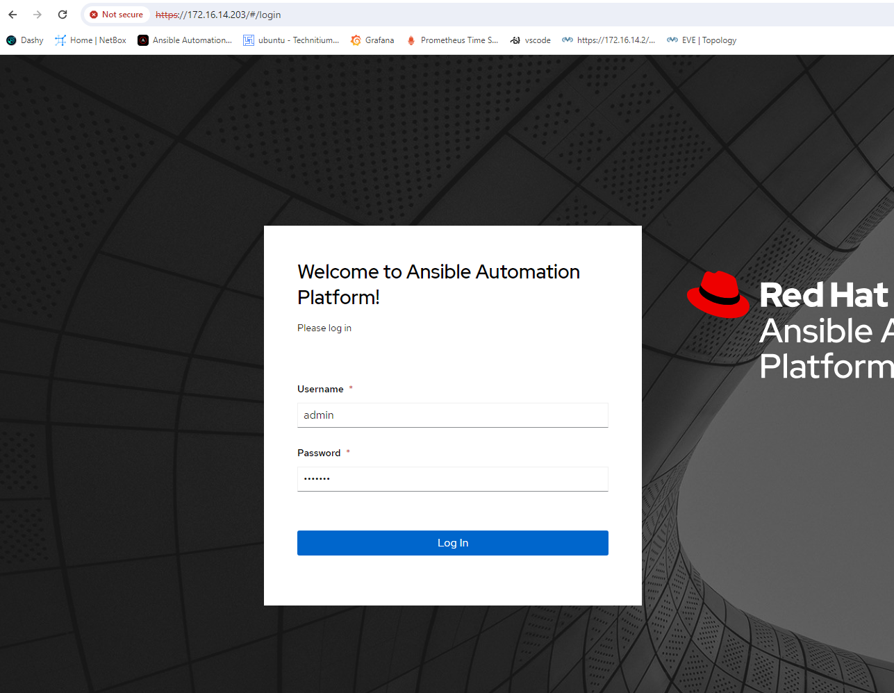
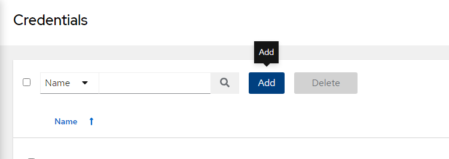
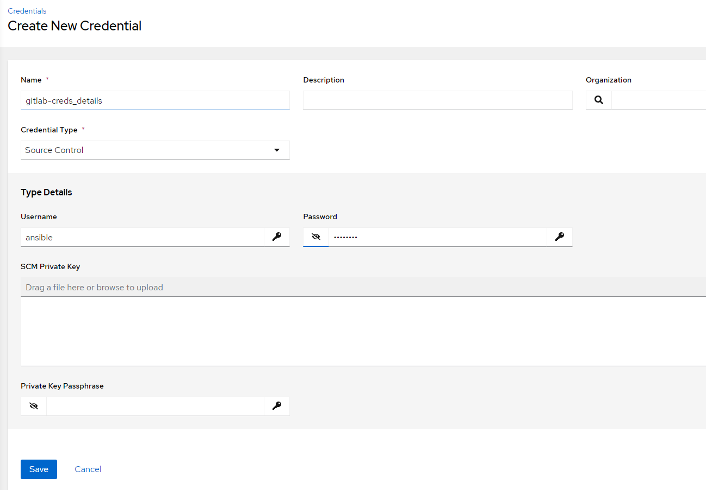
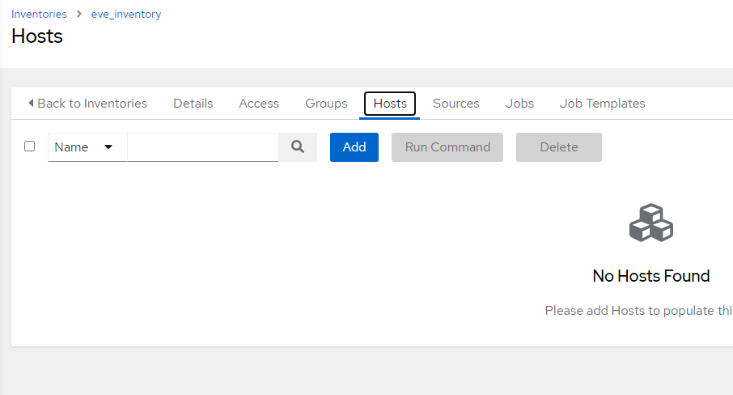
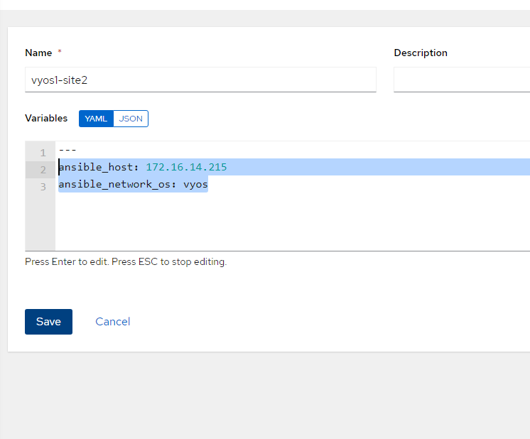
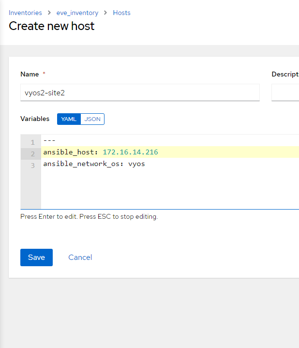

## Problem Statement: 
### GitLab Integration with Ansible Tower
Let's utilize Ansible Tower to execute all the tasks we completed in the previous exercise and initiate the playbook through Ansible Tower.

## Steps


- first login to ansible tower details of the tower you can found in the first lab.


#### Creation of GitLab Credentials in AAP:

   - Navigate to the "Credentials" section in AAP.

   

   - Click on "Add Credentials" and select "Source control" as the credential type.
   
   - Provide the required GitLab credentials(username and password).
   - Save the credential configuration.
   

  - GitLab credentials are configured within AAP, allowing seamless access to the GitLab repository.


#### Inventory Creation in Ansible Automation Platform (AAP):
- Navigate to the "Inventory" section under Resources.


- Click on "Add" and enter "eve_inventory" as the name and select organization as default.
  

- Next add a host "vyos1-site2" to the inventory.
  - go to hosts in eve_inventory
  
  - click on add fil the below details
  ```yaml
    ---
    ansible_host: 172.16.14.215
    ansible_network_os: vyos
  ```
  
  - click on save
  - lets add one more host go to hosts again
  
  
  - click on add and fill the below details

- Next add a host "vyos2-site2" to the inventory.
  ```yaml
    ---
    ansible_host: 172.16.14.216
    ansible_network_os: vyos
  ```
  
- click on save and now you can see we have 2 devices in our inventory


#### now lets create creds for these routers that we are going to use in our inventory


- create a project in gitlab


- open the repo in web ide


- create the files that we created in last lab (playbook.yaml, ansible.cfg)
  ```bash
  cd backup_configurations
  ```
- Move playbook.yml into backup_configurations

  

- Use the command `git add` to add files to the repository.
   ```bash
   git add .
   ```

- Commit the files using the command
   ```bash
   git commit -m "Adding playbook.yaml
   ```
  

- Push changes to the repository

   ```bash
   git push origin master
   ```
   When prompted pass the username and password

   


### 5. Project Creation with GitLab as Source Control:

  - Navigate to the "Projects" section in AAP.
  - Click on "Create Project" and specify config-backup as the name.
  - Choose Git as the source control type and add the source control url and branch
  - Link the project to the previously configured GitLab credentials.
  - Save the project configuration.

  

  - A project is created within AAP, utilizing GitLab as the source control system for storing and managing automation scripts.

### 6. Template Creation and Scheduled Execution:

  - Create a template with "router-backup-conf" as the name.
  - Select eve-inventory and backup-config for inventory and the project.
  - Select playbook.yaml as the playbook.
  - Link the previously configured server-creds.
  - Click create template

  

  - Schedule the playbook as shown below.

  

  - An Ansible template is developed within the AAP project, automating lab infrastructure setup and configuration.

### 7. Template Execution:
  - Launch the template from templates section.
    
   

  - Check the status of the job

  

In this lab, we successfully automated the process of backing up configurations and integrating Ansibke with Git for version control using GitLab.
