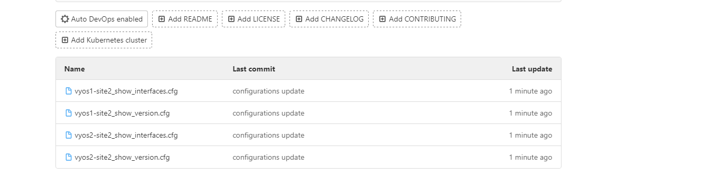

## Problem Statement: 
### GitLab Integration with Ansible Tower
Let's utilize Ansible Tower to execute all the tasks we completed in the previous exercise and initiate the playbook through Ansible Tower.

## Steps


- first login to ansible tower details of the tower you can found in the first lab.


#### Creation of GitLab Credentials in AAP:

   - Navigate to the "Credentials" section in AAP.

   

   - Click on "Add Credentials" and select "Source control" as the credential type.
   
   - Provide the required GitLab credentials(username and password).
   - Save the credential configuration.
   

  - GitLab credentials are configured within AAP, allowing seamless access to the GitLab repository.


#### Inventory Creation in Ansible Automation Platform (AAP):
- Navigate to the "Inventory" section under Resources.


- Click on "Add" and enter "eve_inventory" as the name and select organization as default.
  

- Next add a host "vyos1-site2" to the inventory.
  - go to hosts in eve_inventory
  
  - click on add fil the below details
  ```yaml
    ---
    ansible_host: 172.16.14.215
    ansible_network_os: vyos
  ```
  
  - click on save
  - lets add one more host go to hosts again
  
  
  - click on add and fill the below details

- Next add a host "vyos2-site2" to the inventory.
  ```yaml
    ---
    ansible_host: 172.16.14.216
    ansible_network_os: vyos
  ```
  
- click on save and now you can see we have 2 devices in our inventory


#### now lets create creds for these routers that we are going to use in our inventory
 - Click on "Add Credentials" and select "machine" as the credential type.
 
 
- fill the details as per your need

- click on save

#### Now Create a custom creds that are going to use for the clone the repo and also pushing the code into that repo.
- go to credential type

- click on add
- fill the details like name *Gitlab Creds*
    - input configurations
    ```yaml
    fields:
      - id: gitlab_username
        type: string
        label: Gitlab user
        secret: false
      - id: gitlab_password
        type: string
        label: Gitlab Password
        secret: true
    required:
      - gitlab_username
      - gitlab_password
    ```
    - injector configurations
    ```yaml
    extra_vars:
      gitlab_password: '{{ gitlab_password }}'
      gitlab_username: '{{ gitlab_username }}'
    ```
    


- now go to credentials and create new credential with  type (Gitlab Creds) 
- click on add and fill the details

- click on save

#### Now our required steps are completed now we have to go to gitlab and commit our playbook in gitlab repository. 
- now go to gitlab and create the project (my project name is gitlab-ansible-tower) feel free to change it.


- open the repo in web ide


- create the files that we created in last lab (playbook.yaml)
with below content


```yaml
---
- name: Fetch show version from devices in dc_group
  hosts: vyos1-site2,vyos2-site2
  gather_facts: no

  tasks:
    - name: Clone the gitlab repository
      delegate_to: localhost
      run_once: true
      ansible.builtin.expect:
        command: git clone http://172.16.14.202/ansible/backup_configurations.git --verbose
        responses:
          (?i)Username: "{{ gitlab_username }}"
          (?i)Password: "{{ gitlab_password }}"
    
    - name: Run show version command
      register: show_version_output
      vyos_command:
        commands:
          - show version
          - show interfaces

    - name: Get current date and time
      set_fact:
        current_datetime: "{{ '%Y-%m-%d %H:%M:%S' | strftime }}"
    
    - name: Save show version output to file
      ansible.builtin.copy:
        content: "# This code is dynamically generated by Ansible {{ current_datetime }}\n{{ show_version_output.stdout[0] | replace('\\n','\n')}}"
        dest: "./backup_configurations/{{ inventory_hostname }}_show_version.cfg"
    
    - name: Save show version output to file
      ansible.builtin.copy:
        content: "# This code is dynamically generated by Ansible {{ current_datetime }}\n{{ show_version_output.stdout[1] | replace('\\n','\n')}}"
        dest: "./backup_configurations/{{ inventory_hostname }}_show_interfaces.cfg"

    - name: commit the code
      delegate_to: localhost
      run_once: true
      with_items:
        - "git add ."
        - git config --global user.name "user1"
        - git config --global user.email "user1@onemindservices.com"
        - "git commit -m 'configurations update'"
        - git push origin master
      ansible.builtin.expect:
        chdir: "./backup_configurations"
        command: "{{ item }}"
        responses:
          (?i)Username: "{{ gitlab_username }}"
          (?i)Password: "{{ gitlab_password }}"

```
- click on *commit...*


- click on commit to the master branch


#### now we have placed our project in gitlab let's go to the ansible tower create project in it.


### 5. Project Creation with GitLab as Source Control:

  - Navigate to the "Projects" section in AAP.


  - Click on "add" and specify config-backup as the name.

  - Choose Git as the source control type and add the source control url and branch
  - Link the project to the previously configured GitLab credentials.
  - Save the project configuration.

  

  - A project is created within AAP, utilizing GitLab as the source control system for storing and managing automation scripts.

### 6. Template Creation and Scheduled Execution:
  - go to the template

  
  - click on *add job template*


  - Create a template with "router-backup-conf" as the name.
  - Select eve-inventory and backup-config for inventory and the project.
  - Select playbook.yaml as the playbook.
  - Link the previously configured creds. (select routers_creds, gitlab user details)
  - Click create template


  

  - Schedule the playbook as shown below.

  

  - An Ansible template is developed within the AAP project, automating lab infrastructure setup and configuration.

### 7. Template Execution:
  - go to templates list
  - select the template that u just created
  - click on lauch
 

- now you can go and check in gitlab your configurations files updated


In this lab, we successfully automated the process of backing up configurations and integrating Ansibke with Git for version control using GitLab.
