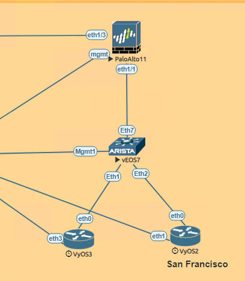
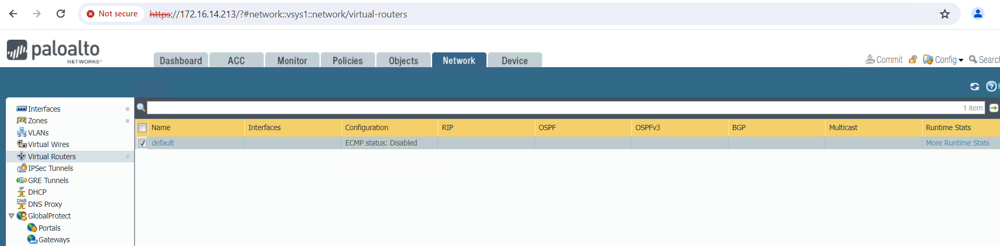
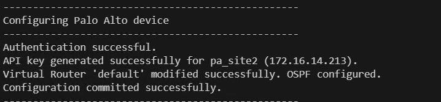
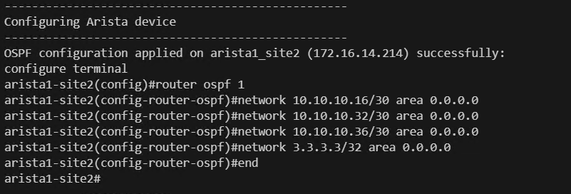
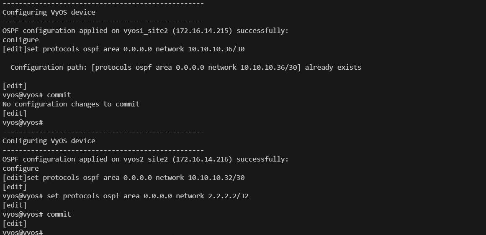

need to have panos and pan-python
# Multi-Vendor Network Automation: LAN OSPF Configuration San Francisco site(PALO ALTO OS, Arista OS, Juniper OS).

# Lab topology
Please find below lab topology used for this lab demonstration.


# Devices used for current excercise:
Below is the topology for the San Francisco site which we are going to use for configuring OSPF.



### Problem Statement:
* Configure dynamic Routing Protocol in San Francisco site.

### Solution
* We will create ospf between VYOS and Arista OS device at newyork site.
* We will create ospf between Arista OS and Palo alto device at newyork site.


### Lab guide:
Steps:
1. Create device_vars_sf.py and add below config.

Description: In below we are creating device variables file which will be having the three device details Nexus OS and palo Alto OS and Juniper OS. This file is having dictionary with three device IP details and username and password our script will authenticate to the devices using these details. 

```python
# device_vars_sf.py

devices_vars = {
    "pa_site2": {
        "device_type": "paloalto_panos",
        "host": "172.16.14.213",
        "username": "admin",
        "password": "Test12345",
        "port": 22,
        "secret": "Test12345"
    },
    "arista1_site2": {
        "device_type": "arista_eos",
        "host": "172.16.14.214",
        "username": "admin",
        "password": "password",
        "port": 22,
        "secret": "admin",
        "timeout": 60
    },
    "vyos1_site2": {
        "device_type": "vyos",
        "host": "172.16.14.215",
        "username": "vyos",
        "password": "vyos",
        "port": 22,
        "secret": "admin"
    },
    "vyos2_site2": {
        "device_type": "vyos",
        "host": "172.16.14.216",
        "username": "vyos",
        "password": "vyos",
        "port": 22,
        "secret": "admin"
    }
}
```
2. Create configurations_sf.py and add below command.

Description: Below is the configuration which we define for each device. In total we have three different devices. So we are defining three dictionary vyos1_config, vyos2_config, arista_config, Palo_alto_config. Each dictionary is having OSPF required information for configuring the OSPF on those devices.
```python
# configurations_sf.py

vyos1_config = {
    'device_ip': '172.16.14.216',
    'ospf_network': ['10.10.10.32/30','2.2.2.2/32'],
}

vyos2_config = {
    'device_ip': '172.16.14.215',
    'ospf_network': ['10.10.10.36/30'],
}

arista_config ={
    'ospf_network': ['10.10.10.16/30','10.10.10.32/30','10.10.10.36/30','3.3.3.3/32']
}

palo_alto_config= {
    'device_ip': '172.16.14.213',
    'router_id' : "10.10.10.21",
    'interfaces' :['ethernet1/1']
}
```
3. Create config_sf.py and add below config

Description: Below mentioned code will configure the OSPF on all the devices. Below is the brief description about each function which is defined in the code.

check_ssh_connectivity: This function will check the connectivity status to the all devices before configuring the OSPF.

apply_ospf_config_vyos: This function uses the netmiko library and configures the VYOS device.


apply_ospf_config_arista: This function uses the netmiko library and configures the arista device.

generate_palo_alto_api_key: This function connects to the Palo Alto device and generates the API token for rest API.

modify_virtual_router: This function modifies the virtual router in the Palo Alto and enables the OSPF in it.

commit_configuration: This function safe The PALO Alto configuration.

```python
import requests
import xml.etree.ElementTree as ET
from netmiko import ConnectHandler
from device_vars_sf import devices_vars
from configurations_sf import vyos1_config, vyos2_config, arista_config, palo_alto_config
import urllib3

# Suppress insecure request warnings from the requests module
urllib3.disable_warnings(urllib3.exceptions.InsecureRequestWarning)

def check_ssh_connectivity(device_name, device_info):
    try:
        # Create connection handler
        net_connect = ConnectHandler(**device_info)
        net_connect.disconnect()
        print(f"SSH connection to {device_name} ({device_info['host']}) successful.")
        return True

    except Exception as e:
        print(f"Failed to establish SSH connection to {device_name} ({device_info['host']}): {e}")
        return False

def apply_ospf_config_vyos(device_name, device_info, ospf_config):
    try:
        # Create connection handler
        net_connect = ConnectHandler(**device_info)

        # Prepare OSPF configuration commands for VyOS devices
        ospf_commands = []

        # Add OSPF network commands
        for network in ospf_config['ospf_network']:
            ospf_commands.append(f"set protocols ospf area 0.0.0.0 network {network}")
        ospf_commands.append('commit')

        # Send OSPF configuration commands
        output = net_connect.send_config_set(ospf_commands)
        print(f"OSPF configuration applied on {device_name} ({device_info['host']}) successfully:")
        print(output)

        # Disconnect from device
        net_connect.disconnect()

    except Exception as e:
        print(f"Failed to apply OSPF configuration on {device_name} ({device_info['host']}): {e}")

def apply_ospf_config_arista(device_name, device_info, ospf_config):
    try:
        # Create connection handler
        net_connect = ConnectHandler(**device_info)

        # Prepare OSPF configuration commands for Arista devices
        ospf_commands = [
            "router ospf 1"
        ]

        # Add OSPF network commands
        for network in ospf_config['ospf_network']:
            ospf_commands.append(f"network {network} area 0.0.0.0")
        net_connect.enable()

        # Send OSPF configuration commands
        output = net_connect.send_config_set(ospf_commands)
        print(f"OSPF configuration applied on {device_name} ({device_info['host']}) successfully:")
        print(output)

        # Disconnect from device
        net_connect.disconnect()

    except Exception as e:
        print(f"Failed to apply OSPF configuration on {device_name} ({device_info['host']}): {e}")

def generate_palo_alto_api_key(device_name, device_info, ospf_config):
    try:
        # API endpoint for generating API key
        api_endpoint = f"https://{device_info['host']}/api/?type=keygen&user={device_info['username']}&password={device_info['password']}"

        # Send POST request to the API endpoint
        response = requests.post(api_endpoint, verify=False)
        print("Authentication successful.")
        response.raise_for_status()  # Raise an exception for any HTTP error

        # Parse XML response
        root = ET.fromstring(response.text)

        # Find the API key element
        api_key_element = root.find('.//key')
        if api_key_element is not None:
            api_key = api_key_element.text
            print(f"API key generated successfully for {device_name} ({device_info['host']}).")
            # Modify virtual router to enable OSPF
            vr_name = "default"  # Modify accordingly
            modify_virtual_router(api_endpoint, api_key, vr_name, ospf_config)
            return api_key
        else:
            print(f"Failed to generate API key for {device_name} ({device_info['host']}): No API key found.")
            return None

    except Exception as e:
        print(f"Failed to generate API key for {device_name} ({device_info['host']}): {e}")
        return None

def modify_virtual_router(api_endpoint, api_key, vr_name, ospf_config):
    try:
        # Prepare the modified virtual router payload
        modified_vr_payload = {
            "entry": {
                "@name": vr_name,
                "interface": {
                    "member": ospf_config['interfaces']
                },
                "protocol": {
                    "ospf": {
                        "enable": "yes",
                        "router-id": ospf_config['router_id'],
                        "area": {
                            "entry": [
                                {
                                    "@name": "0.0.0.0",
                                    "type": {"normal": {}},
                                    "interface": {
                                        "entry": [
                                            {"@name": interface, "enable": "yes", "passive": "yes" if "loopback" in interface.lower() else "no"}
                                            for interface in ospf_config['interfaces']
                                        ]
                                    },
                                }
                            ]
                        },
                    }
                },
            }
        }

        # Send PUT request to modify the virtual router
        headers = {
            "X-PAN-KEY": api_key,
            "Accept": "application/json",
            "Content-Type": "application/json",
        }
        params = {"name": vr_name}  # Add the virtual router name as a query parameter
        response = requests.put(
            api_endpoint, json=modified_vr_payload, params=params, headers=headers, verify=False
        )

        if response.status_code == 200:
            print(f"Virtual Router '{vr_name}' modified successfully. OSPF configured.")
        else:
            print(f"Failed to modify Virtual Router '{vr_name}'. OSPF Config failed. Status code: {response.json()}")

    except Exception as e:
        print(f"Failed to modify Virtual Router '{vr_name}'. OSPF Config failed. : {e}")

def commit_configuration(device_info, api_key):
    try:
        # Construct the API endpoint for committing configuration
        api_endpoint = f"https://{device_info['host']}/api/?type=commit&cmd=%3Ccommit%3E%3C%2Fcommit%3E"

        # Set the headers with the API key
        headers = {
            "X-PAN-KEY": api_key,
            "Accept": "application/xml",  # Adjust content type if needed
        }

        # Send a POST request to commit the configuration with the headers
        response = requests.post(api_endpoint, headers=headers, verify=False)

        # Check if the request was successful (status code 200)
        if response.status_code == 200:
            print("Configuration committed successfully.")
        else:
            print(f"Failed to commit configuration. Status code: {response.status_code}")
            print(response.text)  # Print response content for further analysis if needed

    except Exception as e:
        print(f"An error occurred while committing configuration: {e}")

if __name__ == "__main__":
    # Check SSH connectivity for all devices first
    all_devices_connected = True
    for device_name, device_info in devices_vars.items():
        print("-" * 50)
        if not check_ssh_connectivity(device_name, device_info):
            all_devices_connected = False

    if all_devices_connected:
        # If all devices are connected, proceed with configuration
        print("-" * 50)  # Add a horizontal line for visual separation
        for device_name, device_info in devices_vars.items():
            if "vyos" in device_info["device_type"]:
                print("-" * 50)
                print("Configuring VyOS device")
                print("-" * 50)
                if device_info['host'] == vyos1_config['device_ip']:
                    apply_ospf_config_vyos(device_name, device_info, vyos1_config)
                elif device_info['host'] == vyos2_config['device_ip']:
                    apply_ospf_config_vyos(device_name, device_info, vyos2_config)
            elif "arista" in device_info["device_type"]:
                print("-" * 50)
                print("Configuring Arista device")
                print("-" * 50)
                apply_ospf_config_arista(device_name, device_info, arista_config)
            elif "paloalto" in device_info["device_type"]:
                print("-" * 50)
                print("Configuring Palo Alto device")
                print("-" * 50)
                api_key = generate_palo_alto_api_key(device_name, device_info, palo_alto_config)
                if api_key:
                    api_endpoint = f"https://{device_info['host']}/restapi/v9.1/Network/VirtualRouters"
                    # Modify virtual router to enable OSPF
                    vr_name = "default"  # Modify accordingly
                    modify_virtual_router(api_endpoint, api_key, vr_name, palo_alto_config)
                    
                    # Commit configuration after modifying virtual router
                    commit_configuration(device_info, api_key)
    else:
        print("Not all devices are connected. Please check SSH connectivity.")

```

3. Let's check the current status of the connectivity.
    step1: Open EVENG lab.
    Open VYOS device CLI and run below command.

    show ip ospf neighbor

    

    Open arista device CLI and run below command.

    show ip ospf neighbor

    

    Open PAN OS device and clic on network device. We can see currently ospf is not configured.

    


4. Open VSCODE terminal and run below command.

    python3 config_sf.py


Lets review code output.
First code with connect to all devices before executing OSPF config.
    


We are using Rest API for palo alto. Program will connect to palo alto and generate api key and configure OSPF in device.



Below is configuration done for Arista. We can see configured commands for OSPF.



Below is configuration done for VYOS. We can see configured commands for OSPF.



5. Verifying OSPF configuration.
    
    Open VYOS device CLI and run below command.
    show ip ospf neighbors 

    

    Open VYOS device CLI and run below command.

    

    Open PAN OS device and clic on network >> Virtual Routers >> More routing stats >> OSPF. We can see currently ospf is not configured.

    

6. We have successfully configured OSPF at New York site.


