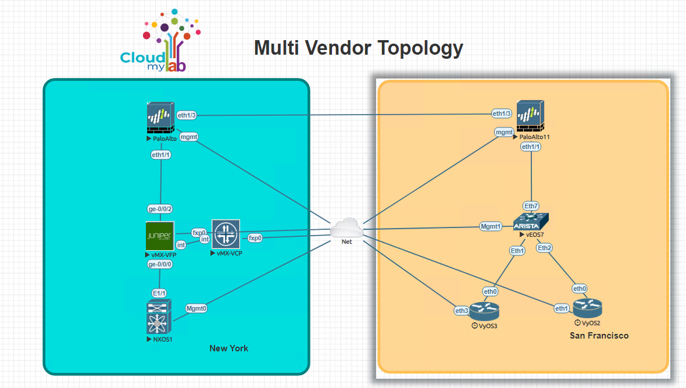

# Multi-Vendor Network Automation: Configuring block policy in palo alto device

## Lab topology
Please find below lab topology used for this lab demonstration.



## Devices used for current excercise:


### Problem Statement:
* Loopback in NXOS in New York(loopback0 1.1.1.1) and Loopback in VYOS in San Francisco(loopback0 2.2.2.2) are able to communicate

### Solution
* Configure block policy in PALO ALTO to block communication between mentioned source and destination.

### Lab guide:
Steps:
1. Create inventory.ini and add below config.

```inventory
[ny]
pa-site1        ansible_host=172.16.14.212  ansible_user=admin  ansible_password=Test12345 ansible_network_os=panos ansible_connection=local

[sf]
pa-site2        ansible_host=172.16.14.213  ansible_user=admin  ansible_password=Test12345 ansible_network_os=panos ansible_connection=local

[all:vars]
ansible_connection=ansible.netcommon.network_cli
ansible_user=admin
ansible_password=admin
ansible_become=true
ansible_become_method=enable
ansible_become_password=admin
```

2. Create add_block_policy.yml and add below config.

```ansible
---
- name: Create block policy
  hosts: ny
  gather_facts: no
  vars:
    provider:
      ip_address: "172.16.14.212"
      username: "admin"
      password: "Test12345"

  tasks:
    - name: Add inbound rule to Panorama device group
      paloaltonetworks.panos.panos_security_rule:
        provider: '{{ provider }}'
        rule_name: 'block'
        description: 'block rule'
        source_zone: ['any']
        source_ip: ['1.1.1.1']
        destination_zone: ['any']
        destination_ip: ['2.2.2.2']
        action: 'deny'
        location: 'top'
        commit: 'true'
```

3. Check the current connection status.


4. Open VSCODE terminal. Run below command.

ansible-playbook add_block_policy.yml -i inventory.ini

5. We can see we are able to ping the destination IP from source.


6. Open VSCODE terminal. Run below command.

ansible-playbook remove_block_policy.yml -i inventory.ini

```ansible
---
- name: Create block policy
  hosts: ny
  gather_facts: no
  vars:
    provider:
      ip_address: "172.16.14.212"
      username: "admin"
      password: "Test12345"

  tasks:
    - name: Remove SSH inbound rule to Panorama device group
      paloaltonetworks.panos.panos_security_rule:
        provider: '{{ provider }}'
        state: 'absent'
        rule_name: 'block'
        commit: 'true'
```


5. Connection is restored.


