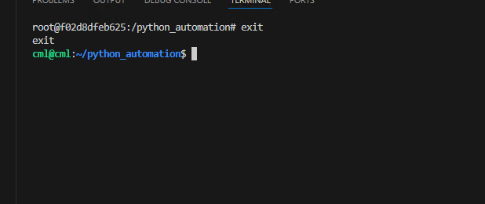
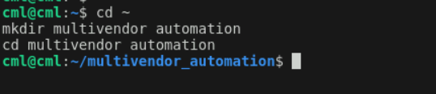
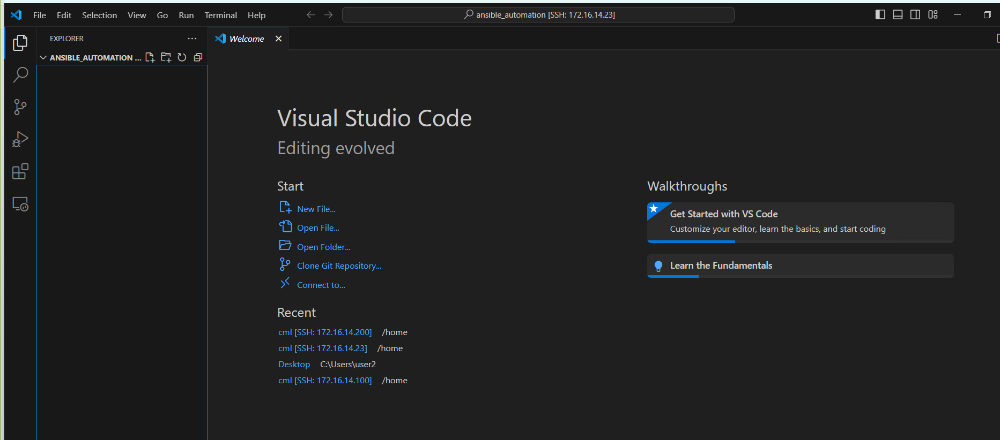
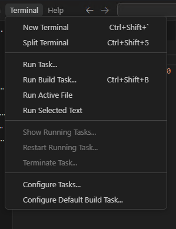
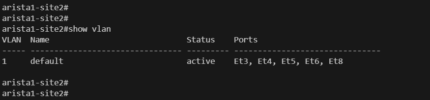
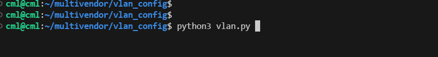
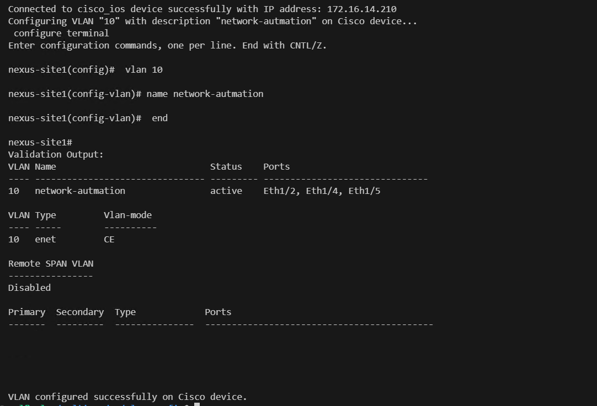
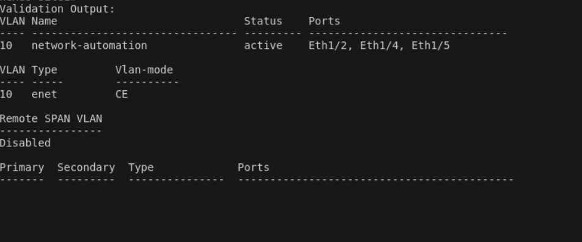

# Multi-Vendor Network Automation: Configuring VLAN on different vendor switches

# Lab topology
* Below is the lab topology used for this configuration demonstration.


### Problem Statement:
* Configure VLANs on devices from different vendors.

### Solution:
* Develop a Python script to configure VLANs and their descriptions on devices from various vendors.

* The script should prompt the user to input the VLAN number and its description.

* Upon receiving the input, it should establish SSH connections to the respective devices and apply the configurations accordingly.

* The goal is to automate the VLAN configuration process across heterogeneous network infrastructure.


### Lab guide:
Follow these steps to set up the lab environment:

To do this exercise create a folder `multivendor_automation` in user's home directory using
- In last excercise we were in containers shell to exit from there run the exit command
```sh
exit
```

- To create a multivendor_automation directory in users home directory run the below commands
```sh
cd ~
mkdir multivendor_automation
cd multivendor_automation
```


- Open the vscode in newly created directory for that lets run the below command
```sh
code .
```

- It will ask you the password for the user, when u give the password, it should open vscode in `multivendor_automation` folder



1 . Open VSCODE and open terminal.



2. Run the container with the appropriate bind mount using the following command:

```sh
docker container run -it -v $(pwd):/multivendor_automation ansible_lab
```
If you encounter issues while creating the Docker image, replace the image name with the one we have already pushed to Docker registry. Use the image name onemindservices2024/naf2024 instead of ansible_lab. The new command will look like this:
```sh
docker container run -it -v $(pwd):/multivendor_automation onemindservices2024/naf2024
```

3. Navigate to the `/multivendor_automation` directory within the container:

```sh
cd multivendor_automation
```

4. Create a new file named `devices.py` and add the following code:

```inventory
# Define Arista device details
arista_device = {
    'device_type': 'arista_eos',
    'ip': '172.16.14.214',
    'username': 'admin',
    'password': 'password',
}

# Define Cisco device details
cisco_device = {
    'device_type': 'cisco_ios',
    'ip': '172.16.14.210',
    'username': 'admin',
    'password': 'admin',
}
```
5. Create a new file named `vlan.py` and add the following code:

```python
import os
from netmiko import ConnectHandler
from devices import *

def clear_screen():
    os.system('clear')

def validate_vlan_number(vlan_number):
    while True:
        try:
            vlan_number = int(vlan_number)
            if 1 <= vlan_number <= 3967:  # Updated range to 1-3967
                return vlan_number
            else:
                print("VLAN number must be in the range of 1-3967.")  # Updated error message
        except ValueError:
            print("Invalid VLAN number. Please enter a valid number.")
        vlan_number = input("Please enter VLAN number (1-3967): ")  # Updated prompt

def connection_test(device, device_type):
    try:
        ssh_conn = ConnectHandler(**device)
        print("#"*100)
        print(f"Connected to {device_type} device successfully with IP address: {device['ip']}")
        return ssh_conn
    except Exception as e:
        print(f"Failed to connect to {device_type} device: {e}")
        return None

def configure_device(ssh_conn, config_commands, device_type, vlan_number, vlan_description):
    if ssh_conn:
        print(f'Configuring VLAN "{vlan_number}" with description "{vlan_description}" on {device_type} device...')
        try:
            ssh_conn.enable()
            output = ssh_conn.send_config_set(config_commands)
            print(output)
            # Validate configuration
            validation_command = f'show vlan id {vlan_number}'
            validation_output = ssh_conn.send_command(validation_command)
            print("Validation Output:", validation_output)
            if vlan_description in validation_output:
                print(f"\nVLAN configured successfully on {device_type} device.")
            else:
                print(f"\nFailed to configure VLAN on {device_type} device.")
            ssh_conn.disconnect()
        except Exception as e:
            print(f"Failed to configure VLAN on {device_type} device: {e}")

if __name__ == "__main__":
    clear_screen()
    # Take input for VLAN configuration
    vlan_number = input("Please enter VLAN number: ")
    vlan_number = validate_vlan_number(vlan_number)

    vlan_description = input("Please enter VLAN description: ")

    # Define VLAN configuration commands for Arista device
    arista_config = [
        f'vlan {vlan_number}',
        f'name {vlan_description}',
    ]

    # Test connection to Arista device
    arista_ssh = connection_test(arista_device, "arista_eos")
    if arista_ssh:
        configure_device(arista_ssh, arista_config, "Arista", vlan_number, vlan_description)
    
    # Define VLAN configuration commands for Cisco device
    cisco_config = [
        f'vlan {vlan_number}',
        f'name {vlan_description}',
    ]

    # Test connection to Cisco device
    cisco_ssh = connection_test(cisco_device, "cisco_ios")
    if cisco_ssh:
        configure_device(cisco_ssh, cisco_config, "Cisco", vlan_number, vlan_description)
```
6. Verify the current VLAN status in Cisco NX-OS by running the following command:

```code
show vlan
```


7. To verify the current VLAN status in Arista EOS, execute the following command:
```code
show vlan
```




8. Execute the Python script by running the following command:
```code
python3 vlan.py
```



9. Please enter a VLAN number between 1 and 3096. This restriction is because Cisco NX-OS reserves VLANs above 3096.

    After that, input the description you wish to configure on the interface, and hit Enter again.


Output Explanation:

The provided output displays the configuration commands for the Arista EOS device. These commands represent the VLAN configuration applied to the device.
    


Below are the Cisco IOS device configuration commands displayed in the output. These commands represent the VLAN configuration applied to the device.



Below is the validation done by python program.



10. After executing, you can verify the current VLAN status in Cisco NX-OS by running the following command:
```code
show vlan
```


11. To verify the current VLAN status in Arista EOS, execute the following command:

```code
show vlan
```

