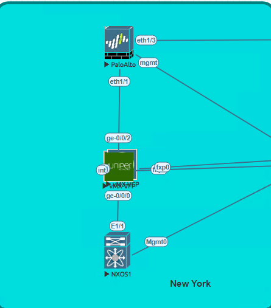
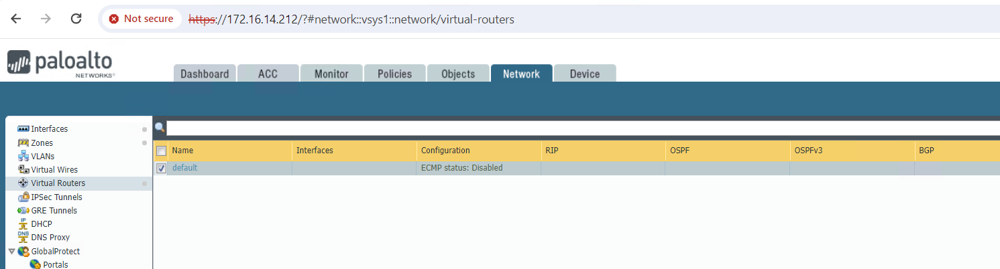
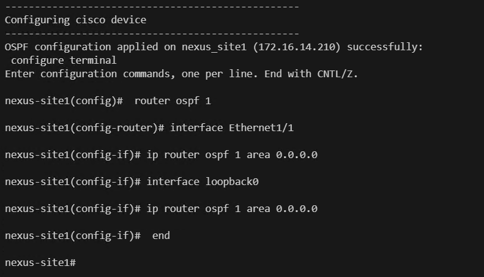
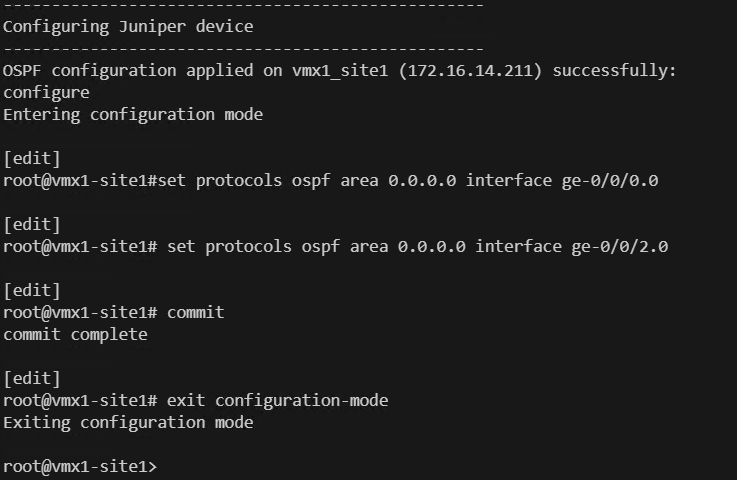
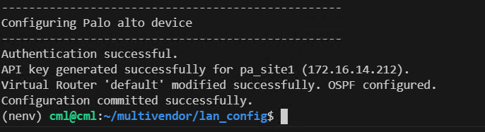
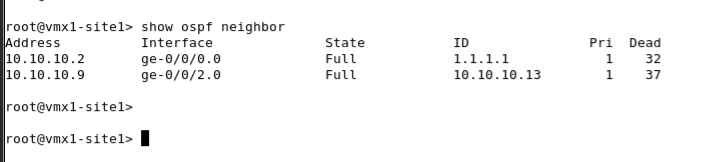
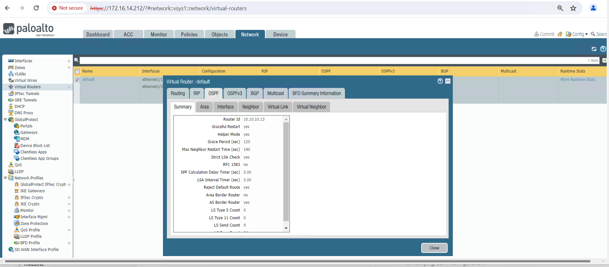

# Multi-Vendor Network Automation: LAN OSPF Configuration New York site(Cisco NXOS, Juniper OS, PALO ALTO OS)

# Lab topology

Below is the lab topology used for this lab demonstration.


# Devices used for current excercise:
Below is the topology for the New York site, which we will use to configure OSPF.



### Problem Statement:
* Configure a dynamic routing protocol in the New York site.

### Solution
* We will establish OSPF between a Cisco NX-OS device and a Juniper OS device at the New York site.
* Also, we will configure OSPF between a Juniper OS device and a Palo Alto device at the New York site.

### Lab guide:
Steps:
1. Create a file named 'device_vars_ny.py' and add the following configuration:

Description: In the code snippet below, we are creating a file to store device variables. This file will contain details for three devices: Nexus OS, Palo Alto OS, and Juniper OS.
Each device is represented as a dictionary with its IP address, username, and password.
These details will be utilized by our script to authenticate to the respective devices during the configuration process. 

```python
#device_vars_ny.py

devices_vars = {
    "nexus_site1": {
        "device_type": "cisco_nxos",
        "host": "172.16.14.210",
        "username": "admin",
        "password": "admin",
        "port": 22,
        "secret": "admin",
        "timeout": 240
    },
    "vmx1_site1": {
        "device_type": "juniper_junos",
        "host": "172.16.14.211",
        "username": "root",
        "password": "Juniper",
        "port": 22,
        "secret": "admin"
    },
    "pa_site1": {
        "device_type": "paloalto_panos",
        "host": "172.16.14.212",
        "username": "admin",
        "password": "Test12345",
        "port": 22,
        "secret": "Test12345"
    },
}

```
2. Next, create a file named 'configurations_ny.py' and add the following command:

Description: This file contains configuration commands for setting up OSPF between Nexus OS, Juniper OS, and Palo Alto OS devices in the New York site.
The commands are organized into lists corresponding to each device's configuration requirements.

```python
# configurations.py

cisco_config = {
    'ospf_interfaces': ['Ethernet1/1','loopback0'],
    'ospf_process_id': 1
}

juniper_config = {
    'ospf_interfaces': ['ge-0/0/0.0','ge-0/0/2.0'],
    'ospf_process_id': 1,
}

palo_alto_config= {
    'device_ip': '172.16.14.212',
    'router_id' : "10.10.10.13",
    'interfaces' :['ethernet1/1','ethernet1/3']
}
```
3. Proceed by creating a file named 'configure_ospf_ny.py' and add the following configuration:

Description: This script configures OSPF on all devices in the network. Below is a brief description of each function defined in the code.

check_ssh_connectivity: This function checks the connectivity status to all devices before configuring OSPF.

apply_ospf_config_cisco: This function utilizes the netmiko library to configure OSPF on Cisco NX-OS devices.

apply_ospf_config_juniper: This function uses the netmiko library to configure OSPF on Juniper devices.

generate_palo_alto_api_key: This function connects to the Palo Alto device and generates the API token for the REST API.

modify_virtual_router: This function modifies the virtual router in Palo Alto and enables OSPF.

commit_configuration: This function safely commits the Palo Alto configuration.

```python
import requests
import xml.etree.ElementTree as ET
from netmiko import ConnectHandler
from device_vars_ny import devices_vars
from configurations_ny import cisco_config, juniper_config, palo_alto_config
import urllib3

# Suppress insecure request warnings from the requests module
urllib3.disable_warnings(urllib3.exceptions.InsecureRequestWarning)

def check_ssh_connectivity(device_name, device_info):
    try:
        # Create connection handler
        net_connect = ConnectHandler(**device_info)
        net_connect.disconnect()
        print(f"SSH connection to {device_name} ({device_info['host']}) successful.")
        return True

    except Exception as e:
        print(f"Failed to establish SSH connection to {device_name} ({device_info['host']}): {e}")
        return False

def apply_ospf_config_cisco(device_name, device_info, ospf_config):
    try:
        # Create connection handler
        net_connect = ConnectHandler(**device_info)

        # Prepare OSPF configuration commands for Cisco devices
        ospf_commands = [
            f"router ospf {ospf_config['ospf_process_id']}"
        ]

        # Iterate over OSPF interfaces and add configuration commands
        for interface in ospf_config['ospf_interfaces']:
            ospf_commands.append(f"interface {interface}")
            ospf_commands.append(f"ip router ospf 1 area 0.0.0.0")

        # Send OSPF configuration commands
        output = net_connect.send_config_set(ospf_commands)
        print(f"OSPF configuration applied on {device_name} ({device_info['host']}) successfully:")
        print(output)

        # Disconnect from device
        net_connect.disconnect()

    except Exception as e:
        print(f"Failed to apply OSPF configuration on {device_name} ({device_info['host']}): {e}")

def apply_ospf_config_juniper(device_name, device_info, ospf_config):
    try:
        # Create connection handler
        net_connect = ConnectHandler(**device_info)

        # Prepare OSPF configuration commands for Juniper devices
        ospf_commands = []

        # Iterate over OSPF interfaces and add configuration commands
        for interface in ospf_config['ospf_interfaces']:
            ospf_commands.append(f"set protocols ospf area 0.0.0.0 interface {interface}")

        # Add commit command
        ospf_commands.append("commit")

        # Send OSPF configuration commands
        output = net_connect.send_config_set(ospf_commands, read_timeout=30)
        print(f"OSPF configuration applied on {device_name} ({device_info['host']}) successfully:")
        print(output)

        # Disconnect from device
        net_connect.disconnect()

    except Exception as e:
        print(f"Failed to apply OSPF configuration on {device_name} ({device_info['host']}): {e}")

def generate_palo_alto_api_key(device_name, device_info):
    try:
        # API endpoint for generating API key
        api_endpoint = f"https://{device_info['host']}/api/?type=keygen&user={device_info['username']}&password={device_info['password']}"

        # Send POST request to the API endpoint
        response = requests.post(api_endpoint, verify=False)
        print("Authentication successful.")
        response.raise_for_status()  # Raise an exception for any HTTP error

        # Parse XML response
        root = ET.fromstring(response.text)

        # Find the API key element
        api_key_element = root.find('.//key')
        if api_key_element is not None:
            api_key = api_key_element.text
            print(f"API key generated successfully for {device_name} ({device_info['host']}).")
            return api_key
        else:
            print(f"Failed to generate API key for {device_name} ({device_info['host']}): No API key found.")
            return None

    except Exception as e:
        print(f"Failed to generate API key for {device_name} ({device_info['host']}): {e}")
        return None

def modify_virtual_router(api_endpoint, api_key, vr_name, paloalto_config):
    try:
        # Prepare the modified virtual router payload
        modified_vr_payload = {
            "entry": {
                "@name": vr_name,
                 "interface": {
                    "member": paloalto_config['interfaces']
                            },
                "protocol": {
                    "ospf": {
                        "enable": "yes",
                        "router-id": paloalto_config['router_id'],
                        "area": {
                            "entry": [
                                {
                                    "@name": "0.0.0.0",
                                    "type": {"normal": {}},
                                    "interface": {
                                        "entry": [
                                            {"@name": interface,"enable": "yes", "passive": "yes" if "loopback" in interface.lower() else "no"}
                                            for interface in paloalto_config['interfaces']
                                        ]
                                    },
                                }
                            ]
                        },
                    }
                },
            }
        }

        # Send PUT request to modify the virtual router
        headers = {
            "X-PAN-KEY": api_key,
            "Accept": "application/json",
            "Content-Type": "application/json",
        }
        params = {"name": vr_name}  # Add the virtual router name as a query parameter
        response = requests.put(
            api_endpoint, json=modified_vr_payload, params=params, headers=headers, verify=False
        )

        if response.status_code == 200:
            print(f"Virtual Router '{vr_name}' modified successfully. OSPF configured.")
        else:
            print(f"Failed to modify Virtual Router '{vr_name}'. OSPF Config failed. Status code: {response.json()}")

    except Exception as e:
        print(f"Failed to modify Virtual Router '{vr_name}'. OSPF Config failed. : {e}")

def commit_configuration(device_info, api_key):
    try:
        # Construct the API endpoint for committing configuration
        api_endpoint = f"https://{device_info['host']}/api/?type=commit&cmd=%3Ccommit%3E%3C%2Fcommit%3E"

        # Set the headers with the API key
        headers = {
            "X-PAN-KEY": api_key,
            "Accept": "application/xml",  # Adjust content type if needed
        }

        # Send a POST request to commit the configuration with the headers
        response = requests.post(api_endpoint, headers=headers, verify=False)

        # Check if the request was successful (status code 200)
        if response.status_code == 200:
            print("Configuration committed successfully.")
        else:
            print(f"Failed to commit configuration. Status code: {response.status_code}")
            print(response.text)  # Print response content for further analysis if needed

    except Exception as e:
        print(f"An error occurred while committing configuration: {e}")

if __name__ == "__main__":
    # Check SSH connectivity for all devices first
    all_devices_connected = True
    for device_name, device_info in devices_vars.items():
        print("-" * 50)
        if not check_ssh_connectivity(device_name, device_info):
            all_devices_connected = False

    if all_devices_connected:
        # If all devices are connected, proceed with configuration
        print("-" * 50)  # Add a horizontal line for visual separation
        for device_name, device_info in devices_vars.items():
            if "cisco" in device_info["device_type"]:
                print("-" * 50)
                print("Configuring cisco device")
                print("-" * 50)
                apply_ospf_config_cisco(device_name, device_info, cisco_config)
            elif "juniper" in device_info["device_type"]:
                print("-" * 50)
                print("Configuring Juniper device")
                print("-" * 50)
                apply_ospf_config_juniper(device_name, device_info, juniper_config)
            elif "paloalto" in device_info["device_type"]:
                print("-" * 50)
                print("Configuring Palo alto device")
                print("-" * 50)
                api_key = generate_palo_alto_api_key(device_name, device_info)
                if api_key:
                    api_endpoint = f"https://{device_info['host']}/restapi/v9.1/Network/VirtualRouters"
                    # Modify virtual router to enable OSPF
                    vr_name = "default"  # Modify accordingly
                    modify_virtual_router(api_endpoint, api_key, vr_name, palo_alto_config)
                    
                    # Commit configuration after modifying virtual router
                    commit_configuration(device_info, api_key)
    else:
        print("Not all devices are connected. Please check SSH connectivity.")

```

3. Checking Current Connectivity Status
Open the EVE-NG lab environment.

    Access the Cisco Nexus OS (NX-OS) device Command Line Interface (CLI).

    Run the following command to display the OSPF neighbor information:

```code
    show ip ospf neighbors 
```


  Access the Juniper device Command Line Interface (CLI).

Run the following command to display OSPF neighbor information:
    
```code
    show ospf neighbor
```


Open a web browser and navigate to the PAN-OS device by accessing the following URL: https://172.16.14.212

Click on "Network" to access network-related configurations.

Verify that OSPF configuration is not present or not enabled. This can be confirmed by checking the OSPF configuration section or by searching for OSPF-related settings.




4. Open VSCODE terminal and run below command. You should see all devices configured successfully. If you see any connection failed error. Please rerun below command.
```code
python3 configure_ospf_ny.py
```


Lets review code output.
First code with connect to all devices before executing OSPF config.
    


Below is configuration done for cisco. We can see configured commands for OSPF.



Below is configuration done for Juniper. We can see configured commands for OSPF.



We are using Rest API for palo alto. Program will connect to palo alto and generate api key and configure OSPF in device.



5. Verifying OSPF configuration.
    
    Open NXOS device CLI and run below command.

    ```code
    show ip ospf neighbors
    ```

    

    Open Juniper device CLI and run below command.

    ```code
    show ospf neighbor
    ```

    

    Open PAN OS device and clic on network >> Virtual Routers >> More routing stats >> OSPF. We can see currently ospf is not configured.

    


6. We have successfully configured OSPF at New York site.