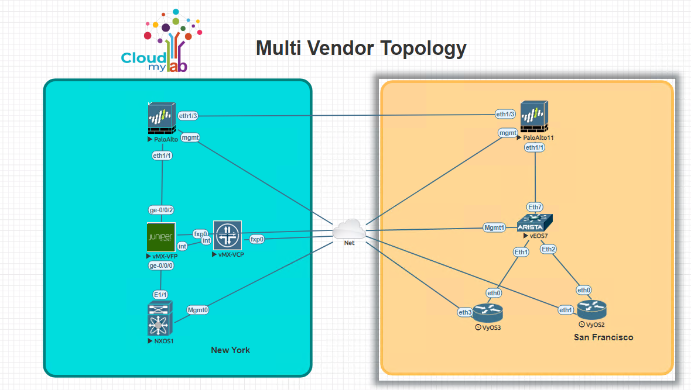
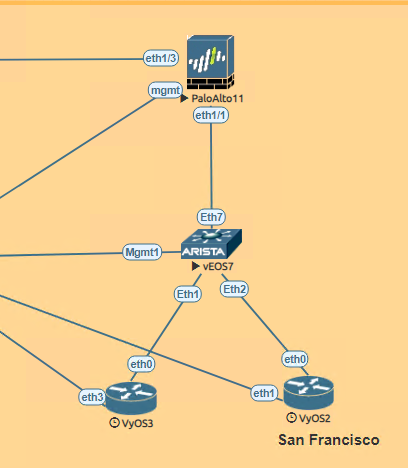
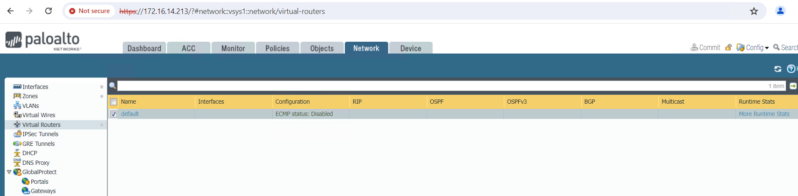
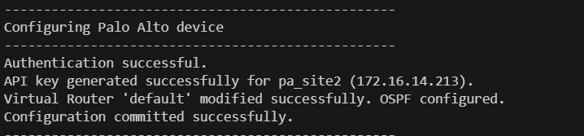
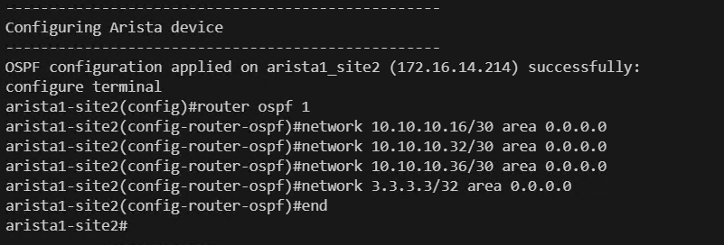
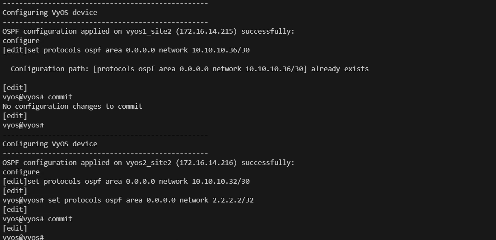
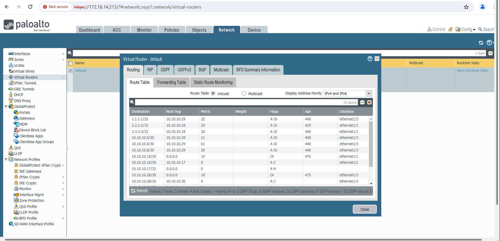

# Multi-Vendor Network Automation: LAN OSPF Configuration San Francisco site(PALO ALTO OS, Arista OS, Juniper OS).

# Lab topology
Please find below lab topology used for this lab demonstration.



# Devices used for current excercise:
Below is the topology for the San Francisco site which we are going to use for configuring OSPF.



### Problem Statement:
* Configure dynamic Routing Protocol in San Francisco site.

### Solution
* We will create ospf between VYOS and Arista OS device at San Francisco site.
* We will create ospf between Arista OS and Palo alto device at San Francisco site.


### Lab guide:
Steps:
1. Create a file named 'device_vars_sf.py' and add the following configuration:

Description: In the code snippet below, we are creating a file to store device variables. This file will contain details for three devices: Arista OS, Palo Alto OS, and VYOS OS.
Each device is represented as a dictionary with its IP address, username, and password.
These details will be utilized by our script to authenticate to the respective devices during the configuration process.  

```python
# device_vars_sf.py

devices_vars = {
    "pa_site2": {
        "device_type": "paloalto_panos",
        "host": "172.16.14.213",
        "username": "admin",
        "password": "Test12345",
        "port": 22,
        "secret": "Test12345"
    },
    "arista1_site2": {
        "device_type": "arista_eos",
        "host": "172.16.14.214",
        "username": "admin",
        "password": "password",
        "port": 22,
        "secret": "admin",
        "timeout": 60
    },
    "vyos1_site2": {
        "device_type": "vyos",
        "host": "172.16.14.215",
        "username": "vyos",
        "password": "vyos",
        "port": 22,
        "secret": "admin"
    },
    "vyos2_site2": {
        "device_type": "vyos",
        "host": "172.16.14.216",
        "username": "vyos",
        "password": "vyos",
        "port": 22,
        "secret": "admin"
    }
}
```
2. Next, create a file named 'configurations_sf.py' and add the following command:

Description: This file contains configuration commands for setting up OSPF between Arista OS, Palo Alto OS, and VYOS OS devices in the San Francisco.
The commands are organized into lists corresponding to each device's configuration requirements.

```python
# configurations_sf.py

vyos1_config = {
    'device_ip': '172.16.14.216',
    'ospf_network': ['10.10.10.32/30','2.2.2.2/32'],
}

vyos2_config = {
    'device_ip': '172.16.14.215',
    'ospf_network': ['10.10.10.36/30'],
}

arista_config ={
    'ospf_network': ['10.10.10.16/30','10.10.10.32/30','10.10.10.36/30','3.3.3.3/32']
}

palo_alto_config= {
    'device_ip': '172.16.14.213',
    'router_id' : "10.10.10.21",
    'interfaces' :['ethernet1/1','ethernet1/3']
}
```
3. Proceed by creating a file named 'configure_ospf_sf.py' and add the following configuration:

Description: This script configures OSPF on all devices within the San Francisco site. It contains a series of functions tailored to handle specific tasks required for OSPF configuration across multiple vendors.

Functions:
- check_ssh_connectivity: This function verifies the SSH connectivity status to all devices before initiating OSPF configuration.
- apply_ospf_config_vyos: Utilizing the netmiko library, this function configures OSPF on the VyOS device.
- apply_ospf_config_arista: Leveraging the netmiko library, this function configures OSPF on the Arista device.
- generate_palo_alto_api_key: Establishes a connection to the Palo Alto device and generates the API token required for REST API operations.
- modify_virtual_router: Modifies the virtual router settings on the Palo Alto device to enable OSPF functionality.
- commit_configuration: Safely saves the configuration changes made on the Palo Alto device.

Note: This script orchestrates OSPF configuration seamlessly across various devices, ensuring consistent and reliable routing functionality within the San Francisco site.

```python
import requests
import xml.etree.ElementTree as ET
from netmiko import ConnectHandler
from device_vars_sf import devices_vars
from configurations_sf import vyos1_config, vyos2_config, arista_config, palo_alto_config
import urllib3

# Suppress insecure request warnings from the requests module
urllib3.disable_warnings(urllib3.exceptions.InsecureRequestWarning)

def check_ssh_connectivity(device_name, device_info):
    try:
        # Create connection handler
        net_connect = ConnectHandler(**device_info)
        net_connect.disconnect()
        print(f"SSH connection to {device_name} ({device_info['host']}) successful.")
        return True

    except Exception as e:
        print(f"Failed to establish SSH connection to {device_name} ({device_info['host']}): {e}")
        return False

def apply_ospf_config_vyos(device_name, device_info, ospf_config):
    try:
        # Create connection handler
        net_connect = ConnectHandler(**device_info)

        # Prepare OSPF configuration commands for VyOS devices
        ospf_commands = []

        # Add OSPF network commands
        for network in ospf_config['ospf_network']:
            ospf_commands.append(f"set protocols ospf area 0.0.0.0 network {network}")
        ospf_commands.append('commit')

        # Send OSPF configuration commands
        output = net_connect.send_config_set(ospf_commands)
        print(f"OSPF configuration applied on {device_name} ({device_info['host']}) successfully:")
        print(output)

        # Disconnect from device
        net_connect.disconnect()

    except Exception as e:
        print(f"Failed to apply OSPF configuration on {device_name} ({device_info['host']}): {e}")

def apply_ospf_config_arista(device_name, device_info, ospf_config):
    try:
        # Create connection handler
        net_connect = ConnectHandler(**device_info)

        # Prepare OSPF configuration commands for Arista devices
        ospf_commands = [
            "router ospf 1"
        ]

        # Add OSPF network commands
        for network in ospf_config['ospf_network']:
            ospf_commands.append(f"network {network} area 0.0.0.0")
        net_connect.enable()

        # Send OSPF configuration commands
        output = net_connect.send_config_set(ospf_commands)
        print(f"OSPF configuration applied on {device_name} ({device_info['host']}) successfully:")
        print(output)

        # Disconnect from device
        net_connect.disconnect()

    except Exception as e:
        print(f"Failed to apply OSPF configuration on {device_name} ({device_info['host']}): {e}")

def generate_palo_alto_api_key(device_name, device_info, ospf_config):
    try:
        # API endpoint for generating API key
        api_endpoint = f"https://{device_info['host']}/api/?type=keygen&user={device_info['username']}&password={device_info['password']}"

        # Send POST request to the API endpoint
        response = requests.post(api_endpoint, verify=False)
        print("Authentication successful.")
        response.raise_for_status()  # Raise an exception for any HTTP error

        # Parse XML response
        root = ET.fromstring(response.text)

        # Find the API key element
        api_key_element = root.find('.//key')
        if api_key_element is not None:
            api_key = api_key_element.text
            print(f"API key generated successfully for {device_name} ({device_info['host']}).")
            # Modify virtual router to enable OSPF
            vr_name = "default"  # Modify accordingly
            return api_key
        else:
            print(f"Failed to generate API key for {device_name} ({device_info['host']}): No API key found.")
            return None

    except Exception as e:
        print(f"Failed to generate API key for {device_name} ({device_info['host']}): {e}")
        return None

def modify_virtual_router(api_endpoint, api_key, vr_name, ospf_config):
    try:
        # Prepare the modified virtual router payload
        modified_vr_payload = {
            "entry": {
                "@name": vr_name,
                "interface": {
                    "member": ospf_config['interfaces']
                },
                "protocol": {
                    "ospf": {
                        "enable": "yes",
                        "router-id": ospf_config['router_id'],
                        "area": {
                            "entry": [
                                {
                                    "@name": "0.0.0.0",
                                    "type": {"normal": {}},
                                    "interface": {
                                        "entry": [
                                            {"@name": interface, "enable": "yes", "passive": "yes" if "loopback" in interface.lower() else "no"}
                                            for interface in ospf_config['interfaces']
                                        ]
                                    },
                                }
                            ]
                        },
                    }
                },
            }
        }

        # Send PUT request to modify the virtual router
        headers = {
            "X-PAN-KEY": api_key,
            "Accept": "application/json",
            "Content-Type": "application/json",
        }
        params = {"name": vr_name}  # Add the virtual router name as a query parameter
        response = requests.put(
            api_endpoint, json=modified_vr_payload, params=params, headers=headers, verify=False
        )

        if response.status_code == 200:
            print(f"Virtual Router '{vr_name}' modified successfully. OSPF configured.")
        else:
            print(f"Failed to modify Virtual Router '{vr_name}'. OSPF Config failed. Status code: {response.json()}")

    except Exception as e:
        print(f"Failed to modify Virtual Router '{vr_name}'. OSPF Config failed. : {e}")

def commit_configuration(device_info, api_key):
    try:
        # Construct the API endpoint for committing configuration
        api_endpoint = f"https://{device_info['host']}/api/?type=commit&cmd=%3Ccommit%3E%3C%2Fcommit%3E"

        # Set the headers with the API key
        headers = {
            "X-PAN-KEY": api_key,
            "Accept": "application/xml",  # Adjust content type if needed
        }

        # Send a POST request to commit the configuration with the headers
        response = requests.post(api_endpoint, headers=headers, verify=False)

        # Check if the request was successful (status code 200)
        if response.status_code == 200:
            print("Configuration committed successfully.")
        else:
            print(f"Failed to commit configuration. Status code: {response.status_code}")
            print(response.text)  # Print response content for further analysis if needed

    except Exception as e:
        print(f"An error occurred while committing configuration: {e}")

if __name__ == "__main__":
    # Check SSH connectivity for all devices first
    all_devices_connected = True
    for device_name, device_info in devices_vars.items():
        print("-" * 50)
        if not check_ssh_connectivity(device_name, device_info):
            all_devices_connected = False

    if all_devices_connected:
        # If all devices are connected, proceed with configuration
        print("-" * 50)  # Add a horizontal line for visual separation
        for device_name, device_info in devices_vars.items():
            if "vyos" in device_info["device_type"]:
                print("-" * 50)
                print("Configuring VyOS device")
                print("-" * 50)
                if device_info['host'] == vyos1_config['device_ip']:
                    apply_ospf_config_vyos(device_name, device_info, vyos1_config)
                elif device_info['host'] == vyos2_config['device_ip']:
                    apply_ospf_config_vyos(device_name, device_info, vyos2_config)
            elif "arista" in device_info["device_type"]:
                print("-" * 50)
                print("Configuring Arista device")
                print("-" * 50)
                apply_ospf_config_arista(device_name, device_info, arista_config)
            elif "paloalto" in device_info["device_type"]:
                print("-" * 50)
                print("Configuring Palo Alto device")
                print("-" * 50)
                api_key = generate_palo_alto_api_key(device_name, device_info, palo_alto_config)
                if api_key:
                    api_endpoint = f"https://{device_info['host']}/restapi/v9.1/Network/VirtualRouters"
                    # Modify virtual router to enable OSPF
                    vr_name = "default"  # Modify accordingly
                    modify_virtual_router(api_endpoint, api_key, vr_name, palo_alto_config)
                    
                    # Commit configuration after modifying virtual router
                    commit_configuration(device_info, api_key)
    else:
        print("Not all devices are connected. Please check SSH connectivity.")

```

4.Checking Current Connectivity Status
Open the EVE-NG lab environment.

Access the Cisco VYOS OS device Command Line Interface (CLI).

Run the following command to display the OSPF neighbor information:

```code
show ip ospf neighbor
```


Access the Arista OS device Command Line Interface (CLI).

Run the following command to display the OSPF neighbor information:

```code
    show ip ospf neighbor
```


Open a web browser and navigate to the PAN-OS device by accessing the following URL: https://172.16.14.213

Click on "Network" to access network-related configurations.

Verify that OSPF configuration is not present or not enabled. Open PAN OS device and clic on network >> Virtual Routers >> More routing stats >> OSPF. We can see currently ospf is not configured.



Login to the Nexus OS and run the following command. Currently we don't have communication as OSPF is not configured.

```code
ping 2.2.2.2 source 1.1.1.1
```


5. Open VSCODE terminal and run below command.

```code
python3 configure_ospf_sf.py
```


Lets review code output.
First code with connect to all devices before executing OSPF config.
    


We are using Rest API for palo alto. Program will connect to palo alto and generate api key and configure OSPF in device.



Below is configuration done for Arista. We can see configured commands for OSPF.



Below is configuration done for VYOS. We can see configured commands for OSPF.



6. Verifying OSPF configuration. OSPF is configured.
    
Open VYOS device CLI and run below command.

```code
show ip ospf neighbors 
```


Access the Arista OS device Command Line Interface (CLI). OSPF is configured.


Open a web browser and navigate to the PAN-OS device by accessing the following URL: https://172.16.14.213

Click on "Network" to access network-related configurations.

Verify that OSPF configuration is not present or not enabled. Open PAN OS device and clic on network >> Virtual Routers >> More routing stats >> OSPF. We can see currently ospf is configured.



7. We have successfully configured OSPF at New York site.

 Check the current connection status. We are able to communicate New York site to San Francisco site.

8. Login to the Nexus OS and run the following command.

```code
ping 2.2.2.2 source 1.1.1.1
```


