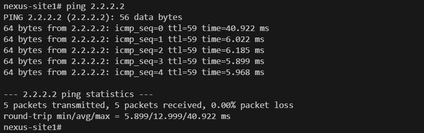
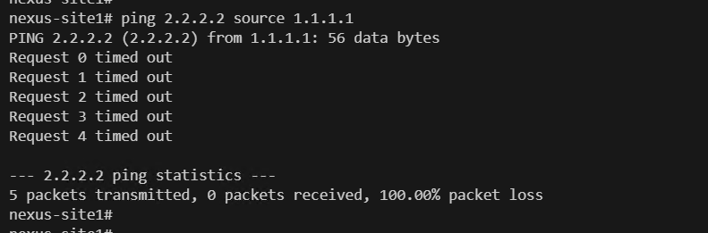
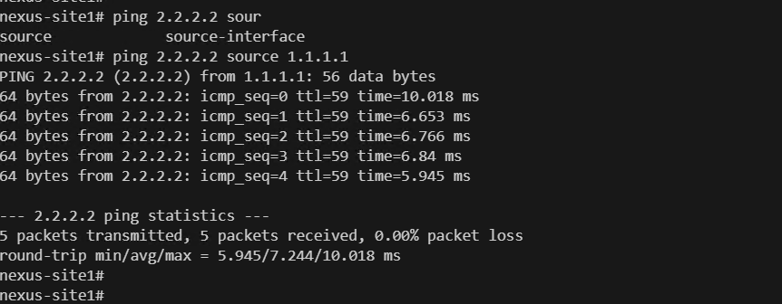

# Multi-Vendor Network Automation: Configuring block policy in palo alto device

## Lab topology
Please find below lab topology used for this lab demonstration.


## Devices used for current excercise:


### Problem Statement:
* The loopback interface configured on the NXOS device in New York (1.1.1.1) and the loopback interface configured on the VYOS device in San Francisco (2.2.2.2) are successfully able to communicate with each other.

### Solution
* To address the issue of communication between the loopback interfaces in New York and San Francisco, we will configure a block policy in the Palo Alto firewall. This policy will effectively block communication between the specified source and destination IP addresses, ensuring that the loopback interfaces cannot communicate with each other.

### Lab guide:
Steps:
1. Create a file named 'inventory.ini' and add the following configuration:

```inventory
[ny]
pa-site1        ansible_host=172.16.14.212  ansible_user=admin  ansible_password=Test12345 ansible_network_os=panos ansible_connection=local

[sf]
pa-site2        ansible_host=172.16.14.213  ansible_user=admin  ansible_password=Test12345 ansible_network_os=panos ansible_connection=local

[all:vars]
ansible_connection=ansible.netcommon.network_cli
ansible_user=admin
ansible_password=admin
ansible_become=true
ansible_become_method=enable
ansible_become_password=admin
```

2. Next, create a file named 'add_block_policy.yml' and add the following ansible code:

```ansible
---
- name: Create block policy
  hosts: ny
  gather_facts: no
  vars:
    provider:
      ip_address: "172.16.14.212"
      username: "admin"
      password: "Test12345"

  tasks:
    - name: Add inbound rule to Panorama device group
      paloaltonetworks.panos.panos_security_rule:
        provider: '{{ provider }}'
        rule_name: 'block'
        description: 'block rule'
        source_zone: ['any']
        source_ip: ['1.1.1.1']
        destination_zone: ['any']
        destination_ip: ['2.2.2.2']
        action: 'deny'
        location: 'top'
        commit: 'true'
```

3. Check the current connection status.
  1. Login to the Nexus OS and run the following command.

```code
ping 2.2.2.2 source 1.1.1.1
```



4. Open VSCODE terminal. Run below command.

```code
ansible-playbook add_block_policy.yml -i inventory.ini
```

5. We can see connectivity is blocked after executing above command.




6. Open VSCODE terminal. add new file 'remove_block_policy.yml'. add below code.

```ansible
---
- name: Create block policy
  hosts: ny
  gather_facts: no
  vars:
    provider:
      ip_address: "172.16.14.212"
      username: "admin"
      password: "Test12345"

  tasks:
    - name: Remove SSH inbound rule to Panorama device group
      paloaltonetworks.panos.panos_security_rule:
        provider: '{{ provider }}'
        state: 'absent'
        rule_name: 'block'
        commit: 'true'
```

7. Open VSCODE terminal. Run below command.

```code
ansible-playbook remove_block_policy.yml -i inventory.ini
```

8. Again login to nexus device and configure below. Run below command. Now we are able ping device.

```code
ping 2.2.2.2 source 1.1.1.1
```


