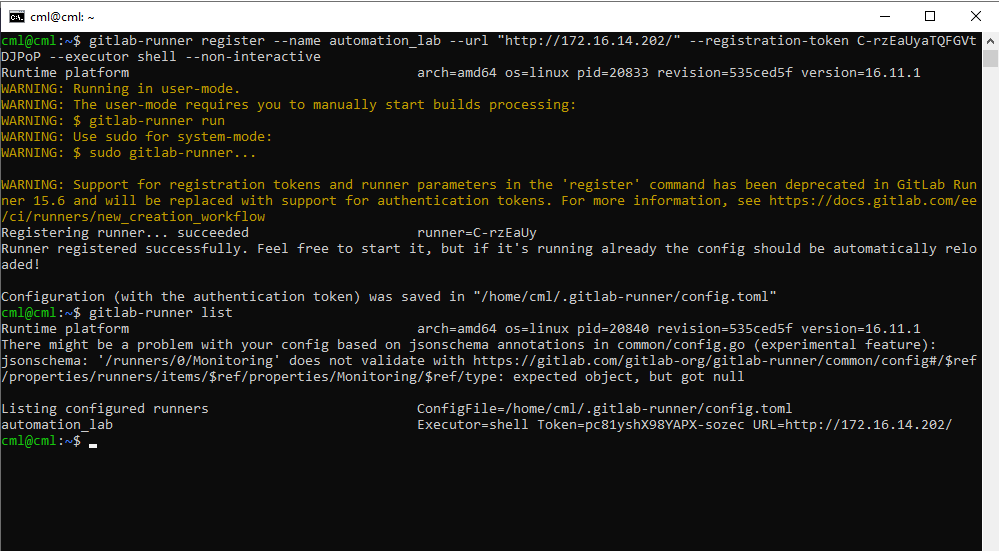
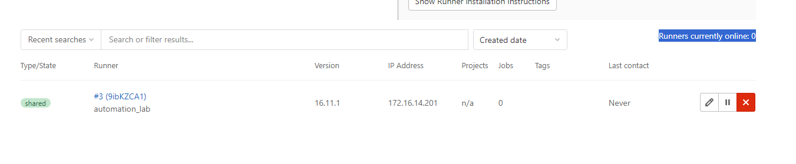

##  Exercise:
### Problem Statement:
In the next few exercises, we will be using GitLab CI. For this, we need a GitLab Runner. How do we set up a GitLab Runner?

## Solution

### Setting up Runner

- **Open Command Prompt (Cmd)**

    

- **Login to Runner**
    ```
    ssh -l cml 172.16.14.201
    ```
    

- **Run the Below Command to Setup Registry**
    ```sh
    curl -L "https://packages.gitlab.com/install/repositories/runner/gitlab-runner/script.deb.sh" | sudo bash
    ```
    

- **Install the Runner using the Following Command**
    ```sh
    sudo apt-get update
    sudo apt-get install python-is-python3
    sudo apt-get install ansible
    ansible-galaxy collection install awx.awx:19.4.0

    echo "172.16.14.202 gitlab-ce" | sudo  tee -a /etc/hosts
    ```
    ```sh
    sudo apt-get install gitlab-runner
    ```
    

- **Runner Machine Configuration**
    - Go to GitLab and login using the provided username and password from exercise one.
    
    - Click on the admin area.  
    
    - Click on "Runner".  
    
    - Runner details are available here.  
    

- **Configure Runner**
    - In the terminal, SSH into the runner machine and execute the command below, ensuring to replace the token and GitLab IP properly.
    ```sh
    gitlab-runner register --name automation_lab --url "http://172.16.14.202/" --registration-token C-rzEaUyaTQFGVtDJPoP --executor shell --non-interactive
    ```

- **View Configured Runners**
    ```sh
    gitlab-runner list
    ```
    

- **Refreshing Runner Configuration**
    - After refreshing the runner configuration page in GitLab, you can see the list of runners configured just now, and you can see that the *runner currently online is 0*.

    

- **Start the Runner**
    - In the terminal, where the runner is already SSHed, run the below command:
    ```sh
    # Install and run as service
    sudo gitlab-runner install --user=gitlab-runner --working-directory=/home/gitlab-runner
    # if you get this error, you can ignore and proceed with next command
    # FATAL: Failed to install gitlab-runner: Init already exists: /etc/systemd/system/gitlab-runner.service
    sudo gitlab-runner restart
    gitlab-runner run
    ```
    Ensure to run `gitlab-runner run` as a non-root user.
    

- **Runner Status Online**
    - Now you can see that the runner is online.  
    
