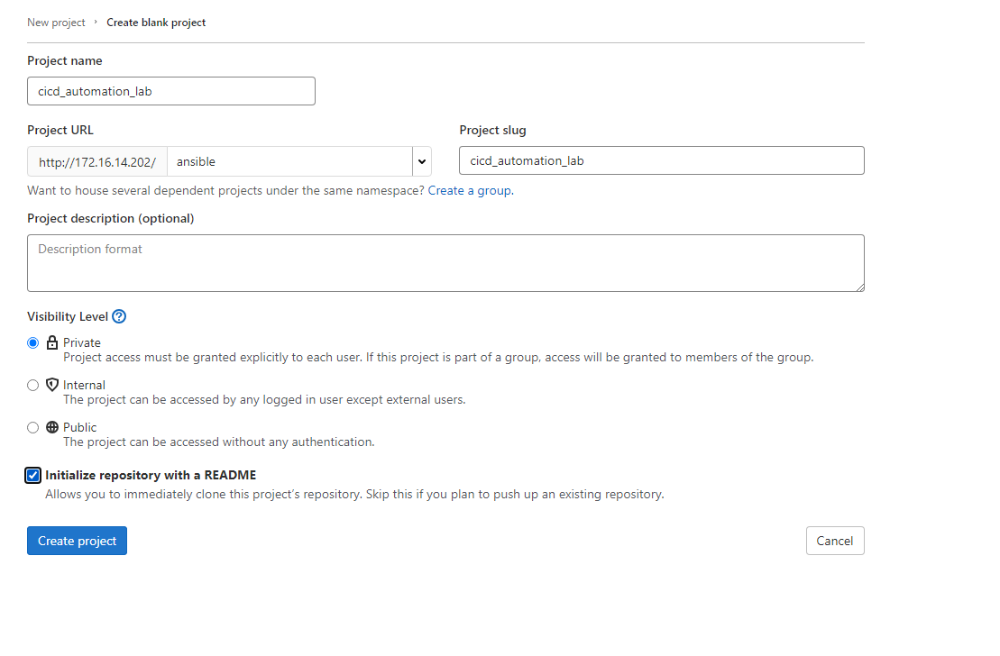
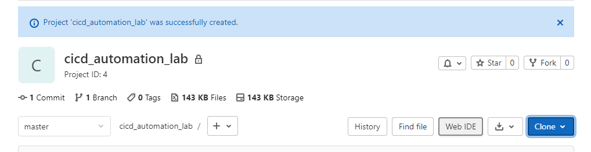
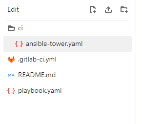
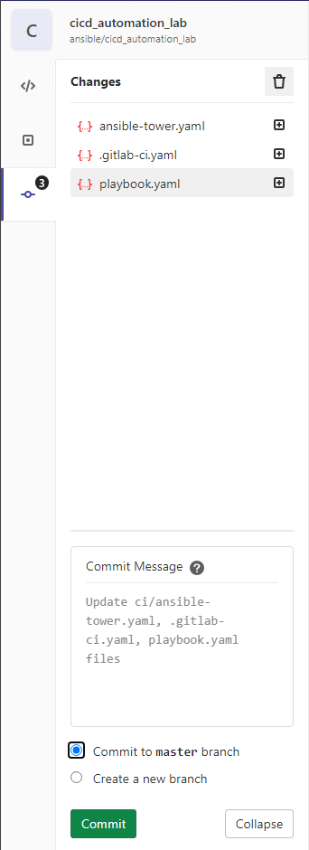
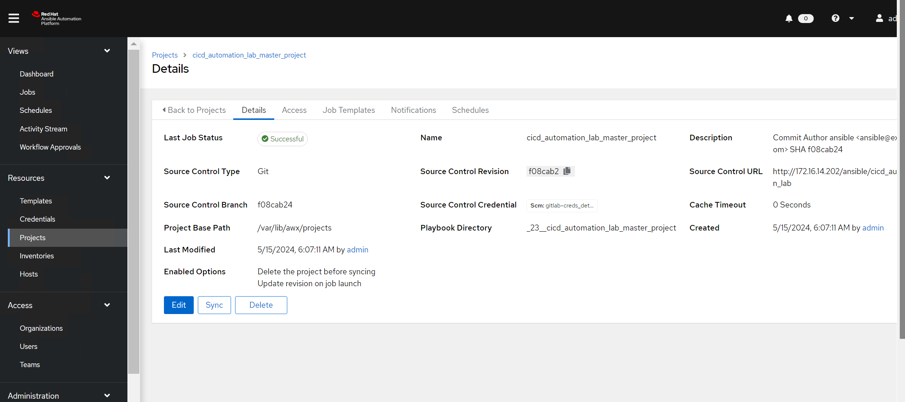
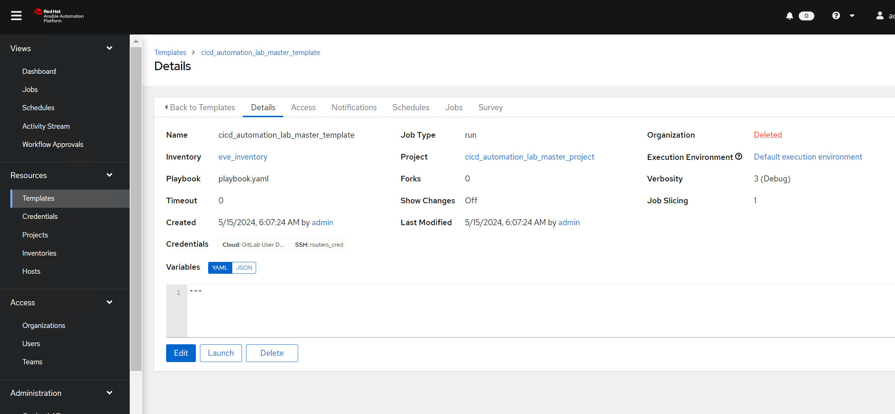

##  Exercise:
### Problem Statement:

In the previous exercise, we executed the playbook using AAP (Ansible Automation Platform), where all configurations were done manually. Now, we aim to streamline this process by setting up a CI (Continuous Integration) pipeline. When a user commits code into GitLab, the following actions should occur automatically:

1. **Project Creation:** The CI pipeline should create a project automatically in Ansible Tower.

2. **Template Creation:** Additionally, the pipeline should create a template automatically within the newly created project.

We are not automating the credentials to avoid storing them in the source code management system. Instead, we'll use the credentials created in the last exercise. Furthermore, we'll set up the GitLab Runner and utilize it to execute the pipeline in GitLab CI.

## Solution

- **Creating a Git Repo**
    - Create a Git repository with any name you want. I'm using `cicd_automation_lab` as the repo name.
    
    - Click on "Web IDE".
    
    - Create folder and file structure as shown below.  
    

below is the content of the files
#### .gitlab-ci.yaml
```yaml
stages:
  - deploy

variables:
  TOWER_USERNAME: "admin"
  TOWER_PASSWORD: "ansible"
  TOWER_HOST: https://172.16.14.203/

deploy:
  stage: deploy
  script:
    - ansible-playbook ci/ansible-tower.yaml
  only:
    - master

```

#### ansible-tower.yaml
```yaml
---
- name: Creating Projects and template on ansible tower
  hosts: localhost
  connection: local
  gather_facts: true
  vars:
    commit_sha: "{{ lookup('ansible.builtin.env', 'CI_COMMIT_SHORT_SHA') }}"
    commit_author: "{{ lookup('ansible.builtin.env', 'CI_COMMIT_AUTHOR' ) }}"
    scm_url: "{{ lookup('ansible.builtin.env', 'CI_PROJECT_URL' ) | replace('gitlab-ce','172.16.14.202') }}"
    project_name: "{{ lookup('ansible.builtin.env', 'CI_PROJECT_NAME' ) }}"
    branch_name: "{{ lookup('ansible.builtin.env', 'CI_COMMIT_REF_NAME' ) }}"
  tasks:
    - name: Create Project
      awx.awx.tower_project:
        name: "{{ project_name }}_{{ branch_name }}_project"
        description: "Commit Author {{ commit_author }} SHA {{ commit_sha }}"
        scm_update_on_launch: true
        scm_delete_on_update: true
        credential: "gitlab-creds_details" 
        scm_type: git
        scm_url: "{{ scm_url }}"
        scm_branch: "{{ commit_sha }}"
        timeout: 3600
        wait: true
        state: present
        validate_certs: false

    - name: Create Job Template
      awx.awx.tower_job_template:
        name: "{{ project_name }}_{{ branch_name }}_template"
        job_type: run
        inventory: "eve_inventory"
        project: "{{ project_name }}_{{ branch_name }}_project"
        playbook: "playbook.yaml"
        validate_certs: false
        credentials:
            - GitLab User Details
            - routers_cred
        verbosity: "3"
        state: present

```


#### playbook.yaml

```yaml
---
- name: Fetch show version from devices in dc_group
  hosts: vyos1-site2,vyos2-site2
  gather_facts: no

  tasks:
    - name: Clone the GitLab repository
      delegate_to: localhost
      run_once: true
      ansible.builtin.expect:
        command: git clone http://172.16.14.202/ansible/backup_configurations.git --verbose
        responses:
          (?i)Username: "{{ gitlab_username }}"
          (?i)Password: "{{ gitlab_password }}"
    
    - name: Run show version command
      register: show_version_output
      vyos_command:
        commands:
          - show version
          - show interfaces

    - name: Get current date and time
      set_fact:
        current_datetime: "{{ '%Y-%m-%d %H:%M:%S' | strftime }}"
    
    - name: Save show version output to file
      ansible.builtin.copy:
        content: "# This code is dynamically generated by Ansible {{ current_datetime }}\n{{ show_version_output.stdout[0] | replace('\\n','\n')}}"
        dest: "./backup_configurations/{{ inventory_hostname }}_show_version.cfg"
    
    - name: Save show version output to file
      ansible.builtin.copy:
        content: "# This code is dynamically generated by Ansible {{ current_datetime }}\n{{ show_version_output.stdout[1] | replace('\\n','\n')}}"
        dest: "./backup_configurations/{{ inventory_hostname }}_show_interfaces.cfg"

    - name: commit the code
      delegate_to: localhost
      run_once: true
      with_items:
        - "git add ."
        - git config --global user.name "user1"
        - git config --global user.email "user1@onemindservices.com"
        - "git commit -m 'configurations update'"
        - git push origin master
      ansible.builtin.expect:
        chdir: "./backup_configurations"
        command: "{{ item }}"
        responses:
          (?i)Username: "{{ gitlab_username }}"
          (?i)Password: "{{ gitlab_password }}"
```

Once you commit the code a new project and a template gets created in ansible tower



Go to Ansible Tower and browse under projects




Now you can execute the template like we have executed in the last exercise.
