##  Exercise:
### Problem Statement:

In the previous exercise, we executed the playbook using AAP (Ansible Automation Platform), where all configurations were done manually. Now, we aim to streamline this process by setting up a CI (Continuous Integration) pipeline. When a user commits code into GitLab, the following actions should occur automatically:

1. **Project Creation:** The CI pipeline should create a project automatically in Ansible Tower.

2. **Template Creation:** Additionally, the pipeline should create a template automatically within the newly created project.

We are not automating the credentials to avoid storing them in the source code management system. Instead, we'll use the credentials created in the last exercise. Furthermore, we'll set up the GitLab Runner and utilize it to execute the pipeline in GitLab CI.

#### Solution

### Setting up Runner

- 
```sh
sudo apt-get update
sudo apt-get install python-is-python3
sudo apt-get install ansible
ansible-galaxy collection install awx.awx:19.4.
```

- **Open Command Prompt (Cmd)**

    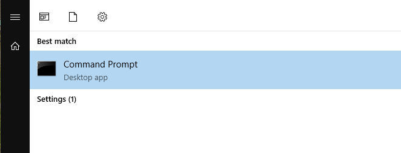

- **Login to Runner**
    ```
    ssh -l cml 172.16.14.201
    ```
    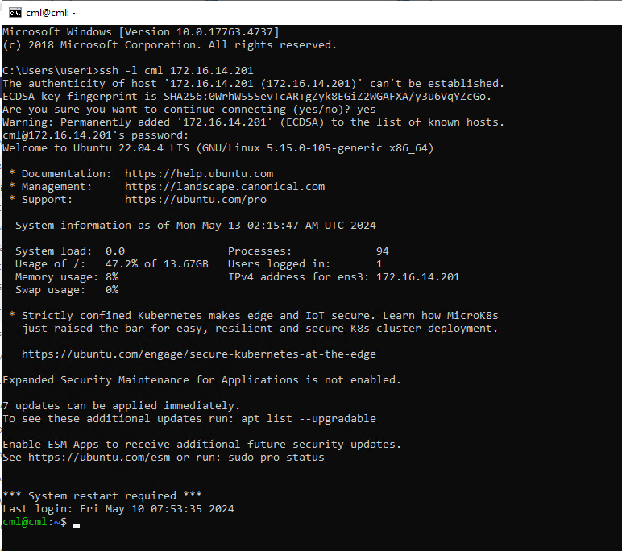

- **Run the Below Command to Setup Registry**
    ```sh
    curl -L "https://packages.gitlab.com/install/repositories/runner/gitlab-runner/script.deb.sh" | sudo bash
    ```
    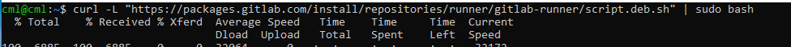

- **Install the Runner using the Following Command**
    ```sh
    sudo apt-get install gitlab-runner
    ```
    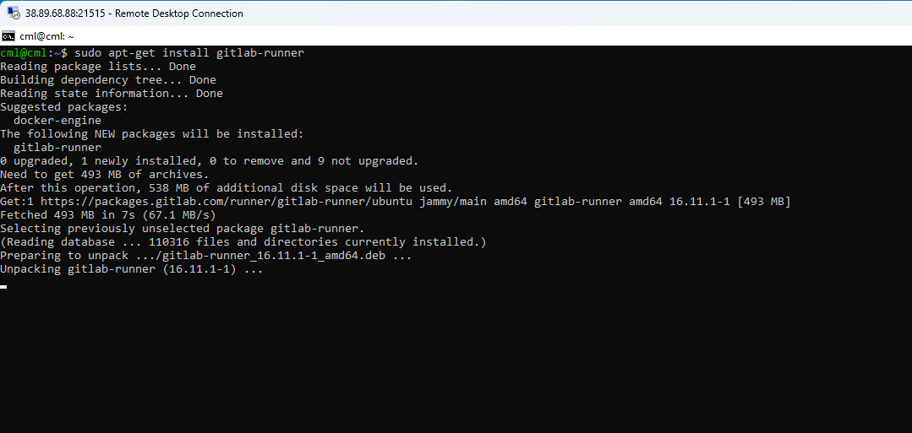

- **Runner Machine Configuration**
    - Go to GitLab and login using the provided username and password from exercise one.
    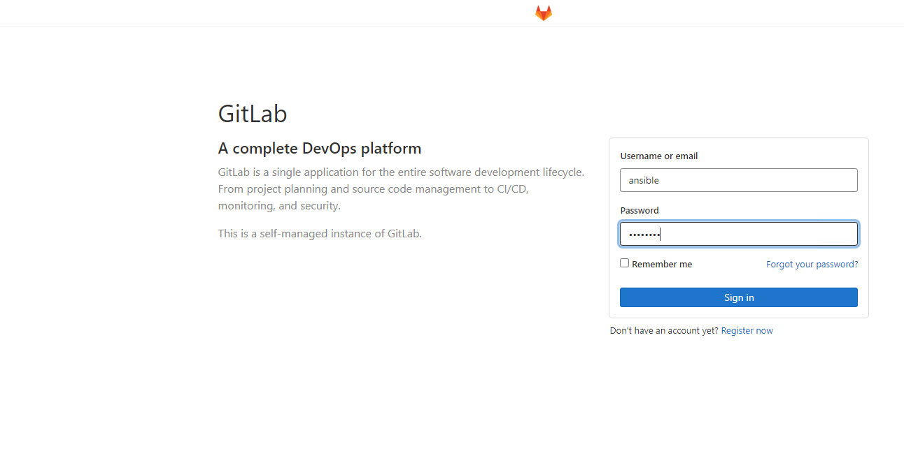
    - Click on the admin area.
    
    - Click on "Runner".
    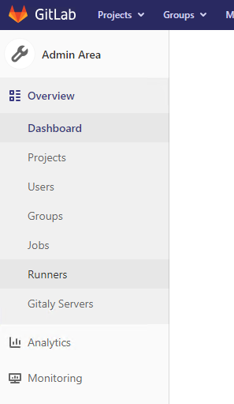
    - Runner details are available here.
    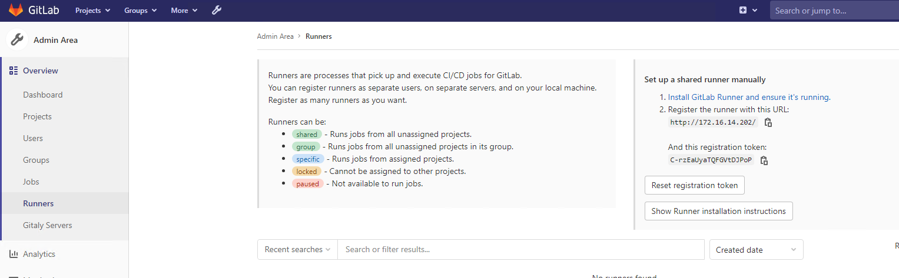

- **Configure Runner**
    - In the terminal, SSH into the runner machine and execute the command below, ensuring to replace the token and GitLab IP properly.
    ```sh
    gitlab-runner register --name automation_lab --url "http://172.16.14.202/" --locked=false  --registration-token C-rzEaUyaTQFGVtDJPoP --executor shell --shell bash --non-interactiv
    ```
    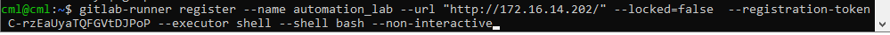

- **View Configured Runners**
    ```sh
    gitlab-runner list
    ```
    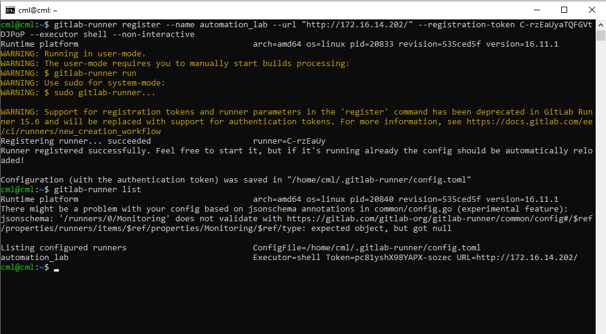

- **Refreshing Runner Configuration**
    - After refreshing the runner configuration page in GitLab, you can see the list of runners configured just now, and you can see that the *runner currently online is 0*.

    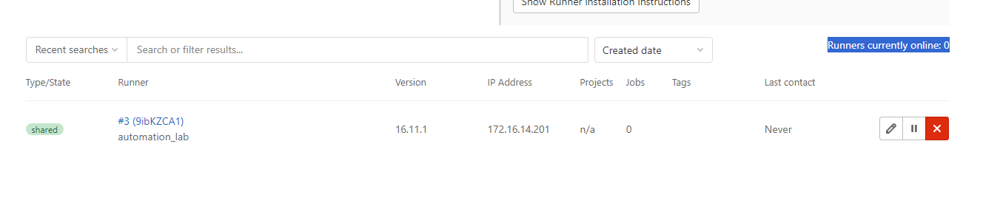

- **Start the Runner**
    - In the terminal, where the runner is already SSHed, run the below command:
    ```sh
    # Install and run as service
    sudo gitlab-runner install --user=gitlab-runner --working-directory=/home/gitlab-runner
    sudo gitlab-runner restart
    gitlab-runner run
    ```
    Ensure to run `gitlab-runner run` as a non-root user.
    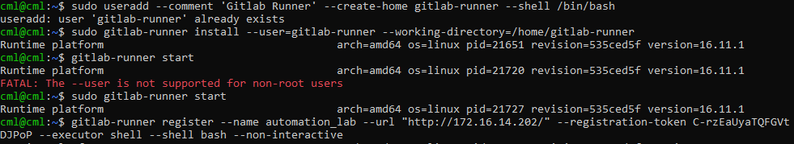
    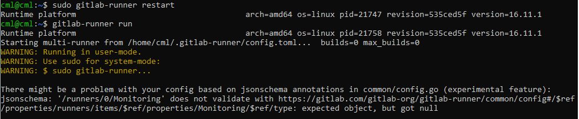

- **Runner Status Online**
    - Now you can see that the runner is online.
    

- **Creating a Git Repo**
    - Create a Git repository with any name you want. I'm using `cicd_automation_lab` as the repo name.
    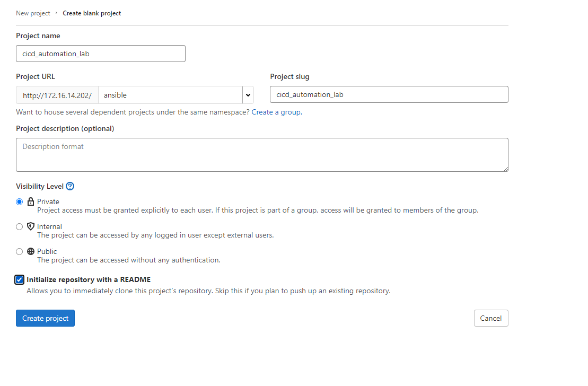
    - Click on "Web IDE".
    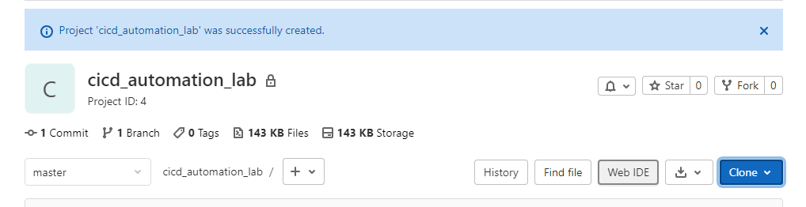
    - Create folder and file structure as shown below.
    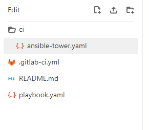

below is the content of the files
#### .gitlab-ci.yaml
```yaml
stages:
  - deploy

variables:
  TOWER_USERNAME: "admin"
  TOWER_PASSWORD: "ansible"
  TOWER_HOST: https://172.16.14.203/

deploy:
  stage: deploy
  script:
    - ansible-playbook ci/ansible-tower.yaml
  only:
    - master

```

#### ansible-tower.yaml
```yaml
---
- name: Creating Projects and template on ansible tower
  hosts: localhost
  connection: local
  gather_facts: true
  tasks:
    - name: Return motd to registered var
      ansible.builtin.command: printenv
      register: mymotd
      
    - name: debug
      debug:
        msg: "{{ mymotd }}"

    - name: Create Project
      awx.awx.tower_project:
        name: "test_project_name"
        description: "Commit Author author_Name_here SHA commit_sh_here" # make it dynamic
        scm_update_on_launch: true
        scm_delete_on_update: true
        credential: "gitlab-creds_details" 
        scm_type: git
        scm_url: "http://172.16.14.202/ansible/cicd_automation_lab.git" # make it dynamic
        scm_branch: "master" # make it dynamic
        timeout: 3600
        wait: true
        state: present
        validate_certs: false


    - name: Create Job Template
      awx.awx.tower_job_template:
        name: "test_project_name_template"
        job_type: run
        inventory: "eve_inventory"
        project: "test_project_name"
        playbook: "playbook.yaml"
        validate_certs: false
        credentials:
            - GitLab User Details
            - routers_cred
        verbosity: "3"
        state: present

```


#### playbook.yaml

```yaml
---
- name: Fetch show version from devices in dc_group
  hosts: vyos1-site2,vyos2-site2
  gather_facts: no

  tasks:
    - name: Clone the GitLab repository
      delegate_to: localhost
      run_once: true
      ansible.builtin.expect:
        command: git clone http://172.16.14.202/ansible/backup_configurations.git --verbose
        responses:
          (?i)Username: "{{ gitlab_username }}"
          (?i)Password: "{{ gitlab_password }}"
    
    - name: Run show version command
      register: show_version_output
      vyos_command:
        commands:
          - show version
          - show interfaces

    - name: Get current date and time
      set_fact:
        current_datetime: "{{ '%Y-%m-%d %H:%M:%S' | strftime }}"
    
    - name: Save show version output to file
      ansible.builtin.copy:
        content: "# This code is dynamically generated by Ansible {{ current_datetime }}\n{{ show_version_output.stdout[0] | replace('\\n','\n')}}"
        dest: "./backup_configurations/{{ inventory_hostname }}_show_version.cfg"
    
    - name: Save show version output to file
      ansible.builtin.copy:
        content: "# This code is dynamically generated by Ansible {{ current_datetime }}\n{{ show_version_output.stdout[1] | replace('\\n','\n')}}"
        dest: "./backup_configurations/{{ inventory_hostname }}_show_interfaces.cfg"

    - name: commit the code
      delegate_to: localhost
      run_once: true
      with_items:
        - "git add ."
        - git config --global user.name "user1"
        - git config --global user.email "user1@onemindservices.com"
        - "git commit -m 'configurations update'"
        - git push origin master
      ansible.builtin.expect:
        chdir: "./backup_configurations"
        command: "{{ item }}"
        responses:
          (?i)Username: "{{ gitlab_username }}"
          (?i)Password: "{{ gitlab_password }}"
```