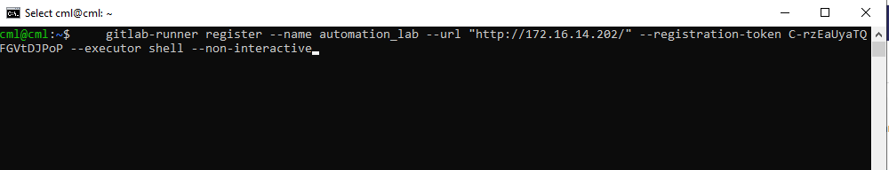
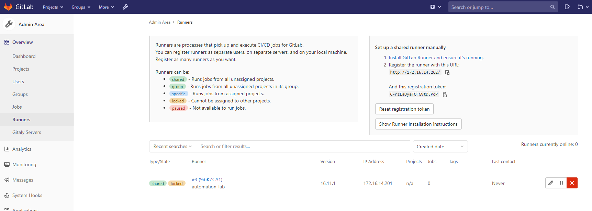
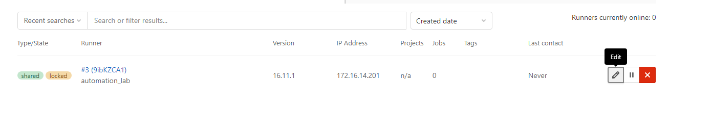
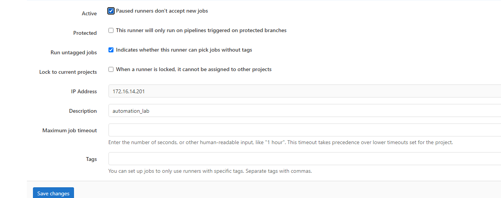
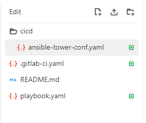

##  Exercise:
### Problem Statement:

runner Configurations

#### Solution

- open Cmd 

- login to runner
    ```
    ssh -l cml 172.16.14.201
    ```
    

- run the below command to install runner
    


- install the runner using below command
    ```sh
    sudo apt-get install gitlab-runner
    ```
    

- now our runner machine is ready now we have to configure it for that go to gitlab and login using user name and password that is provide in the table for exercise one.
    
- click on admin area
    

- click on runner
    

- you can find the runner details here
 

- now go to terminal there we have already ssh the runner machine and run the below command
    ```sh
    gitlab-runner register --name automation_lab --url "http://172.16.14.202/" --registration-token C-rzEaUyaTQFGVtDJPoP --executor shell --non-interactive

    ```
    

- we can see the list of configured runner using below command
    ```sh
    gitlab-runner list
    ```
    

- when u regresh the runner configuration page in gitlab you can see the list of runner that we configured just now


- you can see the runner is shared and locked lets change it as of now for that click on edit


- make sure your configuration should like below  image


- now we can see the *runner currently online is 0* 


- let's start the runner for that go to terminal there runner is already ssh and run the below command

```sh
# Install and run as service
sudo gitlab-runner install --user=gitlab-runner --working-directory=/home/gitlab-runner
sudo gitlab-runner restart
gitlab-runner run
```
make sure u should run `gitlab-runner run` as non root user.


- lets create a git repo with anyname that u want i am using `cicd_automation_lab` as repo name

- click on web ide

- create folder and file structure like below

