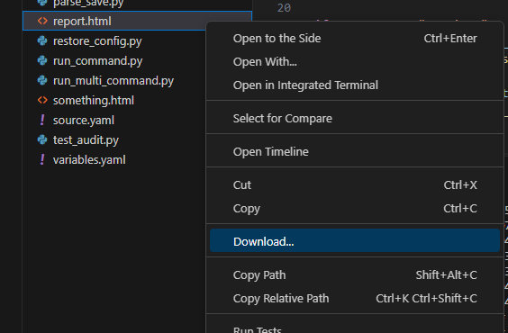
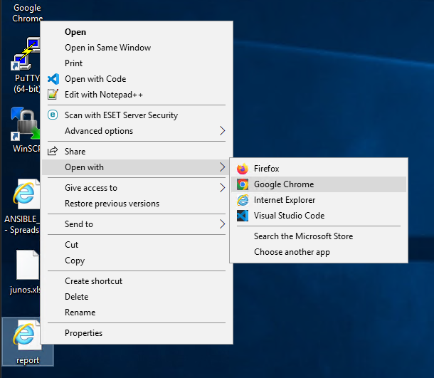

# Write a python code to extract the output of "show configuration json" from both VYOS devices and run audits and tests against our organizational policies to check for security compliance.

## Organizational gold standards
- Routing protocol configured should be OSPF only.
- The default static route should be set to 172.16.14.1
- The debugging level for all facility level should be set to info
- IP address on eth0 interface should be in 10.10.10.0/24 subnet
- IP address on eth1 interface should be in 172.16.14.0/24 subnet
- A local username of "vyos" should be configured


### Solution

```sh
docker container run -it -v $(pwd):/python_automation ansible_lab
```
If you encounter issues while creating the Docker image, replace the image name with the one we have already pushed to Docker registry. Use the image name onemindservices2024/naf2024 instead of ansible_lab. The new command will look like this:
```sh
docker container run -it -v $(pwd):/python_automation onemindservices2024/naf2024
```

Inside a folder named `python_automation` in user's home directory, create a new file with `audit.py` with below content to prepare the fixture data for pytest run

```py
import json
from device_vars import *
from netmiko import ConnectHandler
from rich import print
import pytest
import ipaddress

@pytest.fixture
def json_data():
    device_details = [vyos1_site2, vyos2_site2]
    for device in device_details:
        print(device)
        net_connect = ConnectHandler(**device)
        output = net_connect.send_command('show configuration json')
        # json_data = json.loads(output)
        return output

@pytest.fixture
def data(json_data):
    # Convert JSON string to dictionary
    return json.loads(json_data)
```

Let's write test cases for our audit analysis for network security

Testcase1:-

- Check which routing protocol is operational. If it is OSPF, the test passes, otherwise it is failed

```py
import json
from device_vars import *
from netmiko import ConnectHandler
from rich import print
import pytest
import ipaddress

@pytest.fixture
def json_data():
    device_details = [vyos1_site2, vyos2_site2]
    for device in device_details:
        print(device)
        net_connect = ConnectHandler(**device)
        output = net_connect.send_command('show configuration json')
        # json_data = json.loads(output)
        return output

@pytest.fixture
def data(json_data):
    # Convert JSON string to dictionary
    return json.loads(json_data)

def test_ospf_operational(data):
    # Check if 'ospf' exists under 'protocols'
    assert 'ospf' in data['protocols'], "OSPF configuration not found in protocols"
```

- To run this code, execute 
```py
pytest audit.py --html=report.html --self-contained-html
```

- Right click on report.html in the file viewer and click on download and save to desktop


- Navigate to desktop and open the file with chrome browser to see the test execution results.  


Testcase2:-
- The default static route should be set to 172.16.14.1


Testcase3:-
- The debugging level for all facility level should be set to info