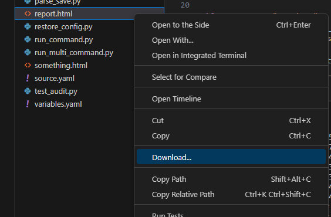
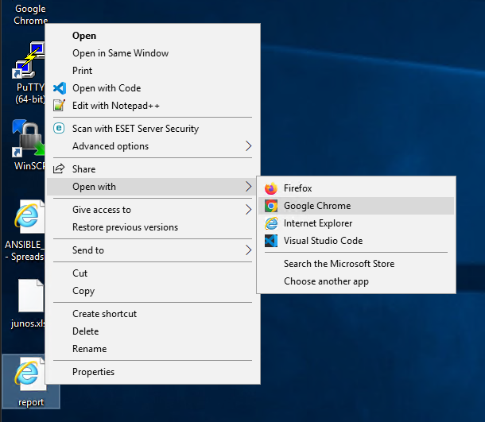
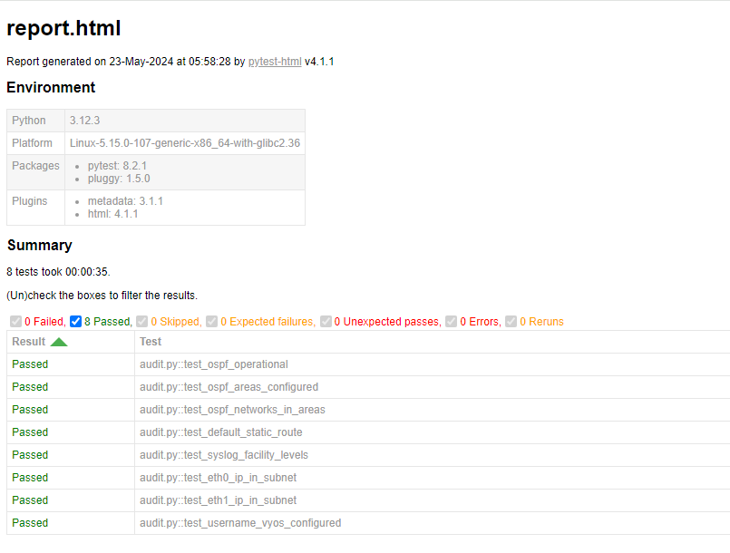
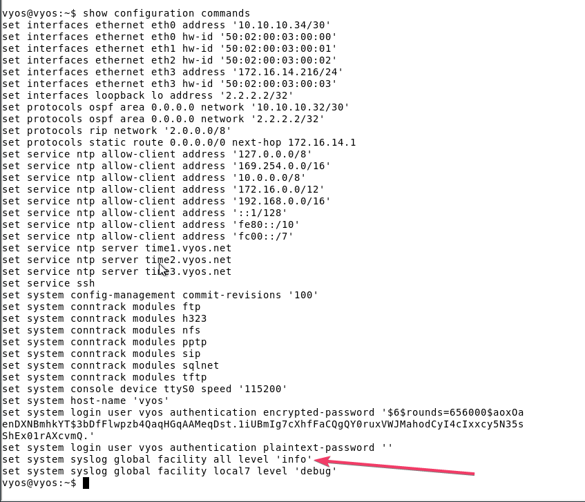
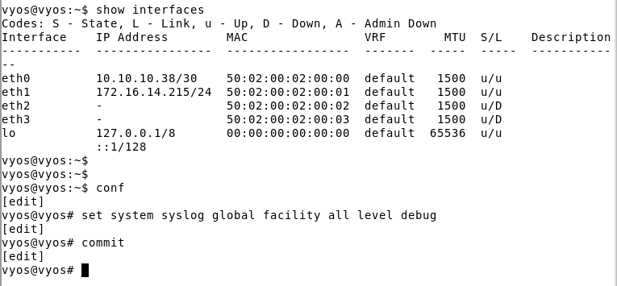
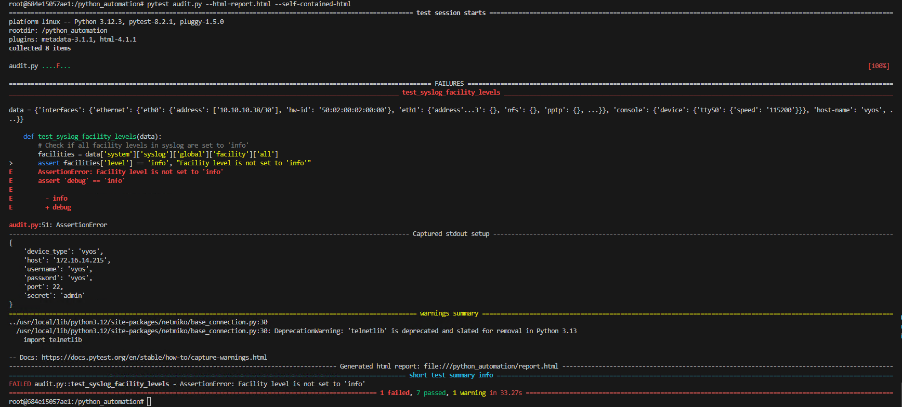
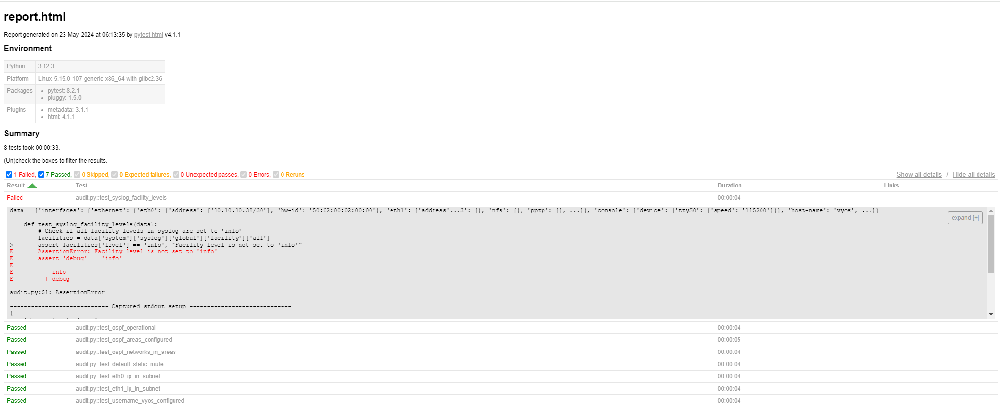

# Write a python code to extract the output of "show configuration json" from one of the VYOS devices and run audits and tests against our organizational policies to check for security compliance.

## Organizational gold standards
- Routing protocol configured should be OSPF only.
- The default static route should be set to 172.16.14.1
- The debugging level for all facility level should be set to info
- IP address on eth0 interface should be in 10.10.10.0/24 subnet
- IP address on eth1 interface should be in 172.16.14.0/24 subnet
- A local username of "vyos" should be configured


### Solution

```sh
docker container run -it -v $(pwd):/python_automation ansible_lab
```
If you encounter issues while creating the Docker image, replace the image name with the one we have already pushed to Docker registry. Use the image name onemindservices2024/naf2024 instead of ansible_lab. The new command will look like this:
```sh
docker container run -it -v $(pwd):/python_automation onemindservices2024/naf2024
```

Inside a folder named `python_automation` in user's home directory, create a new file with `audit.py` with below content to prepare the fixture data for pytest run

```py
import json
from device_vars import *
from netmiko import ConnectHandler
from rich import print
import pytest
import ipaddress

@pytest.fixture
def json_data():
    device_details = [vyos1_site2]
    for device in device_details:
        print(device)
        net_connect = ConnectHandler(**device)
        output = net_connect.send_command('show configuration json')
        # json_data = json.loads(output)
        return output

@pytest.fixture
def data(json_data):
    # Convert JSON string to dictionary
    return json.loads(json_data)
```

Let's write test cases for our audit analysis for network security

Testcase1:-

- Check which routing protocol is operational. If it is OSPF, the test passes, otherwise it is failed

```py
import json
from device_vars import *
from netmiko import ConnectHandler
from rich import print
import pytest
import ipaddress

@pytest.fixture
def json_data():
    device_details = [vyos1_site2]
    for device in device_details:
        print(device)
        net_connect = ConnectHandler(**device)
        output = net_connect.send_command('show configuration json'
        # json_data = json.loads(output)
        return output

@pytest.fixture
def data(json_data):
    # Convert JSON string to dictionary
    return json.loads(json_data)

def test_ospf_operational(data):
    # Check if 'ospf' exists under 'protocols'
    assert 'ospf' in data['protocols'], "OSPF configuration not found in protocols"

def test_ospf_areas_configured(data):
    ospf_config = data['protocols']['ospf']
    # Check if 'area' exists under 'ospf'
    assert 'area' in ospf_config, "OSPF areas not found in OSPF configuration"

def test_ospf_networks_in_areas(data):
    ospf_config = data['protocols']['ospf']
    areas = ospf_config['area']
    # Ensure at least one area is configured
    assert len(areas) > 0, "No OSPF areas configured"

    # Iterate through each area and check for 'network' key
    for area, area_config in areas.items():
        assert 'network' in area_config, f"No networks configured in OSPF area {area}"
        assert len(area_config['network']) > 0, f"No networks found in OSPF area {area}"

if __name__ == "__main__":
    pytest.main()
```

- To run this code, execute 
```py
pytest audit.py --html=report.html --self-contained-html
```

- Right click on report.html in the file viewer and click on download and save to desktop


- Navigate to desktop and open the file with chrome browser to see the test execution results.  


Testcase2:-
- The default static route should be set to 172.16.14.1

```py
import json
from device_vars import *
from netmiko import ConnectHandler
from rich import print
import pytest
import ipaddress

@pytest.fixture
def json_data():
    device_details = [vyos1_site2]
    for device in device_details:
        print(device)
        net_connect = ConnectHandler(**device)
        output = net_connect.send_command('show configuration json')
        # json_data = json.loads(output)
        return output

@pytest.fixture
def data(json_data):
    # Convert JSON string to dictionary
    return json.loads(json_data)

def test_ospf_operational(data):
    # Check if 'ospf' exists under 'protocols'
    assert 'ospf' in data['protocols'], "OSPF configuration not found in protocols"

def test_ospf_areas_configured(data):
    ospf_config = data['protocols']['ospf']
    # Check if 'area' exists under 'ospf'
    assert 'area' in ospf_config, "OSPF areas not found in OSPF configuration"

def test_ospf_networks_in_areas(data):
    ospf_config = data['protocols']['ospf']
    areas = ospf_config['area']
    # Ensure at least one area is configured
    assert len(areas) > 0, "No OSPF areas configured"

    # Iterate through each area and check for 'network' key
    for area, area_config in areas.items():
        assert 'network' in area_config, f"No networks configured in OSPF area {area}"
        assert len(area_config['network']) > 0, f"No networks found in OSPF area {area}"

def test_default_static_route(data):
    # Check if the default static route is set to 172.16.14.1
    static_route = data['protocols'].get('static', {}).get('route', {}).get('0.0.0.0/0', {}).get('next-hop', {})
    assert '172.16.14.1' in static_route, "Default static route to 172.16.14.1 is not set"

if __name__ == "__main__":
    pytest.main()
```


Testcase3:-
- The debugging level for all facility level should be set to info
```py
import json
from device_vars import *
from netmiko import ConnectHandler
from rich import print
import pytest
import ipaddress

@pytest.fixture
def json_data():
    device_details = [vyos1_site2]
    for device in device_details:
        print(device)
        net_connect = ConnectHandler(**device)
        output = net_connect.send_command('show configuration json')
        # json_data = json.loads(output)
        return output

@pytest.fixture
def data(json_data):
    # Convert JSON string to dictionary
    return json.loads(json_data)

def test_ospf_operational(data):
    # Check if 'ospf' exists under 'protocols'
    assert 'ospf' in data['protocols'], "OSPF configuration not found in protocols"

def test_ospf_areas_configured(data):
    ospf_config = data['protocols']['ospf']
    # Check if 'area' exists under 'ospf'
    assert 'area' in ospf_config, "OSPF areas not found in OSPF configuration"

def test_ospf_networks_in_areas(data):
    ospf_config = data['protocols']['ospf']
    areas = ospf_config['area']
    # Ensure at least one area is configured
    assert len(areas) > 0, "No OSPF areas configured"

    # Iterate through each area and check for 'network' key
    for area, area_config in areas.items():
        assert 'network' in area_config, f"No networks configured in OSPF area {area}"
        assert len(area_config['network']) > 0, f"No networks found in OSPF area {area}"

def test_default_static_route(data):
    # Check if the default static route is set to 172.16.14.1
    static_route = data['protocols'].get('static', {}).get('route', {}).get('0.0.0.0/0', {}).get('next-hop', {})
    assert '172.16.14.1' in static_route, "Default static route to 172.16.14.1 is not set"

def test_syslog_facility_levels(data):
    # Check if all facility levels in syslog are set to 'info'
    facilities = data['system']['syslog']['global']['facility']['all']
    assert facilities['level'] == 'info', "Facility level is not set to 'info'"

if __name__ == "__main__":
    pytest.main()

```

TestCase4:
- IP address on eth0 interface should be in 10.10.10.0/24 subnet
```py
import json
from device_vars import *
from netmiko import ConnectHandler
from rich import print
import pytest
import ipaddress

@pytest.fixture
def json_data():
    device_details = [vyos1_site2]
    for device in device_details:
        print(device)
        net_connect = ConnectHandler(**device)
        output = net_connect.send_command('show configuration json')
        # json_data = json.loads(output)
        return output

@pytest.fixture
def data(json_data):
    # Convert JSON string to dictionary
    return json.loads(json_data)

def test_ospf_operational(data):
    # Check if 'ospf' exists under 'protocols'
    assert 'ospf' in data['protocols'], "OSPF configuration not found in protocols"

def test_ospf_areas_configured(data):
    ospf_config = data['protocols']['ospf']
    # Check if 'area' exists under 'ospf'
    assert 'area' in ospf_config, "OSPF areas not found in OSPF configuration"

def test_ospf_networks_in_areas(data):
    ospf_config = data['protocols']['ospf']
    areas = ospf_config['area']
    # Ensure at least one area is configured
    assert len(areas) > 0, "No OSPF areas configured"

    # Iterate through each area and check for 'network' key
    for area, area_config in areas.items():
        assert 'network' in area_config, f"No networks configured in OSPF area {area}"
        assert len(area_config['network']) > 0, f"No networks found in OSPF area {area}"

def test_default_static_route(data):
    # Check if the default static route is set to 172.16.14.1
    static_route = data['protocols'].get('static', {}).get('route', {}).get('0.0.0.0/0', {}).get('next-hop', {})
    assert '172.16.14.1' in static_route, "Default static route to 172.16.14.1 is not set"

def test_syslog_facility_levels(data):
    # Check if all facility levels in syslog are set to 'info'
    facilities = data['system']['syslog']['global']['facility']['all']
    assert facilities['level'] == 'info', "Facility level is not set to 'info'"

def test_eth0_ip_in_subnet(data):
    eth0_address = data['interfaces']['ethernet']['eth0']['address'][0]
    ip = eth0_address.split('/')[0]
    subnet = ipaddress.ip_network('10.10.10.0/24')
    assert ipaddress.ip_address(ip) in subnet, f"IP address {ip} is not in the 10.10.10.0/24 subnet"

if __name__ == "__main__":
    pytest.main()
```

TestCase5:
- IP address on eth1 interface should be in 172.16.14.0/24 subnet

```py
import json
from device_vars import *
from netmiko import ConnectHandler
from rich import print
import pytest
import ipaddress

@pytest.fixture
def json_data():
    device_details = [vyos1_site2]
    for device in device_details:
        print(device)
        net_connect = ConnectHandler(**device)
        output = net_connect.send_command('show configuration json')
        # json_data = json.loads(output)
        return output

@pytest.fixture
def data(json_data):
    # Convert JSON string to dictionary
    return json.loads(json_data)

def test_ospf_operational(data):
    # Check if 'ospf' exists under 'protocols'
    assert 'ospf' in data['protocols'], "OSPF configuration not found in protocols"

def test_ospf_areas_configured(data):
    ospf_config = data['protocols']['ospf']
    # Check if 'area' exists under 'ospf'
    assert 'area' in ospf_config, "OSPF areas not found in OSPF configuration"

def test_ospf_networks_in_areas(data):
    ospf_config = data['protocols']['ospf']
    areas = ospf_config['area']
    # Ensure at least one area is configured
    assert len(areas) > 0, "No OSPF areas configured"

    # Iterate through each area and check for 'network' key
    for area, area_config in areas.items():
        assert 'network' in area_config, f"No networks configured in OSPF area {area}"
        assert len(area_config['network']) > 0, f"No networks found in OSPF area {area}"

def test_default_static_route(data):
    # Check if the default static route is set to 172.16.14.1
    static_route = data['protocols'].get('static', {}).get('route', {}).get('0.0.0.0/0', {}).get('next-hop', {})
    assert '172.16.14.1' in static_route, "Default static route to 172.16.14.1 is not set"

def test_syslog_facility_levels(data):
    # Check if all facility levels in syslog are set to 'info'
    facilities = data['system']['syslog']['global']['facility']['all']
    assert facilities['level'] == 'info', "Facility level is not set to 'info'"

def test_eth0_ip_in_subnet(data):
    eth0_address = data['interfaces']['ethernet']['eth0']['address'][0]
    ip = eth0_address.split('/')[0]
    subnet = ipaddress.ip_network('10.10.10.0/24')
    assert ipaddress.ip_address(ip) in subnet, f"IP address {ip} is not in the 10.10.10.0/24 subnet"

def test_eth1_ip_in_subnet(data):
    eth1_address = data['interfaces']['ethernet']['eth1']['address'][0]
    ip = eth1_address.split('/')[0]
    subnet = ipaddress.ip_network('172.16.14.0/24')
    assert ipaddress.ip_address(ip) in subnet, f"IP address {ip} is not in the 172.16.14.0/24 subnet"

if __name__ == "__main__":
    pytest.main()
```

TestCase6:
- A local username of "vyos" should be configured

```py
import json
from device_vars import *
from netmiko import ConnectHandler
from rich import print
import pytest
import ipaddress

@pytest.fixture
def json_data():
    device_details = [vyos1_site2]
    for device in device_details:
        print(device)
        net_connect = ConnectHandler(**device)
        output = net_connect.send_command('show configuration json')
        # json_data = json.loads(output)
        return output

@pytest.fixture
def data(json_data):
    # Convert JSON string to dictionary
    return json.loads(json_data)

def test_ospf_operational(data):
    # Check if 'ospf' exists under 'protocols'
    assert 'ospf' in data['protocols'], "OSPF configuration not found in protocols"

def test_ospf_areas_configured(data):
    ospf_config = data['protocols']['ospf']
    # Check if 'area' exists under 'ospf'
    assert 'area' in ospf_config, "OSPF areas not found in OSPF configuration"

def test_ospf_networks_in_areas(data):
    ospf_config = data['protocols']['ospf']
    areas = ospf_config['area']
    # Ensure at least one area is configured
    assert len(areas) > 0, "No OSPF areas configured"

    # Iterate through each area and check for 'network' key
    for area, area_config in areas.items():
        assert 'network' in area_config, f"No networks configured in OSPF area {area}"
        assert len(area_config['network']) > 0, f"No networks found in OSPF area {area}"

def test_default_static_route(data):
    # Check if the default static route is set to 172.16.14.1
    static_route = data['protocols'].get('static', {}).get('route', {}).get('0.0.0.0/0', {}).get('next-hop', {})
    assert '172.16.14.1' in static_route, "Default static route to 172.16.14.1 is not set"

def test_syslog_facility_levels(data):
    # Check if all facility levels in syslog are set to 'info'
    facilities = data['system']['syslog']['global']['facility']['all']
    assert facilities['level'] == 'info', "Facility level is not set to 'info'"

def test_eth0_ip_in_subnet(data):
    eth0_address = data['interfaces']['ethernet']['eth0']['address'][0]
    ip = eth0_address.split('/')[0]
    subnet = ipaddress.ip_network('10.10.10.0/24')
    assert ipaddress.ip_address(ip) in subnet, f"IP address {ip} is not in the 10.10.10.0/24 subnet"

def test_eth1_ip_in_subnet(data):
    eth1_address = data['interfaces']['ethernet']['eth1']['address'][0]
    ip = eth1_address.split('/')[0]
    subnet = ipaddress.ip_network('172.16.14.0/24')
    assert ipaddress.ip_address(ip) in subnet, f"IP address {ip} is not in the 172.16.14.0/24 subnet"

def test_username_vyos_configured(data):
    assert 'vyos' in data['system']['login']['user'], "Local username 'vyos' is not configured"

if __name__ == "__main__":
    pytest.main()

```

The final test report if all are success should look like this



You can modify the configuration of the device for the tests to fail and see the report.

For example:-
Let's modify the syslog level for all facility level to debug instead of info and see the result on compliance report.







