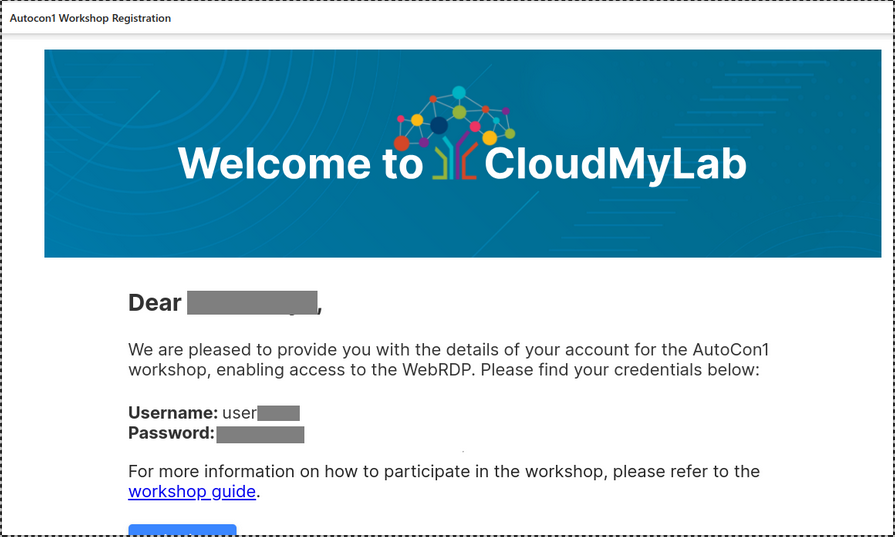
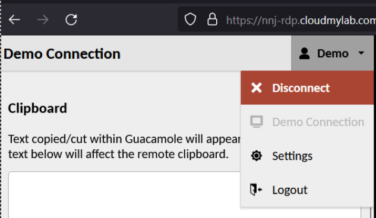
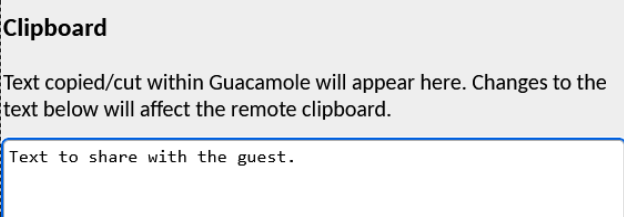
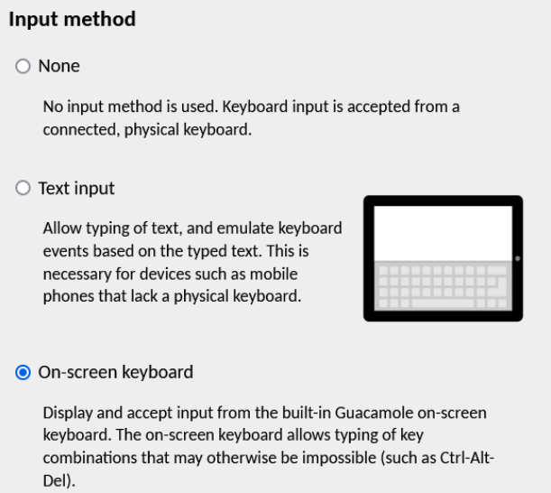

# Getting started

- Begin by navigating to the CloudMyLab Workshop registration/activation page by navigating to https://autocon1.cloudmylab.com 
- In the form on-screen please fill out your details, you must use the email you used to sign up for the workshop.  Once the form is submitted, you should receive an email with your user-specific access credentials. 
    - If you do not receive the email, please check your spam/junk folder and if it is not present in those folders, please contact our support or one of the proctors.  Support details will be listed below. 
- Once you open the email you will be presented with all the details needed to connect to your pod.  The email will look similar to the one below:

- The default access method we are providing is a WebRDP experience.  This has been chosen so there are no requirements to install any specific software and should be vendor agnostic. 
    - Additional access methods such as Zerotier and direct RDP are also available upon request by contacting support. 
    - To login to the webRDP you should use the same credentials that were sent to you. 
- Once connected, we have already opened the web browser to the correct EVE-NG URL.  You can use the listed username and password to login. 
    - If for any reason the browser is closed, you can find the EVE-NG server again using the IP 172.16.15.2. 
    - Upon login you will be greeted with your instance of the lab. 
- Once connected you may close this README and open the workshop exercises to begin the lab. 
    - To contact support please contact an on-site proctor, send an email to naf-support@cloudmylab.com, or use our event slack channel [(invite link)](https://join.slack.com/t/ac1cloudlabwo-eqa9488/shared_invite/zt-2je1pmxnr-wq5dfxWZKJTWSXefpA_2_A) 

Good luck and have fun on the automation journey! 

# Usage, Tips, and Tricks 

- Use the key combination ctrl+shift+alt to open the Web RDP context menu.  The RDP Context menu contains basic settings and actions.  In the top right of the context menu is a submenu where you can find the Logout button as well as the option to disconnect from your current session.  Most common settings will be found within the main context menu. 

    

- In order to facilitate the use of the clipboard a text box is provided in the context menu to share text with the Remote Operating System. 

    

- At times some key combinations intended for the guest may invoke browser hotkeys.  To work around this issue, the on-screen keyboard option may be used. 

    

